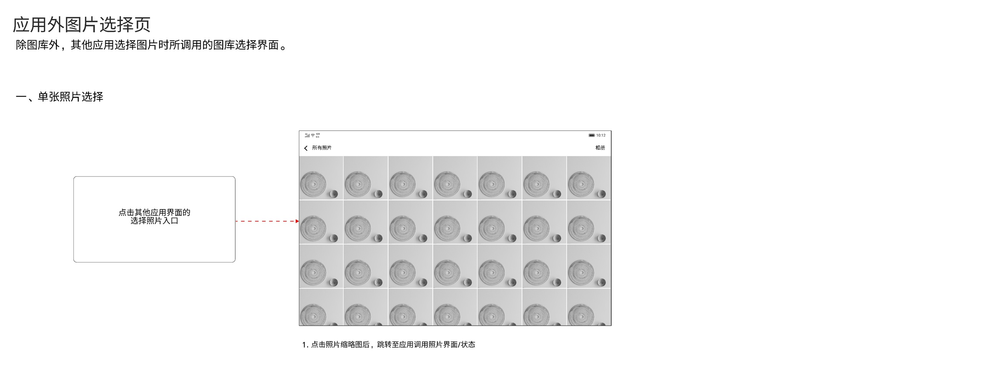

# 应用外图片选择页

[返回图库索引](../../README.md) · [功能索引](../../functions.md) · [导航关系](../../navigation.md)

## 身份与适用范围

| 项目 | 内容 |
|---|---|
| 知识 ID | gallery.external_picker |
| 类型 | 页面及其局部状态 |
| 检索词 | 其他App、选照片、返回调用方、单选 |
| 主来源 | [S08 原始设计稿](../../sources/S08.png) |
| 来源文件名 | 16 应用外图片选择页 UX说明.png |
| 证据性质 | 设计稿知识，未经实机验证 |

正文中明确区分文字规则、图示状态与待确认事项。数值示例用于说明图示状态；产品参数按目标版本核对，操作由当前测试任务决定。

## 1. 单张照片选择

其他App点击选择照片入口后调用图库选择界面。顶部左侧返回及“所有照片”，右侧“相册”；主体媒体网格。

点击照片缩略图后跳转回应用调用照片的界面/状态。此处的单张选择完成后返回调用应用；图库浏览中的缩略图点击进入详情。

本稿未给出多选、编辑或确认按钮。图库被卸载/停用时的外部调用见[应用生命周期](../../features/lifecycle/README.md)。

## 待确认与使用边界

调用方要求的媒体类型、返回URI、取消结果及右上相册完整子流程未说明。

图中箭头、红色编号、修订标签属于设计批注。实际操作位置由实时截图和UI树确定。可按需查看[整图预览](images/overview.jpg)或上述原始设计稿，优先读取当前相关局部图。
