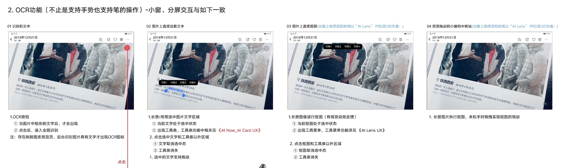
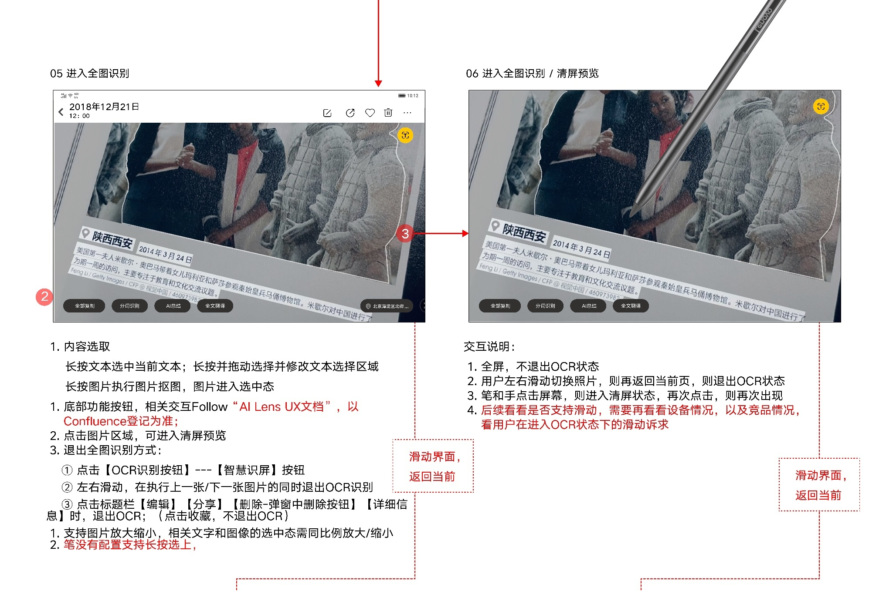
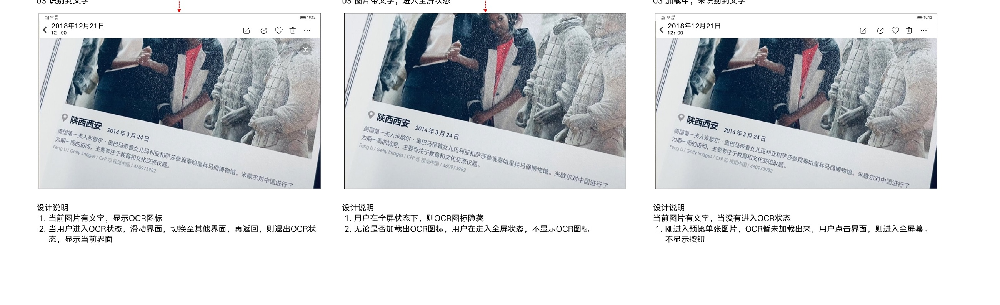

# OCR／全图识别

[返回图库索引](../../README.md) · [功能索引](../../functions.md) · [导航关系](../../navigation.md)

## 身份与适用范围

| 项目 | 内容 |
|---|---|
| 知识 ID | gallery.ocr |
| 类型 | 页面及其局部状态 |
| 检索词 | 文字识别、选字、笔操作、抠图、清屏识别 |
| 主来源 | [S03 原始设计稿](../../sources/S03.png) |
| 来源文件名 | 12 视频详情页-1.png |
| 证据性质 | 设计稿知识，未经实机验证 |

正文中明确区分文字规则、图示状态与待确认事项。数值示例用于说明图示状态；产品参数按目标版本核对，操作由当前测试任务决定。

## 1. 进入与直接选取

原文件名“12 视频详情页-1.png”，画布实际标题为“OCR 5月19日”。本页按OCR画布内容归档，并保留原文件名对应关系。

图片检测到文字才显示OCR图标；回图库预览后台识别出文字后才显示。点击进入全图识别。

长按/用笔选中文字：文字选中并出现工具条；点击选中区和工具条外取消。选中文字可拖动。长按图像可抠图并在不松手时拖动；外部AI Lens定义具体工具项和上线范围。

## 2. 全图识别与退出

全图识别下长按文本、拖动修改选区；长按图片选中主体。图片缩放时文字/图像选区按比例缩放；没有配置长按选上的内容等待后续支持。

点击空白图片区进入清屏，但不退出OCR；再次点击恢复主屏工具。

退出OCR：再次点击识别/智慧识屏按钮；左右滑到前后图片；执行标题栏编辑、分享、详细信息或删除弹窗中的删除。点击收藏不退出OCR。返回当前图片时也不恢复之前OCR状态。

## 3. 清屏和加载状态

清屏状态隐藏OCR图标；无论是否加载出图标，先进入全屏就不显示该按钮。

图片有字且识别进行中时，全屏页面保持OCR按钮隐藏；文字存在性与识别进度分别记录。

## 待确认与使用边界

原稿引用外部AI Card和AI Lens，工具条业务细节不在此包；与照片详情的旧适配规则须结合版本限制。

图中箭头、红色编号、修订标签属于设计批注。实际操作位置由实时截图和UI树确定。可按需查看[整图预览](images/overview.jpg)或上述原始设计稿，优先读取当前相关局部图。
