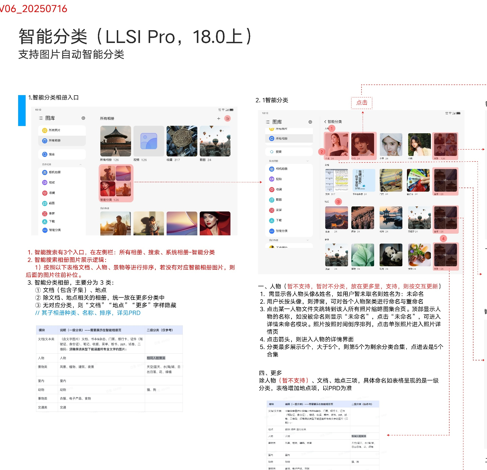
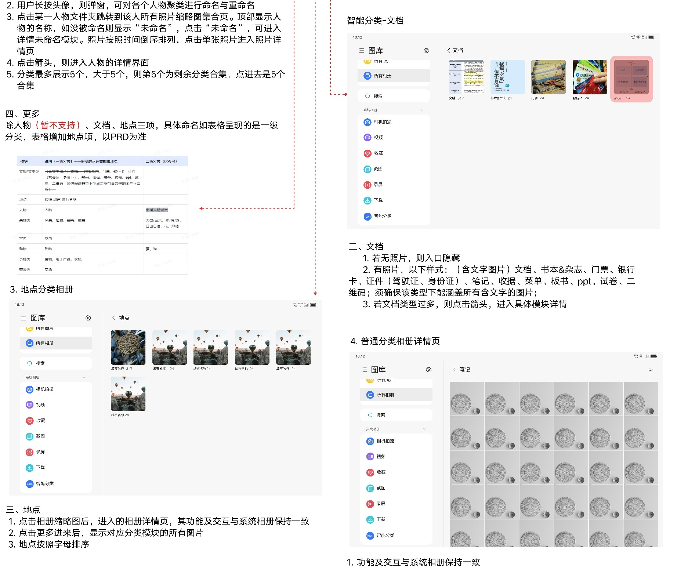
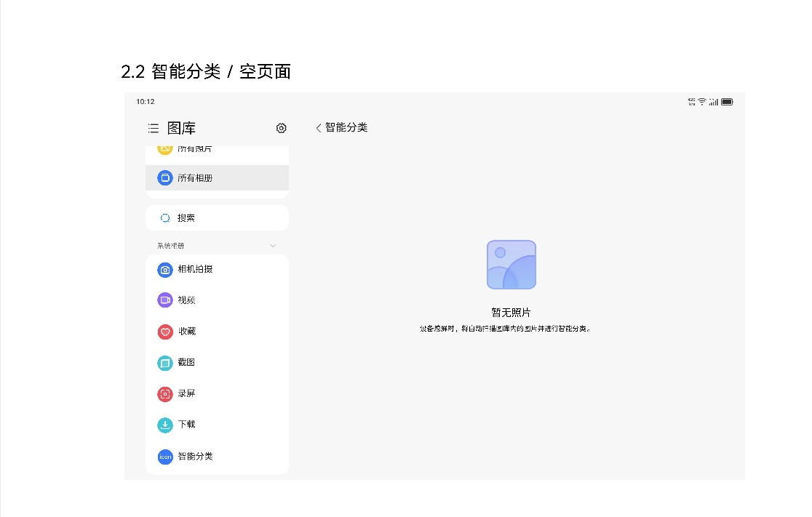

# 智能分类相册

[返回图库索引](../../README.md) · [功能索引](../../functions.md) · [导航关系](../../navigation.md)

## 身份与适用范围

| 项目 | 内容 |
|---|---|
| 知识 ID | gallery.smart_albums |
| 类型 | 页面及其局部状态 |
| 检索词 | 文档、地点、更多、人物暂不支持 |
| 主来源 | [S11 原始设计稿](../../sources/S11.png) |
| 来源文件名 | 19  智能分类相册.png |
| 证据性质 | 设计稿知识，未经实机验证 |

正文中明确区分文字规则、图示状态与待确认事项。数值示例用于说明图示状态；产品参数按目标版本核对，操作由当前测试任务决定。

## 1. 入口与分类

设计标题限定“LLSI Pro，18.0上”，版本标记V06_20250716；其他型号/版本能力未确认。

入口说明写有所有相册、搜索、系统相册→智能分类三处（原文“智能搜索”与本页主题用语有混用）。所有相册卡片另见[所有相册](../all_albums/README.md)补充图。

主要分类为文档（含子集）、地点、更多；除文档/地点外归更多；无对应内容时相应字样/入口隐藏，布局前移。

人物区域标注暂不支持、暂不分类；虽有头像、命名、人物详情示意，不作为当前可用能力。

## 2. 文档和地点

文档包括文字图片、书本杂志、门票、银行卡、证件、笔记、收藏、菜单、板书、PPT、试卷、二维码等，含文字图片需能兜底。无照片隐藏入口。

地点按地点字母排序；点击相册缩略图进入相册详情，功能与系统相册一致；更多进入对应分类集合。文档类型较多可点击箭头进入具体模块详情。

普通分类相册详情按系统相册交互，见[系统相册](../system_albums/README.md)。

## 3. 空态与受限人物示意

智能分类的空态采用本页给出的独立示例。

人物命名、未命名、最多展示5个分类等说明属于“暂不支持”的人物设计，测试适用性按当前版本支持情况确定。具体分类命名和排序引用未提供PRD，保留资料边界。

## 待确认与使用边界

扫描触发、识别准确率、分类枚举最终口径和人物上线时间未给出。

图中箭头、红色编号、修订标签属于设计批注。实际操作位置由实时截图和UI树确定。可按需查看[整图预览](images/overview.jpg)或上述原始设计稿，优先读取当前相关局部图。
