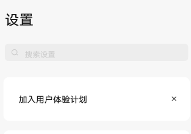

# 首页设置建议

[App 入口](../../README.md) · [功能查找](../../functions.md) · [页面导航](../../navigation.md)

| 信息 | 内容 |
|---|---|
| 知识 ID | `settings.suggestions` |
| 功能入口 | 设置首页 > 建议卡片 |
| 检索词 | 建议 推荐 用户体验 壁纸 熄屏 移除 卡片；移除首页推荐；设置建议卡片；关闭建议 |

## 使用时机与入口

仅在用例涉及首页建议卡片时加载；卡片条件不满足时查正式入口可用于诊断，但不等于完成卡片入口测试。

入口：设置首页 > 建议卡片。到达后按下面的可见控件识别，不仅凭页面背景判断。

## 页面识别与布局

建议卡片位于设置首页导航上方，可有关闭按钮。卡片主题决定点击后的目标。

## 关键控件：形状、位置与操作目标

位置均相对**当前页面的内容区或弹窗**，不是固定屏幕坐标。颜色只是辅助线索；优先结合标签、控件形状及相邻元素识别。

| 控件／入口 | 外观特征 | 相对位置 | 操作目标／状态区别 | 局部图 |
|---|---|---|---|---|
| 建议卡片 | 白色圆角矩形，左侧标题、右侧小叉 | 设置左栏搜索框下面 | 点标题／卡片主体进入功能 | [图 1](./images/focus_01.png) |
| 关闭 | 小号 × | 建议卡片右端 | 仅移除建议，不进入功能 | [图 1](./images/focus_01.png) |

## 操作与结果

| 操作目的 | 如何操作 | 页面变化／结果 |
|---|---|---|
| 查看体验计划建议 | 点击用户体验计划卡片 | 打开完整协议；同意开启，不同意关闭 |
| 移除建议 | 点击卡片关闭入口 | 本次卡片隐藏 |
| 进入建议的功能 | 点击壁纸或熄屏时间等卡片 | 分别跳对应设置 |

## 交互常识与入口缺失检查

建议有条件显示，不把每张卡片都当作首次启动必备。加入体验计划后对应卡片消失，退出后可重新显示。卡片消失时仍可从正式功能入口进入。

## 相关页面

[隐私保护／隐私控制](../../pages/privacy/README.md)、[屏幕熄灭时间](../../pages/screen_timeout/README.md)、[通用设置](../../pages/general/README.md)。

## 控件局部图

每张图聚焦上表对应的页面区域，保留标题或相邻标签作为定位参照。原图里的编号、虚线和箭头是设计说明，不是 App 控件。

### 图 1：搜索下方的建议卡片和关闭按钮

## 资料来源（无需常规加载）

[S16](../../sources/S16.png)；原文件映射见[来源表](../../sources.md)。
