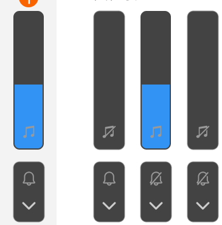
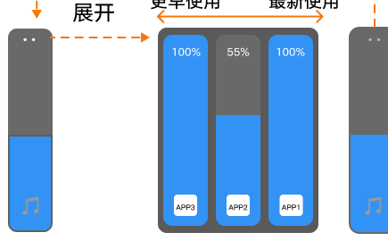

# 物理音量键与音量面板

[App 入口](../../README.md) · [功能查找](../../functions.md) · [页面导航](../../navigation.md)

| 信息 | 内容 |
|---|---|
| 知识 ID | `settings.volume_panel` |
| 功能入口 | 按设备音量键 |
| 检索词 | 音量键 浮层 媒体 来电 通话 每应用音量 实时字幕；展开音量面板；调单个应用音量；通话音量；物理音量键 |

## 使用时机与入口

仅在用例涉及物理音量键或浮层时加载；主通道取决于媒体／来电／通话场景。

入口：按设备音量键。到达后按下面的可见控件识别，不仅凭页面背景判断。

## 页面识别与布局

按物理音量键显示浮层。普通场景主控媒体，来电／通话场景优先相应通道；其他通道可折叠。展开后有多个音量控件，媒体使用时可有顶部更多入口。

## 关键控件：形状、位置与操作目标

位置均相对**当前页面的内容区或弹窗**，不是固定屏幕坐标。颜色只是辅助线索；优先结合标签、控件形状及相邻元素识别。

| 控件／入口 | 外观特征 | 相对位置 | 操作目标／状态区别 | 局部图 |
|---|---|---|---|---|
| 音量滑条 | 深色竖向圆角条，蓝色填充表示音量，底部通道图标 | 浮层主条 | 沿纵向滑动；先辨音乐／铃铛／听筒图标 | [图 1](./images/focus_01.png) |
| 展开 | 小面板内的向下尖角 | 主音量条下方的折叠通道区域 | 点尖角展开其他通道 | [图 1](./images/focus_01.png) |
| 静音／恢复 | 音乐或铃铛图标，可带斜杠 | 对应通道条的图标位置 | 点图标切换，不把展开箭头当静音 | [图 1](./images/focus_01.png) |
| 每应用音量 | 并排竖条，顶部百分比和应用身份 | 媒体更多入口展开后 | 逐个对应应用，最多三项 | [图 2](./images/focus_02.png) |

音量浮层出现在哪一侧应以当前屏幕为准；原设计仅保证内部控件关系。点击面板外侧关闭。应用音量百分比与系统主音量是不同参数。

## 操作与结果

| 操作目的 | 如何操作 | 页面变化／结果 |
|---|---|---|
| 调整音量 | 确认当前通道后按音量键或拖动对应滑块 | 改变所选通道 |
| 显示其他通道 | 展开面板 | 显示更多音量控制 |
| 关闭浮层 | 点击面板外侧 | 浮层消失 |
| 调单个应用音量 | 媒体使用时进入更多，定位目标应用 | 最多 3 个应用，0–100%，默认 100；物理键不改变该比例 |

## 交互常识与入口缺失检查

通话最小音量不为零。停止或退后台的应用可暂留列表。ROW 原生实时字幕图标与无障碍同步，区别于 AI 实时字幕。

## 相关页面

[声音和振动](../../pages/sound/README.md)、[AI 智慧服务](../../pages/ai_services/README.md)。

## 控件局部图

每张图聚焦上表对应的页面区域，保留标题或相邻标签作为定位参照。原图里的编号、虚线和箭头是设计说明，不是 App 控件。

### 图 1：竖向音量条与折叠按钮

### 图 2：每应用音量条与更多入口

## 资料来源（无需常规加载）

[S19](../../sources/S19.png)；原文件映射见[来源表](../../sources.md)。
