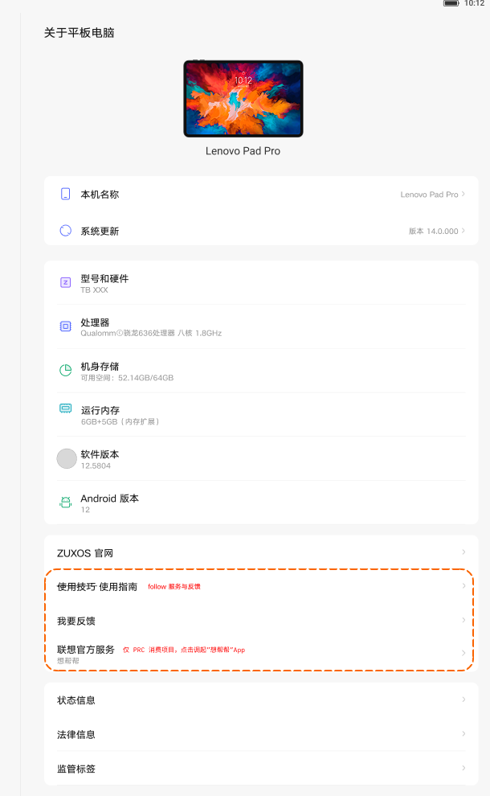

# 关于平板电脑

[App 入口](../../README.md) · [功能查找](../../functions.md) · [页面导航](../../navigation.md)

| 信息 | 内容 |
|---|---|
| 知识 ID | `settings.about` |
| 功能入口 | 设置 > 关于平板电脑 |
| 检索词 | 关于 型号 名称 系统更新 处理器 内存 软件 Android；查看机型；系统版本；设备名称；系统更新 |

## 进入本页

| 定位要点 | 操作依据 |
|---|---|
| 推荐路径 | 设置 > 关于平板电脑 |
| 直接上级／起点 | [设置首页](../home/README.md) |
| 要找的入口 | 关于平板电脑 |
| 形状与相对位置 | 首页的分组导航列表；图标＋模块名称所在行。双栏在左侧，向下滚动导航区查找。 |
| 入口图示 | [上级页入口区域](../home/images/focus_02.png) |
| 到达确认 | 顶部为设备图、设备名称／本机名称和系统更新；中部为型号、处理器、存储、内存、软件／Android 版本；下方有状态信息、法律和监管等入口。 |
| 资料覆盖 | 覆盖范围以本页列出的入口、控件和操作反馈为限；未列出的子流程不视为已知。 |

点击后先核对内容区标题及上述识别特征；双栏中左侧仍显示原导航属于正常布局，不要求整屏切换。多级路径中每一步均按当前界面重新定位。

## 页面识别与布局

顶部为设备图、设备名称／本机名称和系统更新；中部为型号、处理器、存储、内存、软件／Android 版本；下方有状态信息、法律和监管等入口。

## 关键控件：形状、位置与操作目标

位置均相对**当前页面的内容区或弹窗**，不是固定屏幕坐标。颜色只是辅助线索；优先结合标签、控件形状及相邻元素识别。

| 控件／入口 | 外观特征 | 相对位置 | 操作目标／状态区别 | 局部图 |
|---|---|---|---|---|
| 设备图与名称 | 小平板图片，下方设备名称 | 内容上部居中 | 用于识别页面，不能按示例机型匹配 | [图 1](./images/focus_01.png) |
| 本机名称／系统更新 | 两行文字入口，左侧小图标、右侧值 | 设备图下方第一块卡片 | 点对应行进入 | [图 1](./images/focus_01.png) |
| 硬件参数 | 小图标＋字段名＋较小的值 | 页面中部卡片 | 按字段读取值，区别于点击子页 | [图 1](./images/focus_01.png) |
| 状态／法律／监管 | 三个文字行，右端箭头 | 内容下部卡片 | 看不到时滚动内容区 | [图 1](./images/focus_01.png) |

## 操作与结果

| 操作目的 | 如何操作 | 页面变化／结果 |
|---|---|---|
| 查看设备或系统参数 | 按字段名读取对应值 | 得到当前设备实际值 |
| 查网络地址或序列号 | 点击状态信息 | 进入状态页 |
| 查许可证或监管资料 | 点击法律信息或监管信息 | 进入对应子页 |

## 入口找不到时的排查顺序

1. 确认起点为[设置首页](../home/README.md)，在“进入本页”注明的区域定位／滚动。
2. 滚动内容区找状态、法律和监管；型号与容量是读取字段，不是统一的子页入口。
3. 核对下方出现条件；仍无匹配时按[导航中的搜索与返回策略](../../navigation.md)诊断。只有用例允许时才改变前置条件或使用替代入口；无新线索则按[资料不足处理](../../limitations.md)记录阻塞。

## 交互常识与出现条件

字段和值随设备变化。PRC 开启内存扩展后可能显示额外容量。使用指南、服务入口的完整流程未提供。

## 返回与继续导航

上级资料：[设置首页](../home/README.md)。本文件若包含子页或弹窗，返回可能先到内部上一级；按实际标题确认，不假定一次返回就到上述起点。保存与取消规则见“操作与结果”，公共策略见[页面导航](../../navigation.md)。

## 从这里继续找子功能

下表链接到各目标页的进入方法；条件性分支以目标页为准。

| 要找的入口 | 目标资料 |
|---|---|
| 状态信息 | [状态信息](../status/README.md) |
| 法律信息／监管信息 | [法律与监管信息](../legal/README.md) |

## 相关页面

[状态信息](../../pages/status/README.md)、[法律与监管信息](../../pages/legal/README.md)、[通用设置](../../pages/general/README.md)。

## 控件局部图

每张图聚焦上表对应的页面区域，保留标题或相邻标签作为定位参照。原图里的编号、虚线和箭头是设计说明，不是 App 控件。

### 图 1：设备信息与状态／法律入口

## 资料来源（无需常规加载）

[S10](../../sources/S10.png)、[S09](../../sources/S09.png)；原文件映射见[来源表](../../sources.md)。
