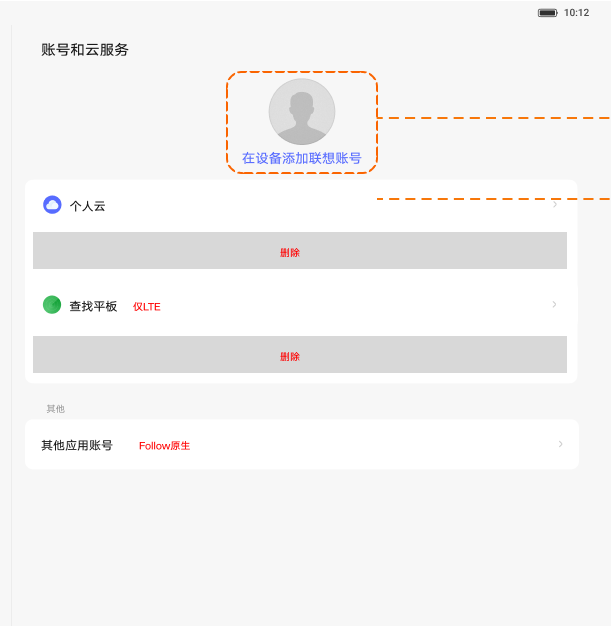
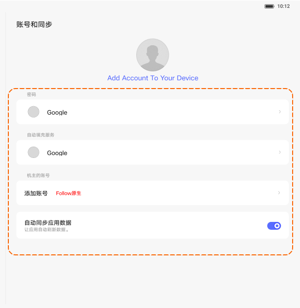

# 账号和服务／账号和同步

[App 入口](../../README.md) · [功能查找](../../functions.md) · [页面导航](../../navigation.md)

| 信息 | 内容 |
|---|---|
| 知识 ID | `settings.accounts` |
| 功能入口 | PRC：设置 > 账号和服务；ROW：账号和同步 |
| 检索词 | 账号 登录 同步 联想ID 个人云 查找平板 Google；登录联想账号；添加账号；账号同步；查找平板 |

## 进入本页

| 定位要点 | 操作依据 |
|---|---|
| 推荐路径 | PRC：设置 > 账号和服务；ROW：账号和同步 |
| 直接上级／起点 | [设置首页](../home/README.md) |
| 要找的入口 | 账号卡片／账号和服务／账号和同步 |
| 形状与相对位置 | PRC 可从搜索框下面的账号卡片进入；ROW 从导航列表的账号和同步进入。名称和是否登录按当前界面确认。 |
| 入口图示 | [上级页入口区域](../home/images/focus_01.png) |
| 到达确认 | 核对账号和服务／账号和同步标题，或登录后头像昵称；头像内容随当前账号变化。 |
| 资料覆盖 | 入口与布局级：账号入口及同步相关布局；未提供完整登录和身份验证流程。 |

点击后先核对内容区标题及上述识别特征；双栏中左侧仍显示原导航属于正常布局，不要求整屏切换。多级路径中每一步均按当前界面重新定位。

## 页面识别与布局

PRC 顶部为账号头像／添加联想账号，下方为个人云、查找平板、其他应用账号；ROW 或商用设备可能使用账号和同步列表。已登录时可见头像／昵称。

## 关键控件：形状、位置与操作目标

位置均相对**当前页面的内容区或弹窗**，不是固定屏幕坐标。颜色只是辅助线索；优先结合标签、控件形状及相邻元素识别。

| 控件／入口 | 外观特征 | 相对位置 | 操作目标／状态区别 | 局部图 |
|---|---|---|---|---|
| 账号头像 | 圆形头像，下方蓝色添加／登录文字 | 内容上部居中 | 点击头像或对应文字，核对实际跳转 | [图 1](./images/focus_01.png) |
| 其他应用账号 | 独立圆角文字行，右端箭头 | 服务项下方 | 进入其他账号管理 | [图 1](./images/focus_01.png) |
| 同步账号 | 图标＋账号文字的列表行 | 账号和同步卡片内 | 点具体账号，区别于底部自动同步开关 | [图 2](./images/focus_02.png) |
| 自动同步 | 行右侧胶囊开关 | 同步列表底部 | 直接修改同步状态 | [图 2](./images/focus_02.png) |

## 操作与结果

| 操作目的 | 如何操作 | 页面变化／结果 |
|---|---|---|
| 进入账号操作 | 按当前页面选择头像、添加账号或已有账号 | 进入对应账号服务 |
| 查同步设置 | 在账号和同步布局中定位对应账号或同步项 | 进入该账号同步设置 |
| 查找设备 | 在支持 LTE 等能力的页面查找平板入口 | 进入相应服务 |

## 入口找不到时的排查顺序

1. 确认起点为[设置首页](../home/README.md)，在“进入本页”注明的区域定位／滚动。
2. 先区分账号卡片、账号服务与同步列表；登录后出现的头像昵称属于动态数据；跳出设置后重新识别App。
3. 核对下方出现条件；仍无匹配时按[导航中的搜索与返回策略](../../navigation.md)诊断。只有用例允许时才改变前置条件或使用替代入口；无新线索则按[资料不足处理](../../limitations.md)记录阻塞。

## 交互常识与出现条件

登录和身份验证完整流程未提供；跨 App 后重新确认目标包名和页面。

## 返回与继续导航

上级资料：[设置首页](../home/README.md)。本文件若包含子页或弹窗，返回可能先到内部上一级；按实际标题确认，不假定一次返回就到上述起点。保存与取消规则见“操作与结果”，公共策略见[页面导航](../../navigation.md)。

## 相关页面

[备份](../../pages/backup/README.md)、[设置首页](../../pages/home/README.md)。

## 控件局部图

每张图聚焦上表对应的页面区域，保留标题或相邻标签作为定位参照。原图里的编号、虚线和箭头是设计说明，不是 App 控件。

### 图 1：账号和服务的头像与入口

### 图 2：账号和同步列表

## 资料来源（无需常规加载）

[S11](../../sources/S11.png)；原文件映射见[来源表](../../sources.md)。
