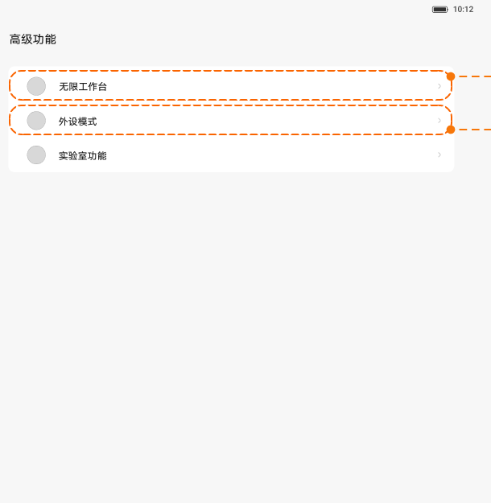
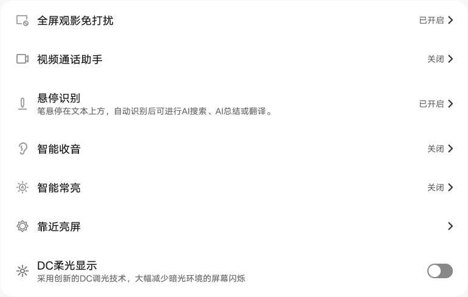
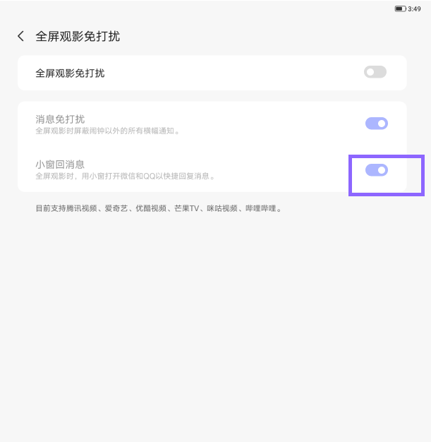

# 高级功能与实验室

[App 入口](../../README.md) · [功能查找](../../functions.md) · [页面导航](../../navigation.md)

| 信息 | 内容 |
|---|---|
| 知识 ID | `settings.advanced` |
| 功能入口 | 设置 > 高级功能 > 实验室功能 |
| 检索词 | 高级 实验室 无界工作台 外设 全屏观影 小窗 智能收音 屏蔽通知 DC；实验室；观影免打扰；智能收音；应用内屏蔽通知；DC柔光 |

## 进入本页

| 定位要点 | 操作依据 |
|---|---|
| 推荐路径 | 设置 > 高级功能 > 实验室功能 |
| 直接上级／起点 | [设置首页](../home/README.md) |
| 要找的入口 | 高级功能 → 实验室功能（按任务需要） |
| 形状与相对位置 | 先点导航中的高级功能，再在内容区选择实验室功能；无界工作台和外设模式为同级的其他入口。 |
| 入口图示 | [上级页入口区域](../home/images/focus_02.png) |
| 到达确认 | 高级功能页出现无界工作台、外设模式、实验室等入口；进入实验室后看到横幅下的功能列表。 |
| 资料覆盖 | 覆盖范围以本页列出的入口、控件和操作反馈为限；未列出的子流程不视为已知。 |

点击后先核对内容区标题及上述识别特征；双栏中左侧仍显示原导航属于正常布局，不要求整屏切换。多级路径中每一步均按当前界面重新定位。

## 页面识别与布局

高级功能内有无界工作台、外设模式和实验室功能。实验室以列表提供观影免打扰、视频通话助手、智能收音、常亮、靠近亮屏等；ROW 可能另有 AI 服务、距离提醒和应用内屏蔽通知。

## 关键控件：形状、位置与操作目标

位置均相对**当前页面的内容区或弹窗**，不是固定屏幕坐标。颜色只是辅助线索；优先结合标签、控件形状及相邻元素识别。

| 控件／入口 | 外观特征 | 相对位置 | 操作目标／状态区别 | 局部图 |
|---|---|---|---|---|
| 高级功能入口 | 每行带文字及右箭头 | 高级功能内容上部 | 无界工作台、外设模式、实验室为不同入口 | [图 1](./images/focus_01.png) |
| 实验室列表 | 左侧线形图标＋标题；右端状态和箭头 | 蓝色实验图案横幅下方 | 点击箭头型行进入子页 | [图 2](./images/focus_02.png) |
| DC 柔光显示 | 标题和说明，右端胶囊开关 | 实验室列表底部 | 直接切换，区别于其他跳页条目 | [图 2](./images/focus_02.png) |
| 观影子项 | 主开关下的消息免打扰、小窗回消息开关 | 观影免打扰子页内容上部 | 先核对主开关，再操作目标子项 | [图 3](./images/focus_03.png) |

## 操作与结果

| 操作目的 | 如何操作 | 页面变化／结果 |
|---|---|---|
| 配置观影免打扰 | 进入全屏观影免打扰，操作总开关及消息／小窗子项 | 观影场景按所选规则处理通知 |
| 配置智能收音 | 进入智能收音；也可长按控制中心对应磁贴 | 进入设置；切换方向出现前方／全向反馈 |
| 选择需要屏蔽通知的应用 | 打开应用内屏蔽通知总开关，再在已选／可添加区域操作 | 显示应用网格，加入或移除所选应用 |
| 总开关关闭后找不到应用列表 | 先打开总开关 | 应用网格显示 |

## 入口找不到时的排查顺序

1. 确认起点为[设置首页](../home/README.md)，在“进入本页”注明的区域定位／滚动。
2. 先选高级功能，再选实验室；应用网格缺失时读应用内屏蔽通知总开关；加减号含义不足时结合分组确认。
3. 核对下方出现条件；仍无匹配时按[导航中的搜索与返回策略](../../navigation.md)诊断。只有用例允许时才改变前置条件或使用替代入口；无新线索则按[资料不足处理](../../limitations.md)记录阻塞。

## 交互常识与出现条件

PRC 观影免打扰：LTE 保留来电和闹钟例外，Wi-Fi 保留闹钟。应用列表新加入项靠前、卸载项移除。加减号含义在设计中不一致，操作前结合所属分组及操作后移动结果确认。

## 返回与继续导航

上级资料：[设置首页](../home/README.md)。本文件若包含子页或弹窗，返回可能先到内部上一级；按实际标题确认，不假定一次返回就到上述起点。保存与取消规则见“操作与结果”，公共策略见[页面导航](../../navigation.md)。

## 从这里继续找子功能

下表链接到各目标页的进入方法；条件性分支以目标页为准。

| 要找的入口 | 目标资料 |
|---|---|
| ROW：实验室内智能常亮／靠近亮屏／距离提醒 | [智能常亮、靠近亮屏与距离提醒](../presence/README.md) |

## 相关页面

[智能常亮、靠近亮屏与距离提醒](../../pages/presence/README.md)、[AI 智慧服务](../../pages/ai_services/README.md)、[控制中心及跨页状态同步](../../features/control_center_sync/README.md)。

## 控件局部图

每张图聚焦上表对应的页面区域，保留标题或相邻标签作为定位参照。原图里的编号、虚线和箭头是设计说明，不是 App 控件。

### 图 1：高级功能入口

### 图 2：实验室功能列表

### 图 3：观影免打扰开关

## 资料来源（无需常规加载）

[S04](../../sources/S04.png)、[S40](../../sources/S40.png)；原文件映射见[来源表](../../sources.md)。
