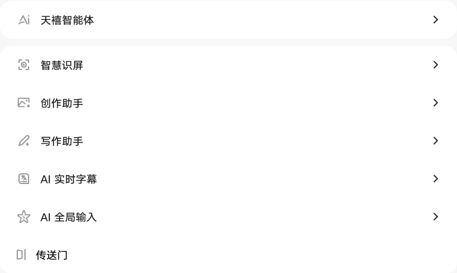
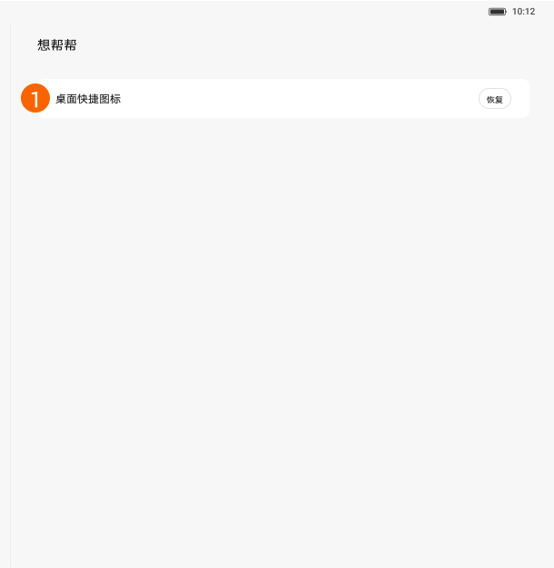

# AI 智慧服务

[App 入口](../../README.md) · [功能查找](../../functions.md) · [页面导航](../../navigation.md)

| 信息 | 内容 |
|---|---|
| 知识 ID | `settings.ai_services` |
| 功能入口 | PRC：设置 > AI 智慧服务 |
| 检索词 | AI 天禧智能体 智慧识屏 创作助手 写作助手 字幕 全局输入 传送门 想帮帮；AI字幕；智慧识屏；写作助手；恢复AI桌面图标 |

## 进入本页

| 定位要点 | 操作依据 |
|---|---|
| 推荐路径 | PRC：设置 > AI 智慧服务 |
| 直接上级／起点 | [设置首页](../home/README.md) |
| 要找的入口 | PRC：AI 智慧服务 |
| 形状与相对位置 | 分组导航中的 AI 智慧服务行；ROW 的部分服务改从高级功能中的实验室查找。 |
| 入口图示 | [上级页入口区域](../home/images/focus_02.png) |
| 到达确认 | PRC 页面以列表提供天禧智能体、智慧识屏、创作助手、写作助手、AI 实时字幕、AI 全局输入、传送门、想帮帮等入口。ROW 部分 AI 入口位于实验室。 |
| 资料覆盖 | 入口级为主：服务列表和部分图标管理；各服务内部完整操作未提供。 |

点击后先核对内容区标题及上述识别特征；双栏中左侧仍显示原导航属于正常布局，不要求整屏切换。多级路径中每一步均按当前界面重新定位。

ROW 的部分 AI 功能可在[高级功能与实验室](../advanced/README.md)查找，不要求出现 PRC 一级入口。

## 页面识别与布局

PRC 页面以列表提供天禧智能体、智慧识屏、创作助手、写作助手、AI 实时字幕、AI 全局输入、传送门、想帮帮等入口。ROW 部分 AI 入口位于实验室。

## 关键控件：形状、位置与操作目标

位置均相对**当前页面的内容区或弹窗**，不是固定屏幕坐标。颜色只是辅助线索；优先结合标签、控件形状及相邻元素识别。

| 控件／入口 | 外观特征 | 相对位置 | 操作目标／状态区别 | 局部图 |
|---|---|---|---|---|
| AI 服务行 | 灰色线形图标＋名称＋右尖括号 | 右侧白色圆角卡片内 | 点击对应整行 | [图 1](./images/focus_01.png) |
| 天禧智能体 | 单独圆角入口行 | AI 功能列表最上方 | 区别于下方合并卡片 | [图 1](./images/focus_01.png) |
| 想帮帮 | 独立圆角行，左侧图标，右侧箭头 | 服务列表下面 | 点入口后检查恢复／打开按钮 | [图 2](./images/focus_02.png) |
| 恢复／打开 | 行右端的小圆角文字按钮 | 想帮帮页面的桌面图标行 | 恢复后变打开，二者结果不同 | [图 3](./images/focus_03.png) |

## 操作与结果

| 操作目的 | 如何操作 | 页面变化／结果 |
|---|---|---|
| 进入 AI 功能 | 按功能名称选择列表项 | 进入对应功能，完整目标 UX 需另查 |
| 恢复想帮帮图标 | 在桌面缺图标时使用恢复操作 | 恢复图标后按钮变为打开 |
| 启动想帮帮 | 按钮已为打开时点击 | 启动对应应用 |

## 入口找不到时的排查顺序

1. 确认起点为[设置首页](../home/README.md)，在“进入本页”注明的区域定位／滚动。
2. PRC查AI智慧服务；ROW部分入口在实验室；区分启动服务与恢复桌面图标。
3. 核对下方出现条件；仍无匹配时按[导航中的搜索与返回策略](../../navigation.md)诊断。只有用例允许时才改变前置条件或使用替代入口；无新线索则按[资料不足处理](../../limitations.md)记录阻塞。

## 交互常识与出现条件

按实际可见列表定位，不要求所有设备提供全部服务。区分恢复桌面图标与启动应用两个动作。

## 返回与继续导航

上级资料：[设置首页](../home/README.md)。本文件若包含子页或弹窗，返回可能先到内部上一级；按实际标题确认，不假定一次返回就到上述起点。保存与取消规则见“操作与结果”，公共策略见[页面导航](../../navigation.md)。

## 相关页面

[高级功能与实验室](../../pages/advanced/README.md)。

## 控件局部图

每张图聚焦上表对应的页面区域，保留标题或相邻标签作为定位参照。原图里的编号、虚线和箭头是设计说明，不是 App 控件。

### 图 1：AI 服务入口列表

### 图 2：想帮帮独立入口

### 图 3：想帮帮恢复按钮

## 资料来源（无需常规加载）

[S03](../../sources/S03.png)、[S21](../../sources/S21.png)；原文件映射见[来源表](../../sources.md)。
