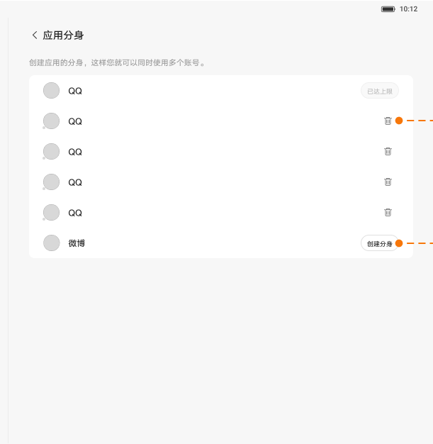

# 应用分身

[App 入口](../../README.md) · [功能查找](../../functions.md) · [页面导航](../../navigation.md)

| 信息 | 内容 |
|---|---|
| 知识 ID | `settings.app_clone` |
| 功能入口 | PRC：设置 > 应用管理 > 应用分身 |
| 检索词 | 应用分身 克隆 多开 创建 删除 内存；应用多开；双开；创建分身；删除分身 |

## 进入本页

| 定位要点 | 操作依据 |
|---|---|
| 推荐路径 | PRC：设置 > 应用管理 > 应用分身 |
| 直接上级／起点 | [应用管理](../app_management/README.md) |
| 要找的入口 | 应用分身（PRC） |
| 形状与相对位置 | 应用管理顶部横排快捷入口，圆形图标＋应用分身文字。 |
| 入口图示 | [上级页入口区域](../app_management/images/focus_01.png) |
| 到达确认 | 页面按应用组织分身相关操作；创建按钮在达到数量上限后不可用。 |
| 资料覆盖 | 覆盖范围以本页列出的入口、控件和操作反馈为限；未列出的子流程不视为已知。 |

点击后先核对内容区标题及上述识别特征；双栏中左侧仍显示原导航属于正常布局，不要求整屏切换。多级路径中每一步均按当前界面重新定位。

## 页面识别与布局

页面按应用组织分身相关操作；创建按钮在达到数量上限后不可用。

## 关键控件：形状、位置与操作目标

位置均相对**当前页面的内容区或弹窗**，不是固定屏幕坐标。颜色只是辅助线索；优先结合标签、控件形状及相邻元素识别。

| 控件／入口 | 外观特征 | 相对位置 | 操作目标／状态区别 | 局部图 |
|---|---|---|---|---|
| 应用／分身条目 | 左侧圆形应用图标，右侧操作文字或按钮 | 分身页列表区域 | 按应用名称确定所属组 | [图 1](./images/focus_01.png) |
| 创建入口 | 行末端的小按钮／文字 | 对应应用行右侧 | 达到上限后变灰不可用 | [图 1](./images/focus_01.png) |
| 删除入口 | 垃圾桶形图标 | 已有分身行右侧 | 点后有删除数据确认 | [图 1](./images/focus_01.png) |
| 内存提醒 | 居中白色弹窗，下方两个文字按钮 | 遮罩上方 | 取消在左、继续创建在右 | [图 2](./images/focus_02.png) |

## 操作与结果

| 操作目的 | 如何操作 | 页面变化／结果 |
|---|---|---|
| 创建分身 | 选择支持的应用并创建；若出现内存提醒，按任务选择取消或继续 | 继续后进入加载，完成时桌面出现带分身标识的图标 |
| 删除分身 | 选择移除，并处理删除分身数据确认 | 确认后执行移除 |
| 创建按钮不可点 | 核对该应用已有分身数量 | 每个应用最多 4 个分身，达上限禁用 |

## 入口找不到时的排查顺序

1. 确认起点为[应用管理](../app_management/README.md)，在“进入本页”注明的区域定位／滚动。
2. 先查PRC入口和支持应用；创建按钮不可用时检查数量上限；取消创建提示不会创建分身。
3. 核对下方出现条件；仍无匹配时按[导航中的搜索与返回策略](../../navigation.md)诊断。只有用例允许时才改变前置条件或使用替代入口；无新线索则按[资料不足处理](../../limitations.md)记录阻塞。

## 交互常识与出现条件

PRC 功能。取消创建提醒不创建新分身。名称编号及支持应用名单未确定，不按固定名字识别分身。

## 返回与继续导航

上级资料：[应用管理](../app_management/README.md)。本文件若包含子页或弹窗，返回可能先到内部上一级；按实际标题确认，不假定一次返回就到上述起点。保存与取消规则见“操作与结果”，公共策略见[页面导航](../../navigation.md)。

## 相关页面

[应用管理](../../pages/app_management/README.md)。

## 控件局部图

每张图聚焦上表对应的页面区域，保留标题或相邻标签作为定位参照。原图里的编号、虚线和箭头是设计说明，不是 App 控件。

### 图 1：应用分身列表和创建入口

### 图 2：高内存应用创建提醒

## 资料来源（无需常规加载）

[S05](../../sources/S05.png)；原文件映射见[来源表](../../sources.md)。
