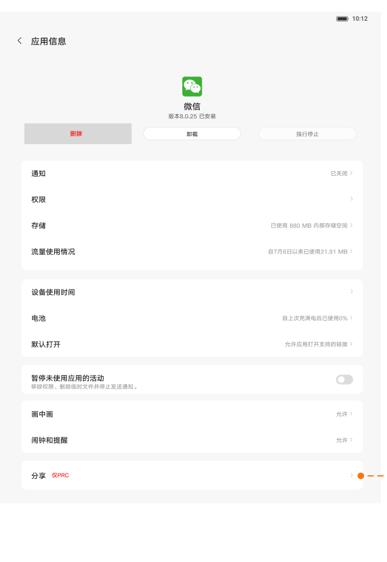

# 应用信息

[App 入口](../../README.md) · [功能查找](../../functions.md) · [页面导航](../../navigation.md)

| 信息 | 内容 |
|---|---|
| 知识 ID | `settings.app_info` |
| 功能入口 | 设置 > 应用管理 > 所有应用 > 目标应用 |
| 检索词 | 应用详情 版本 卸载 强行停止 存储 权限 流量 电池 画中画；卸载应用；强行停止；应用权限；应用存储；应用通知；画中画 |

## 进入本页

| 定位要点 | 操作依据 |
|---|---|
| 推荐路径 | 设置 > 应用管理 > 所有应用 > 目标应用 |
| 直接上级／起点 | [应用管理](../app_management/README.md) |
| 要找的入口 | 所有应用 → 目标应用 |
| 形状与相对位置 | 所有应用入口在快捷入口／最近应用区域下方；进入后在图标＋名称列表中选择目标应用。系统应用必要时先打开右上三点菜单。 |
| 入口图示 | [上级页入口区域](../app_management/images/focus_02.png) |
| 到达确认 | 应用信息顶部的图标和名称与目标应用一致，下方出现通知／权限／存储等设置行。 |
| 资料覆盖 | 覆盖应用信息主页面；存储清理、权限等深层页面仅有入口。 |

点击后先核对内容区标题及上述识别特征；双栏中左侧仍显示原导航属于正常布局，不要求整屏切换。多级路径中每一步均按当前界面重新定位。

## 页面识别与布局

顶部为应用图标、名称、版本及卸载／强行停止按钮；下方是通知、权限、存储、流量、电池、默认打开、未使用活动、画中画等行。

## 关键控件：形状、位置与操作目标

位置均相对**当前页面的内容区或弹窗**，不是固定屏幕坐标。颜色只是辅助线索；优先结合标签、控件形状及相邻元素识别。

| 控件／入口 | 外观特征 | 相对位置 | 操作目标／状态区别 | 局部图 |
|---|---|---|---|---|
| 应用身份 | 居中应用图标，下面为名称和版本 | 内容区顶部 | 先确认应用，再执行任何操作 | [图 1](./images/focus_01.png) |
| 卸载／强行停止 | 文字居中的横向胶囊按钮 | 应用身份下方同一行 | 按标签定位；按钮可能禁用。图中灰色遮挡且标注删除的区域不作为入口 | [图 1](./images/focus_01.png) |
| 子设置 | 白色分组卡片中的文字行，右端摘要／箭头 | 按钮行下方 | 权限、存储、流量等分别进入 | [图 1](./images/focus_01.png) |
| 暂停未使用活动 | 带解释文字的开关行 | 默认打开附近 | 直接开关，区别于周围跳页行 | [图 1](./images/focus_01.png) |

## 操作与结果

| 操作目的 | 如何操作 | 页面变化／结果 |
|---|---|---|
| 确定正在操作正确应用 | 核对顶部名称、图标和版本 | 确认目标应用身份 |
| 进入应用子设置 | 点击权限、存储、通知等对应行 | 进入该应用的相关设置 |
| 卸载或强停 | 使用顶部对应按钮，并按实际确认弹窗操作 | 按钮可用性依应用类型；完整确认文案未提供 |
| 分享应用（PRC） | 找到分享入口 | 进入联想闪传相关弹窗／流程 |

## 入口找不到时的排查顺序

1. 确认起点为[应用管理](../app_management/README.md)，在“进入本页”注明的区域定位／滚动。
2. 先从所有应用按名称识别目标，不点最近列表中的同类应用替代；系统应用按钮可能禁用。
3. 核对下方出现条件；仍无匹配时按[导航中的搜索与返回策略](../../navigation.md)诊断。只有用例允许时才改变前置条件或使用替代入口；无新线索则按[资料不足处理](../../limitations.md)记录阻塞。

## 交互常识与出现条件

系统应用与第三方应用按钮可用性不同。子设置不一定全部显示。未提供存储清理、权限授权的完整子流程。

## 返回与继续导航

上级资料：[应用管理](../app_management/README.md)。本文件若包含子页或弹窗，返回可能先到内部上一级；按实际标题确认，不假定一次返回就到上述起点。保存与取消规则见“操作与结果”，公共策略见[页面导航](../../navigation.md)。

## 相关页面

[应用管理](../../pages/app_management/README.md)、[默认应用](../../pages/default_apps/README.md)。

## 控件局部图

每张图聚焦上表对应的页面区域，保留标题或相邻标签作为定位参照。原图里的编号、虚线和箭头是设计说明，不是 App 控件。

### 图 1：应用信息按钮与子设置列表

## 资料来源（无需常规加载）

[S05](../../sources/S05.png)；原文件映射见[来源表](../../sources.md)。
