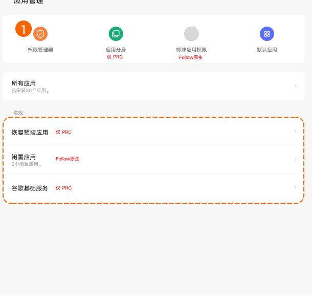
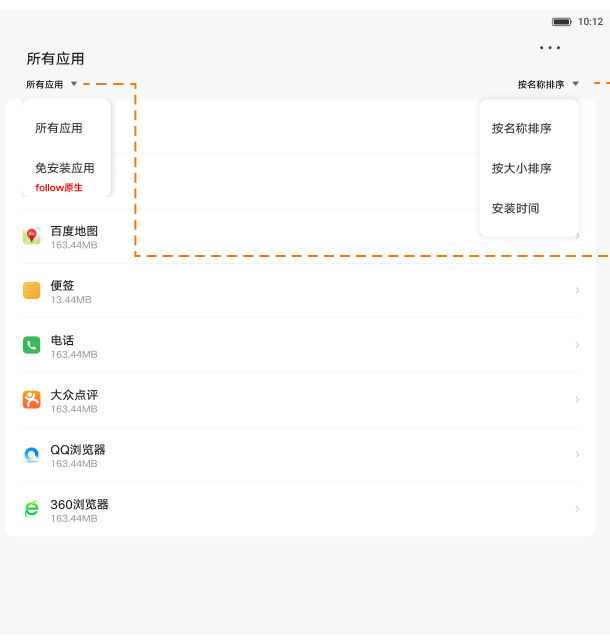
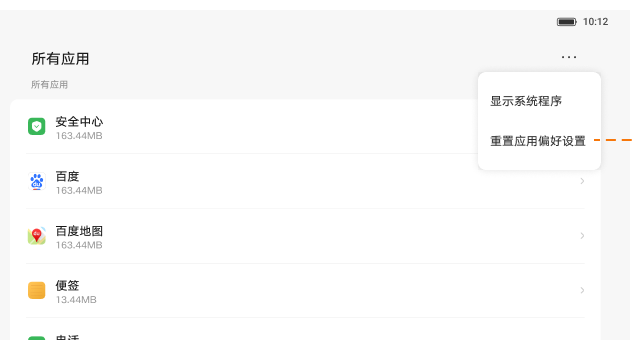

# 应用管理

[App 入口](../../README.md) · [功能查找](../../functions.md) · [页面导航](../../navigation.md)

| 信息 | 内容 |
|---|---|
| 知识 ID | `settings.app_management` |
| 功能入口 | 设置 > 应用管理 |
| 检索词 | 应用列表 所有应用 最近 未使用 恢复预装 排序 系统应用；找所有应用；显示系统应用；应用排序；恢复预装应用 |

## 进入本页

| 定位要点 | 操作依据 |
|---|---|
| 推荐路径 | 设置 > 应用管理 |
| 直接上级／起点 | [设置首页](../home/README.md) |
| 要找的入口 | 应用管理 |
| 形状与相对位置 | 首页的分组导航列表；图标＋模块名称所在行。双栏在左侧，向下滚动导航区查找。 |
| 入口图示 | [上级页入口区域](../home/images/focus_02.png) |
| 到达确认 | 顶部快捷项包括权限管理器、应用分身、特殊应用权限、默认应用；下方是最多 6 个最近应用、所有应用，以及支持的恢复预装／未使用的应用等入口。 |
| 资料覆盖 | 覆盖范围以本页列出的入口、控件和操作反馈为限；未列出的子流程不视为已知。 |

点击后先核对内容区标题及上述识别特征；双栏中左侧仍显示原导航属于正常布局，不要求整屏切换。多级路径中每一步均按当前界面重新定位。

## 页面识别与布局

顶部快捷项包括权限管理器、应用分身、特殊应用权限、默认应用；下方是最多 6 个最近应用、所有应用，以及支持的恢复预装／未使用的应用等入口。

## 关键控件：形状、位置与操作目标

位置均相对**当前页面的内容区或弹窗**，不是固定屏幕坐标。颜色只是辅助线索；优先结合标签、控件形状及相邻元素识别。

| 控件／入口 | 外观特征 | 相对位置 | 操作目标／状态区别 | 局部图 |
|---|---|---|---|---|
| 顶部快捷入口 | 四个圆形图标及图标下方文字 | 应用管理标题下方横排 | 权限管理器、分身、特殊权限、默认应用分别定位 | [图 1](./images/focus_01.png) |
| 所有应用 | 独立文字行，右端箭头 | 快捷入口／最近应用区域下方 | 进入完整列表，区别于最近应用项 | [图 1](./images/focus_01.png) |
| 筛选／排序 | 带下三角的小文字入口 | 所有应用页标题下面：筛选偏左、排序偏右 | 点对应菜单再选规则 | [图 2](./images/focus_02.png) |
| 更多 | 横向三点图标 | 所有应用内容栏右上角 | 弹出显示系统程序、重置应用偏好等菜单 | [图 3](./images/focus_03.png) |
| 应用项 | 图标＋名称＋较小的容量文字 | 筛选工具栏下方列表 | 按应用身份点击 | [图 2](./images/focus_02.png) |

## 操作与结果

| 操作目的 | 如何操作 | 页面变化／结果 |
|---|---|---|
| 找到目标应用 | 点击所有应用，按名称查找并点击 | 进入应用信息 |
| 调整列表顺序 | 选择按名称、大小或安装时间排序 | 列表立即按所选规则排序 |
| 查系统应用 | 打开更多菜单，选择显示系统应用 | 系统项可供查找 |
| 重置应用偏好 | 在更多菜单选择重置应用偏好 | 进入相应确认流程 |

## 入口找不到时的排查顺序

1. 确认起点为[设置首页](../home/README.md)，在“进入本页”注明的区域定位／滚动。
2. 最近列表不是完整列表；进入所有应用；系统应用查右上三点菜单中的显示系统程序／应用。
3. 核对下方出现条件；仍无匹配时按[导航中的搜索与返回策略](../../navigation.md)诊断。只有用例允许时才改变前置条件或使用替代入口；无新线索则按[资料不足处理](../../limitations.md)记录阻塞。

## 交互常识与出现条件

存在即时应用时才有对应筛选。权限管理器可跳安全中心。分身、恢复预装、谷歌基础服务有地区限制；不能把未出现在最近列表理解为未安装。

## 返回与继续导航

上级资料：[设置首页](../home/README.md)。本文件若包含子页或弹窗，返回可能先到内部上一级；按实际标题确认，不假定一次返回就到上述起点。保存与取消规则见“操作与结果”，公共策略见[页面导航](../../navigation.md)。

## 从这里继续找子功能

下表链接到各目标页的进入方法；条件性分支以目标页为准。

| 要找的入口 | 目标资料 |
|---|---|
| 默认应用 | [默认应用](../default_apps/README.md) |
| 应用分身（PRC） | [应用分身](../app_clone/README.md) |
| 所有应用 → 目标应用 | [应用信息](../app_info/README.md) |

## 相关页面

[应用信息](../../pages/app_info/README.md)、[应用分身](../../pages/app_clone/README.md)、[默认应用](../../pages/default_apps/README.md)、[重置选项](../../pages/reset/README.md)。

## 控件局部图

每张图聚焦上表对应的页面区域，保留标题或相邻标签作为定位参照。原图里的编号、虚线和箭头是设计说明，不是 App 控件。

### 图 1：顶部快捷入口和所有应用

### 图 2：所有应用的筛选与排序

### 图 3：更多菜单

## 资料来源（无需常规加载）

[S05](../../sources/S05.png)；原文件映射见[来源表](../../sources.md)。
