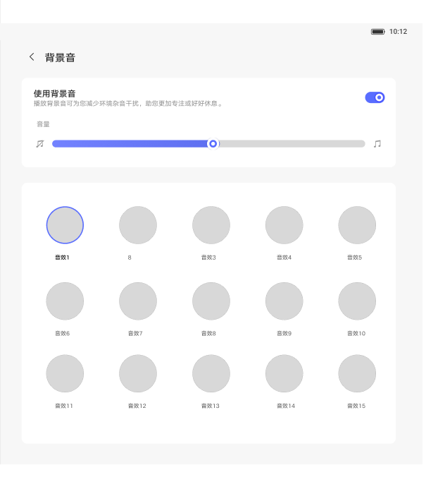

# 背景音（仅入口存在时）

[App 入口](../../README.md) · [功能查找](../../functions.md) · [页面导航](../../navigation.md)

| 信息 | 内容 |
|---|---|
| 知识 ID | `settings.background_sound` |
| 功能入口 | 设置 > 声音和振动 > 背景音 |
| 检索词 | 背景音 白噪音 阅读 放松 音源；白噪音；环境音；背景音源 |

## 进入本页

| 定位要点 | 操作依据 |
|---|---|
| 推荐路径 | 设置 > 声音和振动 > 背景音 |
| 直接上级／起点 | [声音和振动](../sound/README.md) |
| 要找的入口 | 背景音 |
| 形状与相对位置 | 声音内容区的功能列表。杜比和模式位于静音卡片下面；背景音仅在实际提供该入口时进入，固定排序未确认。 |
| 入口图示 | [上级页入口区域](../sound/images/focus_02.png) |
| 到达确认 | 内容区实际出现背景音标题、使用背景音开关、音量滑块和音源网格。 |
| 资料覆盖 | 覆盖范围以本页列出的入口、控件和操作反馈为限；未列出的子流程不视为已知。 |

点击后先核对内容区标题及上述识别特征；双栏中左侧仍显示原导航属于正常布局，不要求整屏切换。多级路径中每一步均按当前界面重新定位。

## 页面识别与布局

仅在当前设备确实显示“背景音”入口时使用本页。页面有总开关、音源网格和音量设置。

## 关键控件：形状、位置与操作目标

位置均相对**当前页面的内容区或弹窗**，不是固定屏幕坐标。颜色只是辅助线索；优先结合标签、控件形状及相邻元素识别。

| 控件／入口 | 外观特征 | 相对位置 | 操作目标／状态区别 | 局部图 |
|---|---|---|---|---|
| 总开关 | 背景音行右端开关 | 内容上部 | 只在实际存在该入口时操作 | [图 1](./images/focus_01.png) |
| 音源 | 多个可选图案／音源项组成网格 | 总开关下方 | 先开主开关，再选音源 | [图 1](./images/focus_01.png) |
| 音量 | 水平滑动控件 | 音源区域附近 | 按实际轨道调节，默认值未确定 | [图 1](./images/focus_01.png) |

## 操作与结果

| 操作目的 | 如何操作 | 页面变化／结果 |
|---|---|---|
| 播放背景音 | 打开总开关并选择音源 | 播放并记忆选择 |
| 处理来电中断 | 观察通话前后播放状态 | 来电临时静音，结束后恢复 |
| 切换系统用户 | 观察背景音状态 | 停止并关闭，不自动恢复 |

## 入口找不到时的排查顺序

1. 确认起点为[声音和振动](../sound/README.md)，在“进入本页”注明的区域定位／滚动。
2. 只在声音页实际显示背景音时进入；缺失后记录当前设备未找到该入口，不把它当所有设备必备项。
3. 核对下方出现条件；仍无匹配时按[导航中的搜索与返回策略](../../navigation.md)诊断。只有用例允许时才改变前置条件或使用替代入口；无新线索则按[资料不足处理](../../limitations.md)记录阻塞。

## 交互常识与出现条件

不是必备入口。没有此项时不沿设计图反复寻找。音量默认值未确定。与控制中心同步，支持与其他音频混合。

## 返回与继续导航

上级资料：[声音和振动](../sound/README.md)。本文件若包含子页或弹窗，返回可能先到内部上一级；按实际标题确认，不假定一次返回就到上述起点。保存与取消规则见“操作与结果”，公共策略见[页面导航](../../navigation.md)。

## 相关页面

[声音和振动](../../pages/sound/README.md)、[控制中心及跨页状态同步](../../features/control_center_sync/README.md)。

## 控件局部图

每张图聚焦上表对应的页面区域，保留标题或相邻标签作为定位参照。原图里的编号、虚线和箭头是设计说明，不是 App 控件。

### 图 1：背景音开关、音源与音量区域

## 资料来源（无需常规加载）

[S18](../../sources/S18.png)；原文件映射见[来源表](../../sources.md)。
