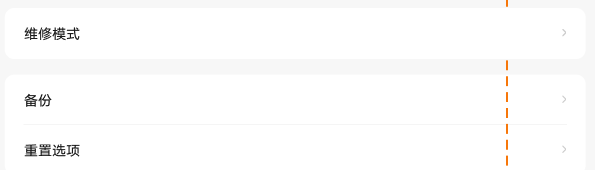

# 备份

[App 入口](../../README.md) · [功能查找](../../functions.md) · [页面导航](../../navigation.md)

| 信息 | 内容 |
|---|---|
| 知识 ID | `settings.backup` |
| 功能入口 | 设置 > 通用设置 > 备份 |
| 检索词 | 备份 云备份 联想云 Google 最近备份；云备份；联想云备份；Google备份；查看备份时间 |

## 进入本页

| 定位要点 | 操作依据 |
|---|---|
| 推荐路径 | 设置 > 通用设置 > 备份 |
| 直接上级／起点 | [通用设置](../general/README.md) |
| 要找的入口 | 备份 |
| 形状与相对位置 | 通用设置内容区的分组文字列表，右侧摘要或箭头；备份／重置等下方条目需滚动内容区查找。 |
| 入口图示 | [上级页入口区域](../general/images/focus_01.png) |
| 到达确认 | 确认当前备份或云服务页面的实际标题及所属App；设计未给出可唯一识别备份内部页面的完整控件组合。 |
| 资料覆盖 | 入口级：可定位备份及地区服务；未提供完整备份、恢复与登录流程。 |

点击后先核对内容区标题及上述识别特征；双栏中左侧仍显示原导航属于正常布局，不要求整屏切换。多级路径中每一步均按当前界面重新定位。

## 页面识别与布局

页面包含云备份入口及可能的最近完成时间。PRC 使用联想云相关服务，ROW 使用 Google 备份。

## 关键控件：形状、位置与操作目标

位置均相对**当前页面的内容区或弹窗**，不是固定屏幕坐标。颜色只是辅助线索；优先结合标签、控件形状及相邻元素识别。

| 控件／入口 | 外观特征 | 相对位置 | 操作目标／状态区别 | 局部图 |
|---|---|---|---|---|
| 备份入口 | 白色卡片内的文字行，右端箭头 | 通用设置下部、重置选项上一行 | 点击备份，避免点击相邻重置选项 | [图 1](./images/focus_01.png) |

本包只确认进入备份服务的入口；没有备份服务内部按钮的完整设计，因此不虚构“立即备份”等按钮的形状和位置。

## 操作与结果

| 操作目的 | 如何操作 | 页面变化／结果 |
|---|---|---|
| 进入备份服务 | 点击当前页面的云备份入口 | 进入对应服务 |
| 检查备份状态 | 读取页面上的完成时间和状态 | 以实际账号与当前数据显示为准 |

## 入口找不到时的排查顺序

1. 确认起点为[通用设置](../general/README.md)，在“进入本页”注明的区域定位／滚动。
2. 从通用设置查备份；按地区区分联想云和Google服务；跨App后的登录／恢复流程需要目标服务资料。
3. 核对下方出现条件；仍无匹配时按[导航中的搜索与返回策略](../../navigation.md)诊断。只有用例允许时才改变前置条件或使用替代入口；无新线索则按[资料不足处理](../../limitations.md)记录阻塞。

## 交互常识与出现条件

本包未提供完整登录、内容选择和恢复数据流程；到达目标服务后需加载相应资料。

## 返回与继续导航

上级资料：[通用设置](../general/README.md)。本文件若包含子页或弹窗，返回可能先到内部上一级；按实际标题确认，不假定一次返回就到上述起点。保存与取消规则见“操作与结果”，公共策略见[页面导航](../../navigation.md)。

## 相关页面

[账号和服务／账号和同步](../../pages/accounts/README.md)、[重置选项](../../pages/reset/README.md)。

## 控件局部图

每张图聚焦上表对应的页面区域，保留标题或相邻标签作为定位参照。原图里的编号、虚线和箭头是设计说明，不是 App 控件。

### 图 1：通用列表中的备份与重置入口

## 资料来源（无需常规加载）

[S06](../../sources/S06.png)；原文件映射见[来源表](../../sources.md)。
