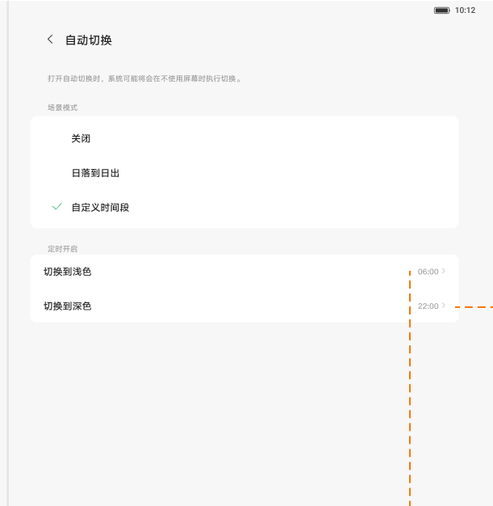
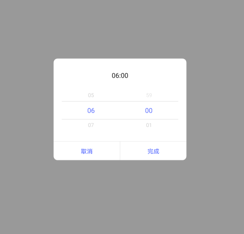

# 深浅色自动切换

[App 入口](../../README.md) · [功能查找](../../functions.md) · [页面导航](../../navigation.md)

| 信息 | 内容 |
|---|---|
| 知识 ID | `settings.dark_mode` |
| 功能入口 | 设置 > 显示和亮度 > 自动切换 |
| 检索词 | 深色 浅色 自动切换 日落 日出 定时 外观；夜间自动深色；定时切换主题；日落后深色；白天浅色 |

## 进入本页

| 定位要点 | 操作依据 |
|---|---|
| 推荐路径 | 设置 > 显示和亮度 > 自动切换 |
| 直接上级／起点 | [显示和亮度](../display/README.md) |
| 要找的入口 | 自动切换 |
| 形状与相对位置 | 浅色／深色预览卡片下面的独立设置行，右侧有当前值或箭头；点击该行。 |
| 入口图示 | [上级页入口区域](../display/images/focus_01.png) |
| 到达确认 | “自动切换”页按关闭、日落日出、自定义时间等方式选择；自定义方式提供浅色和深色启用时间。 |
| 资料覆盖 | 覆盖范围以本页列出的入口、控件和操作反馈为限；未列出的子流程不视为已知。 |

点击后先核对内容区标题及上述识别特征；双栏中左侧仍显示原导航属于正常布局，不要求整屏切换。多级路径中每一步均按当前界面重新定位。

## 页面识别与布局

“自动切换”页按关闭、日落日出、自定义时间等方式选择；自定义方式提供浅色和深色启用时间。

## 关键控件：形状、位置与操作目标

位置均相对**当前页面的内容区或弹窗**，不是固定屏幕坐标。颜色只是辅助线索；优先结合标签、控件形状及相邻元素识别。

| 控件／入口 | 外观特征 | 相对位置 | 操作目标／状态区别 | 局部图 |
|---|---|---|---|---|
| 切换方式 | 竖向选项，选中项旁有勾选标记 | 标题说明下的白色卡片 | 选择关闭、日落日出或自定义 | [图 1](./images/focus_01.png) |
| 启用时间 | 浅色和深色分别一行，右端显示时刻 | 选择自定义后，方式卡片下方 | 点击对应时刻行 | [图 1](./images/focus_01.png) |
| 时间选择器 | 居中白色弹窗，小时／分钟滚轮列 | 遮罩中央 | 滚动对应列，底部取消在左、完成在右 | [图 2](./images/focus_02.png) |

取消时间弹窗不提交选择；完成后再核对浅色／深色行的保存值。日落日出出现“计算中”时，先检查位置和网络条件。

## 操作与结果

| 操作目的 | 如何操作 | 页面变化／结果 |
|---|---|---|
| 按时间切换外观 | 选择自定义时间，编辑浅色／深色时刻并完成 | 保存时间，按当前时段应用外观 |
| 按日落日出切换 | 选择日落日出，按提示启用所需位置服务 | 获取切换时间；离线可显示计算中 |
| 停止自动切换 | 关闭自动切换 | 不再按该计划切换 |

## 入口找不到时的排查顺序

1. 确认起点为[显示和亮度](../display/README.md)，在“进入本页”注明的区域定位／滚动。
2. 日落日出不可用时查位置服务和已出现的定位授权提示；自定义时间要先选择自定义方式。
3. 核对下方出现条件；仍无匹配时按[导航中的搜索与返回策略](../../navigation.md)诊断。只有用例允许时才改变前置条件或使用替代入口；无新线索则按[资料不足处理](../../limitations.md)记录阻塞。

## 交互常识与出现条件

日落日出依赖定位，PRC 首次可能出现百度定位授权。关闭位置会使该自动计划恢复关闭。不要把示例时刻当作用户当前设置；外观还可能被控制中心或小组件改变。

## 返回与继续导航

上级资料：[显示和亮度](../display/README.md)。本文件若包含子页或弹窗，返回可能先到内部上一级；按实际标题确认，不假定一次返回就到上述起点。保存与取消规则见“操作与结果”，公共策略见[页面导航](../../navigation.md)。

## 相关页面

[位置信息](../../pages/location/README.md)、[深浅模式桌面小组件](../../features/dark_widget/README.md)、[控制中心及跨页状态同步](../../features/control_center_sync/README.md)。

## 控件局部图

每张图聚焦上表对应的页面区域，保留标题或相邻标签作为定位参照。原图里的编号、虚线和箭头是设计说明，不是 App 控件。

### 图 1：自动切换方式与自定义时刻

### 图 2：时间选择弹窗

## 资料来源（无需常规加载）

[S17](../../sources/S17.png)、[S12](../../sources/S12.png)；原文件映射见[来源表](../../sources.md)。
