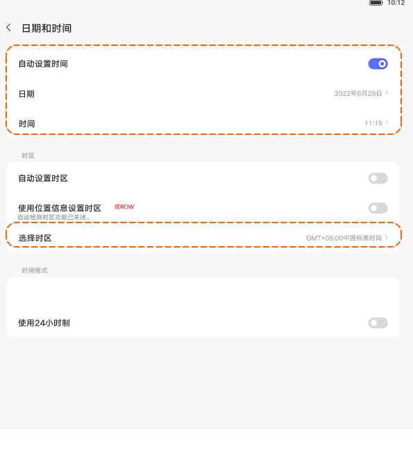

# 日期和时间

[App 入口](../../README.md) · [功能查找](../../functions.md) · [页面导航](../../navigation.md)

| 信息 | 内容 |
|---|---|
| 知识 ID | `settings.date_time` |
| 功能入口 | 设置 > 通用设置 > 日期和时间 |
| 检索词 | 时间 日期 时区 自动时间 位置时区；手动改时间；关闭自动时间；时区；24小时制 |

## 进入本页

| 定位要点 | 操作依据 |
|---|---|
| 推荐路径 | 设置 > 通用设置 > 日期和时间 |
| 直接上级／起点 | [通用设置](../general/README.md) |
| 要找的入口 | 日期和时间 |
| 形状与相对位置 | 通用设置内容区的分组文字列表，右侧摘要或箭头；备份／重置等下方条目需滚动内容区查找。 |
| 入口图示 | [上级页入口区域](../general/images/focus_01.png) |
| 到达确认 | 页面按自动时间、日期／时间、时区、时间格式分组，包含使用 24 小时制。 |
| 资料覆盖 | 覆盖范围以本页列出的入口、控件和操作反馈为限；未列出的子流程不视为已知。 |

点击后先核对内容区标题及上述识别特征；双栏中左侧仍显示原导航属于正常布局，不要求整屏切换。多级路径中每一步均按当前界面重新定位。

## 页面识别与布局

页面按自动时间、日期／时间、时区、时间格式分组，包含使用 24 小时制。

## 关键控件：形状、位置与操作目标

位置均相对**当前页面的内容区或弹窗**，不是固定屏幕坐标。颜色只是辅助线索；优先结合标签、控件形状及相邻元素识别。

| 控件／入口 | 外观特征 | 相对位置 | 操作目标／状态区别 | 局部图 |
|---|---|---|---|---|
| 自动时间 | 首行右端胶囊开关 | 日期和时间卡片顶部 | 关闭后下面日期／时间由灰变可编辑 | [图 1](./images/focus_01.png) |
| 日期／时间 | 文字行，右端为当前值 | 自动时间下面两行 | 点击对应行编辑 | [图 1](./images/focus_01.png) |
| 时区 | 自动项与选择时区行组成一组 | 日期／时间组下面 | 先判断是否存在自动时区和位置时区 | [图 1](./images/focus_01.png) |
| 24 小时制 | 单独的开关行 | 时间格式分组 | 改变显示格式，不是调整当前时间 | [图 1](./images/focus_01.png) |

## 操作与结果

| 操作目的 | 如何操作 | 页面变化／结果 |
|---|---|---|
| 手动修改日期或时间 | 先关闭自动设置时间，再点击日期／时间 | 原禁用项可编辑 |
| 手动设置时区 | 在有自动时区的页面先关闭相应自动项，再选择时区 | 手动时区入口可用 |
| 使用位置时区（ROW） | 打开使用位置信息设置时区；缺位置时按提示跳位置设置 | 满足位置条件后才能使用 |
| 切换时间格式 | 操作使用 24 小时制开关 | 时间显示格式改变 |

## 入口找不到时的排查顺序

1. 确认起点为[通用设置](../general/README.md)，在“进入本页”注明的区域定位／滚动。
2. 手动日期／时间不可用先检查自动时间；时区开关是否存在取决于地区及LTE/Wi-Fi能力。
3. 核对下方出现条件；仍无匹配时按[导航中的搜索与返回策略](../../navigation.md)诊断。只有用例允许时才改变前置条件或使用替代入口；无新线索则按[资料不足处理](../../limitations.md)记录阻塞。

## 交互常识与出现条件

自动时间开启时日期／时间禁用。PRC Wi-Fi 可直接提供手动时区，不一定有自动开关；LTE 与 Wi-Fi 可见项不同。

## 返回与继续导航

上级资料：[通用设置](../general/README.md)。本文件若包含子页或弹窗，返回可能先到内部上一级；按实际标题确认，不假定一次返回就到上述起点。保存与取消规则见“操作与结果”，公共策略见[页面导航](../../navigation.md)。

## 相关页面

[位置信息](../../pages/location/README.md)、[通用设置](../../pages/general/README.md)。

## 控件局部图

每张图聚焦上表对应的页面区域，保留标题或相邻标签作为定位参照。原图里的编号、虚线和箭头是设计说明，不是 App 控件。

### 图 1：自动时间、时区与 24 小时制

## 资料来源（无需常规加载）

[S06](../../sources/S06.png)；原文件映射见[来源表](../../sources.md)。
