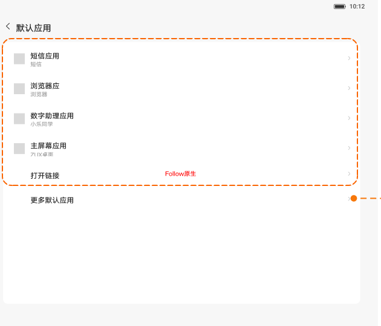
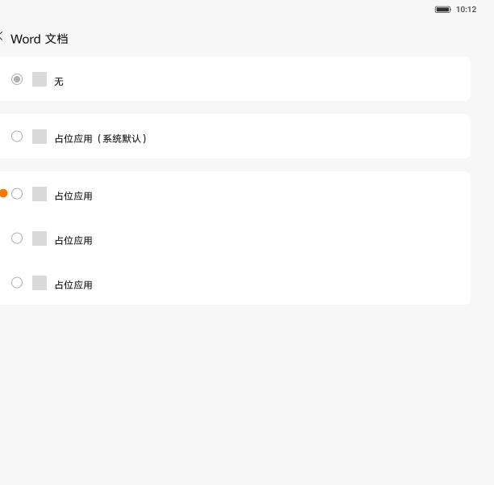
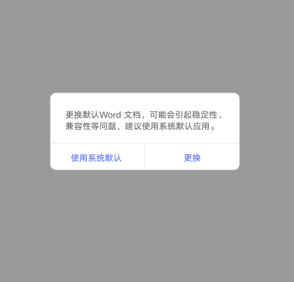
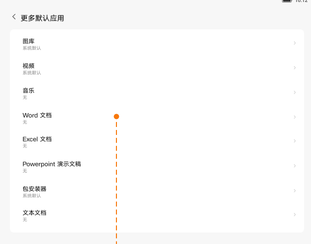

# 默认应用

[App 入口](../../README.md) · [功能查找](../../functions.md) · [页面导航](../../navigation.md)

| 信息 | 内容 |
|---|---|
| 知识 ID | `settings.default_apps` |
| 功能入口 | 设置 > 应用管理 > 默认应用 |
| 检索词 | 默认程序 浏览器 默认打开 图片 视频 音乐 Word Excel PowerPoint 安装器 文本；默认浏览器；默认打开方式；默认看图应用；Word默认应用 |

## 进入本页

| 定位要点 | 操作依据 |
|---|---|
| 推荐路径 | 设置 > 应用管理 > 默认应用 |
| 直接上级／起点 | [应用管理](../app_management/README.md) |
| 要找的入口 | 默认应用 |
| 形状与相对位置 | 应用管理标题下方横排快捷入口；定位圆形图标下面的默认应用文字。 |
| 入口图示 | [上级页入口区域](../app_management/images/focus_01.png) |
| 到达确认 | 主页面显示默认角色及更多默认应用入口；进入具体类别后显示应用候选项和圆形单选标记。 |
| 资料覆盖 | 覆盖范围以本页列出的入口、控件和操作反馈为限；未列出的子流程不视为已知。 |

点击后先核对内容区标题及上述识别特征；双栏中左侧仍显示原导航属于正常布局，不要求整屏切换。多级路径中每一步均按当前界面重新定位。

## 页面识别与布局

页面列出默认角色及更多默认应用；更多类别包括图片、视频、音乐、Word、Excel、PowerPoint、安装器、文本等。类别内列出可选应用。

## 关键控件：形状、位置与操作目标

位置均相对**当前页面的内容区或弹窗**，不是固定屏幕坐标。颜色只是辅助线索；优先结合标签、控件形状及相邻元素识别。

| 控件／入口 | 外观特征 | 相对位置 | 操作目标／状态区别 | 局部图 |
|---|---|---|---|---|
| 默认类别 | 纵向文字行，右端有当前应用摘要／箭头 | 默认应用页内容区域 | 先选浏览器等可见默认角色；图片、音乐、文档先进入更多默认应用 | [图 1](./images/focus_01.png) |
| 候选应用 | 左侧圆形单选标记、应用图标和名称 | 类别页列表内 | 点候选项，不按图示占位应用名查找 | [图 2](./images/focus_02.png) |
| 更多默认应用 | 图片／视频／音乐／文档等文字行，右侧有摘要和箭头 | 默认应用页的更多默认应用子页 | 先进入更多类别，再选具体文件类型 | [图 4](./images/focus_04.png) |
| 确认按钮 | 弹窗底部两个文字按钮 | 更换第三方默认应用时 | 左侧使用系统默认，右侧更换 | [图 3](./images/focus_03.png) |

## 操作与结果

| 操作目的 | 如何操作 | 页面变化／结果 |
|---|---|---|
| 改变默认应用 | 先选类别，再选择目标应用 | 可能出现更换确认，处理后再确认选择结果 |
| 确认使用第三方 | 出现风险确认时选择更换 | 确认目标应用 |
| 保留系统默认 | 在确认弹窗选择使用系统默认 | 恢复系统项 |

## 入口找不到时的排查顺序

1. 确认起点为[应用管理](../app_management/README.md)，在“进入本页”注明的区域定位／滚动。
2. 图片、视频、音乐、文档等先进入更多默认应用；候选缺失时核对安装状态；选择第三方后处理实际出现的确认框。
3. 核对下方出现条件；仍无匹配时按[导航中的搜索与返回策略](../../navigation.md)诊断。只有用例允许时才改变前置条件或使用替代入口；无新线索则按[资料不足处理](../../limitations.md)记录阻塞。

## 交互常识与出现条件

候选取决于安装状态。已有系统默认时选择第三方可要求确认；选择无或系统默认没有同类确认。不要把尚未确认的列表点击当作已保存。

## 返回与继续导航

上级资料：[应用管理](../app_management/README.md)。本文件若包含子页或弹窗，返回可能先到内部上一级；按实际标题确认，不假定一次返回就到上述起点。保存与取消规则见“操作与结果”，公共策略见[页面导航](../../navigation.md)。

## 相关页面

[应用管理](../../pages/app_management/README.md)、[应用信息](../../pages/app_info/README.md)。

## 控件局部图

每张图聚焦上表对应的页面区域，保留标题或相邻标签作为定位参照。原图里的编号、虚线和箭头是设计说明，不是 App 控件。

### 图 1：默认应用类别

### 图 2：类别中的应用单选列表

### 图 3：更换默认应用确认

### 图 4：更多默认应用类别

## 资料来源（无需常规加载）

[S05](../../sources/S05.png)；原文件映射见[来源表](../../sources.md)。
