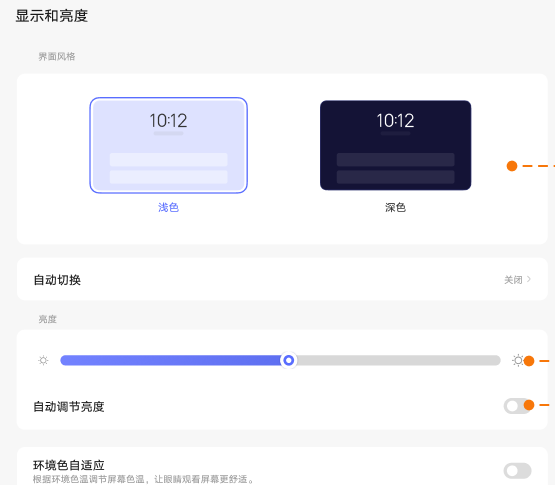
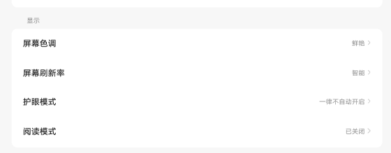
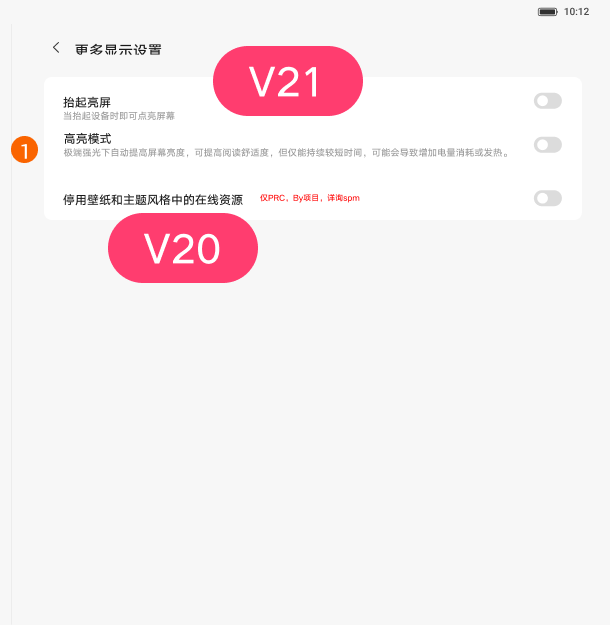

# 显示和亮度

[App 入口](../../README.md) · [功能查找](../../functions.md) · [页面导航](../../navigation.md)

| 信息 | 内容 |
|---|---|
| 知识 ID | `settings.display` |
| 功能入口 | 设置 > 显示和亮度 |
| 检索词 | 亮度 自动亮度 屏幕旋转 抬起亮屏 手套 视频画质；调亮屏幕；自动亮度；切换深色外观；自动旋转；抬起亮屏 |

## 进入本页

| 定位要点 | 操作依据 |
|---|---|
| 推荐路径 | 设置 > 显示和亮度 |
| 直接上级／起点 | [设置首页](../home/README.md) |
| 要找的入口 | 显示和亮度 |
| 形状与相对位置 | 首页的分组导航列表；图标＋模块名称所在行。双栏在左侧，向下滚动导航区查找。 |
| 入口图示 | [上级页入口区域](../home/images/focus_02.png) |
| 到达确认 | 内容顶部是浅色／深色卡片、自动切换、亮度滑块和自动亮度；往下是屏幕色调、刷新率、护眼、阅读、屏幕熄灭时间、显示大小和文字等入口。更多显示设置位于下方，必要时滚动内容区。 |
| 资料覆盖 | 覆盖范围以本页列出的入口、控件和操作反馈为限；未列出的子流程不视为已知。 |

点击后先核对内容区标题及上述识别特征；双栏中左侧仍显示原导航属于正常布局，不要求整屏切换。多级路径中每一步均按当前界面重新定位。

## 页面识别与布局

内容顶部是浅色／深色卡片、自动切换、亮度滑块和自动亮度；往下是屏幕色调、刷新率、护眼、阅读、屏幕熄灭时间、显示大小和文字等入口。更多显示设置位于下方，必要时滚动内容区。

## 关键控件：形状、位置与操作目标

位置均相对**当前页面的内容区或弹窗**，不是固定屏幕坐标。颜色只是辅助线索；优先结合标签、控件形状及相邻元素识别。

| 控件／入口 | 外观特征 | 相对位置 | 操作目标／状态区别 | 局部图 |
|---|---|---|---|---|
| 浅色／深色 | 并排的屏幕预览卡片，下有文字；选中卡有轮廓强调 | 内容最上方，浅色在左、深色在右 | 点目标卡片 | [图 1](./images/focus_01.png) |
| 自动切换 | 独立圆角设置行，右侧为当前值／箭头 | 预览卡片下方 | 点行进入时间计划 | [图 1](./images/focus_01.png) |
| 亮度 | 水平细长轨道＋圆形滑块，两端为亮度图标 | 亮度分组上部 | 拖当前轨道上的滑块；不要操作下一行开关 | [图 1](./images/focus_01.png) |
| 自动调节亮度 | 行右端的胶囊开关，圆形滑块表示状态 | 亮度滑块下面 | 核对标签后切换 | [图 1](./images/focus_01.png) |
| 显示子页入口 | 文字列表行，右端可能有当前值和右尖括号 | 亮度／增强分组下方 | 点击目标行；看不到时滚动内容区 | [图 2](./images/focus_02.png) |

## 操作与结果

| 操作目的 | 如何操作 | 页面变化／结果 |
|---|---|---|
| 改变外观 | 点击浅色或深色卡片 | 界面外观切换，与控制中心同步 |
| 设置亮度 | 定位亮度滑块后拖动 | 亮度变化；部分高亮度设备拖动到高亮区域时提示耗电高，释放后提示消失 |
| 进入显示子功能 | 点击对应文字行 | 进入以该功能为标题的子页 |
| 调整更多显示项 | 进入更多显示设置 | 可查抬起亮屏、手套模式等支持项 |

## 入口找不到时的排查顺序

1. 确认起点为[设置首页](../home/README.md)，在“进入本页”注明的区域定位／滚动。
2. 子功能入口在下方时滚动显示内容区；双击亮屏去通用设置的快捷手势查找，不在显示页反复寻找。
3. 核对下方出现条件；仍无匹配时按[导航中的搜索与返回策略](../../navigation.md)诊断。只有用例允许时才改变前置条件或使用替代入口；无新线索则按[资料不足处理](../../limitations.md)记录阻塞。

## 交互常识与出现条件

游戏／视频增强、手套模式及在线资源开关依设备支持。手套模式会影响 NFC／多指手势。PRC 关闭在线壁纸／主题资源后，对应在线入口隐藏。双击亮屏可在通用设置的快捷手势中查找。

## 返回与继续导航

上级资料：[设置首页](../home/README.md)。本文件若包含子页或弹窗，返回可能先到内部上一级；按实际标题确认，不假定一次返回就到上述起点。保存与取消规则见“操作与结果”，公共策略见[页面导航](../../navigation.md)。

## 从这里继续找子功能

下表链接到各目标页的进入方法；条件性分支以目标页为准。

| 要找的入口 | 目标资料 |
|---|---|
| 屏幕色调 | [屏幕色调](../screen_color/README.md) |
| 屏幕刷新率 | [屏幕刷新率](../refresh_rate/README.md) |
| 护眼模式 | [护眼模式](../eye_comfort/README.md) |
| 阅读模式 | [阅读模式](../reading_mode/README.md) |
| 屏幕熄灭时间 | [屏幕熄灭时间](../screen_timeout/README.md) |
| 显示大小和文字 | [显示大小和文字](../display_size_text/README.md) |
| 自动切换 | [深浅色自动切换](../dark_mode/README.md) |
| 界面材质 | [界面材质](../interface_material/README.md) |

## 相关页面

[深浅色自动切换](../../pages/dark_mode/README.md)、[屏幕刷新率](../../pages/refresh_rate/README.md)、[护眼模式](../../pages/eye_comfort/README.md)、[阅读模式](../../pages/reading_mode/README.md)、[屏幕熄灭时间](../../pages/screen_timeout/README.md)、[显示大小和文字](../../pages/display_size_text/README.md)、[屏幕色调](../../pages/screen_color/README.md)、[界面材质](../../pages/interface_material/README.md)。

## 控件局部图

每张图聚焦上表对应的页面区域，保留标题或相邻标签作为定位参照。原图里的编号、虚线和箭头是设计说明，不是 App 控件。

### 图 1：外观卡片、亮度与自动亮度

### 图 2：色调、刷新率、护眼和阅读入口

### 图 3：更多显示设置

## 资料来源（无需常规加载）

[S17](../../sources/S17.png)；原文件映射见[来源表](../../sources.md)。
