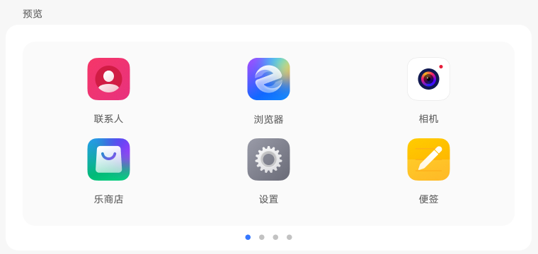
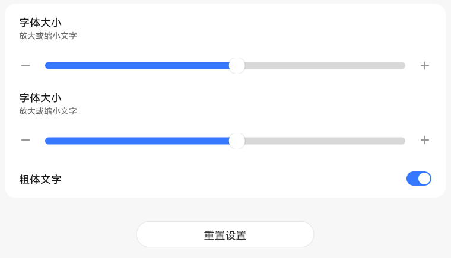

# 显示大小和文字

[App 入口](../../README.md) · [功能查找](../../functions.md) · [页面导航](../../navigation.md)

| 信息 | 内容 |
|---|---|
| 知识 ID | `settings.display_size_text` |
| 功能入口 | 设置 > 显示和亮度 > 显示大小和文字 |
| 检索词 | 字体 显示大小 文字 粗体 重置 预览；放大字体；调显示大小；粗体；恢复文字默认设置 |

## 进入本页

| 定位要点 | 操作依据 |
|---|---|
| 推荐路径 | 设置 > 显示和亮度 > 显示大小和文字 |
| 直接上级／起点 | [显示和亮度](../display/README.md) |
| 要找的入口 | 显示大小和文字 |
| 形状与相对位置 | 显示内容区的子功能文字列表行，位于亮度等上方设置之后；右侧可带摘要或箭头。未显示时滚动内容区。 |
| 入口图示 | [上级页入口区域](../display/images/focus_02.png) |
| 到达确认 | 上方是可切换的预览卡片，下方有两个尺寸滑块、粗体文字开关和重置设置按钮。 |
| 资料覆盖 | 部分覆盖：滑块、粗体、预览；第二条滑块语义和重置弹窗待实机确认。 |

点击后先核对内容区标题及上述识别特征；双栏中左侧仍显示原导航属于正常布局，不要求整屏切换。多级路径中每一步均按当前界面重新定位。

## 页面识别与布局

上方是可切换的预览卡片，下方有两个尺寸滑块、粗体文字开关和重置设置按钮。

## 关键控件：形状、位置与操作目标

位置均相对**当前页面的内容区或弹窗**，不是固定屏幕坐标。颜色只是辅助线索；优先结合标签、控件形状及相邻元素识别。

| 控件／入口 | 外观特征 | 相对位置 | 操作目标／状态区别 | 局部图 |
|---|---|---|---|---|
| 预览 | 圆角大卡片内显示应用图标，下方有分页小圆点 | 内容区上部 | 只作为效果预览，不把预览内图标当真实 App 入口 | [图 1](./images/focus_01.png) |
| 大小滑块 | 两条水平轨道、圆形滑块，两端为减号／加号 | 预览下方，两个控件上下排列 | 先确认具体标签再调节；原图标签重复不能猜测 | [图 2](./images/focus_02.png) |
| 粗体文字 | 左侧文字、右端胶囊开关 | 两个滑块下方，同一白色卡片底部 | 点击开关 | [图 2](./images/focus_02.png) |
| 重置设置 | 水平胶囊形按钮，文字居中 | 内容区域靠下居中 | 点击后按实际提示处理 | [图 2](./images/focus_02.png) |

## 操作与结果

| 操作目的 | 如何操作 | 页面变化／结果 |
|---|---|---|
| 调整文字／显示大小 | 先用实机控件标签确认两个滑块的含义，再拖动目标滑块 | 观察预览及实际文字／布局变化 |
| 切换粗体 | 操作粗体文字开关 | 观察文字粗细变化 |
| 恢复设置 | 找到重置设置按钮，按当前页面提示操作 | 确认实际恢复结果 |

## 入口找不到时的排查顺序

1. 确认起点为[显示和亮度](../display/README.md)，在“进入本页”注明的区域定位／滚动。
2. 两个滑块标签不清时查当前控件树与预览关系；仍无法区分就记录资料不足，不猜测第二条滑块。
3. 核对下方出现条件；仍无匹配时按[导航中的搜索与返回策略](../../navigation.md)诊断。只有用例允许时才改变前置条件或使用替代入口；无新线索则按[资料不足处理](../../limitations.md)记录阻塞。

## 交互常识与出现条件

设计图把两个滑块都标为字体大小，无法据图唯一确定第二个含义。未提供滑块范围、默认档位与重置弹窗，不应猜测或固定点击第几个滑块。

## 返回与继续导航

上级资料：[显示和亮度](../display/README.md)。本文件若包含子页或弹窗，返回可能先到内部上一级；按实际标题确认，不假定一次返回就到上述起点。保存与取消规则见“操作与结果”，公共策略见[页面导航](../../navigation.md)。

## 相关页面

[显示和亮度](../../pages/display/README.md)。

## 控件局部图

每张图聚焦上表对应的页面区域，保留标题或相邻标签作为定位参照。原图里的编号、虚线和箭头是设计说明，不是 App 控件。

### 图 1：预览卡片与分页圆点

### 图 2：两个滑块、粗体开关与重置

## 资料来源（无需常规加载）

[S37](../../sources/S37.png)、[S17](../../sources/S17.png)；原文件映射见[来源表](../../sources.md)。
