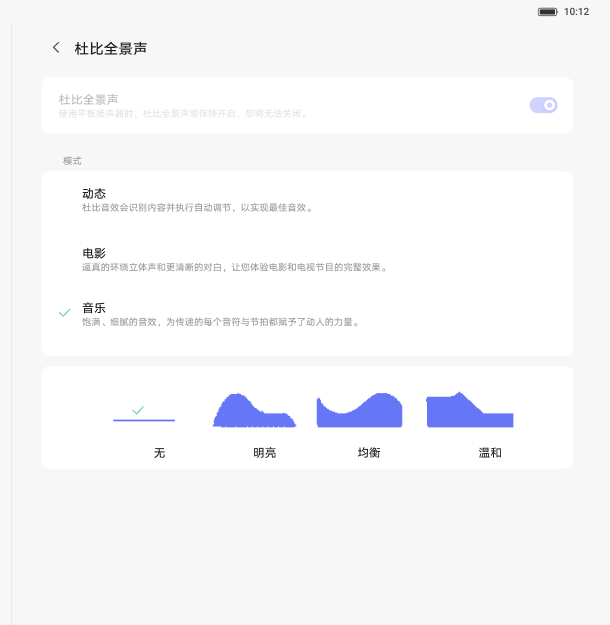
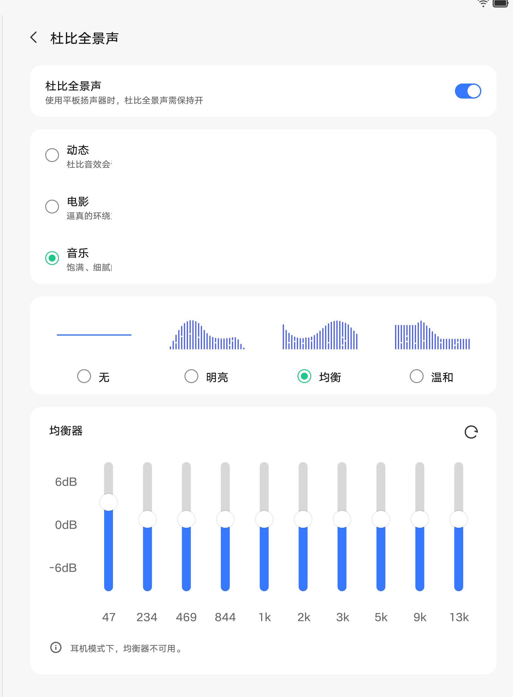
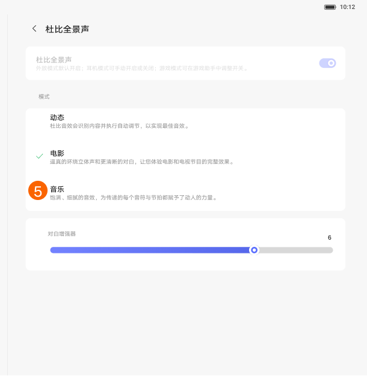

# 杜比音效

[App 入口](../../README.md) · [功能查找](../../functions.md) · [页面导航](../../navigation.md)

| 信息 | 内容 |
|---|---|
| 知识 ID | `settings.dolby` |
| 功能入口 | 设置 > 声音和振动 > 杜比全景声／杜比音效 |
| 检索词 | Dolby Atmos Audio 杜比 动态 电影 音乐 均衡器 EQ 游戏音效；杜比；音效模式；均衡器；EQ；电影音效 |

## 进入本页

| 定位要点 | 操作依据 |
|---|---|
| 推荐路径 | 设置 > 声音和振动 > 杜比全景声／杜比音效 |
| 直接上级／起点 | [声音和振动](../sound/README.md) |
| 要找的入口 | 杜比全景声／杜比音效 |
| 形状与相对位置 | 声音内容区的功能列表。杜比和模式位于静音卡片下面；背景音仅在实际提供该入口时进入，固定排序未确认。 |
| 入口图示 | [上级页入口区域](../sound/images/focus_02.png) |
| 到达确认 | 页面有杜比总开关及动态、电影、音乐等模式。电影可显示滑块；音乐可显示无、细节、均衡、温暖预设，一行或 2×2 排列。部分设备提供 10 段 EQ 和重置图标。 |
| 资料覆盖 | 覆盖范围以本页列出的入口、控件和操作反馈为限；未列出的子流程不视为已知。 |

点击后先核对内容区标题及上述识别特征；双栏中左侧仍显示原导航属于正常布局，不要求整屏切换。多级路径中每一步均按当前界面重新定位。

## 页面识别与布局

页面有杜比总开关及动态、电影、音乐等模式。电影可显示滑块；音乐可显示无、细节、均衡、温暖预设，一行或 2×2 排列。部分设备提供 10 段 EQ 和重置图标。

## 关键控件：形状、位置与操作目标

位置均相对**当前页面的内容区或弹窗**，不是固定屏幕坐标。颜色只是辅助线索；优先结合标签、控件形状及相邻元素识别。

| 控件／入口 | 外观特征 | 相对位置 | 操作目标／状态区别 | 局部图 |
|---|---|---|---|---|
| 总开关 | 杜比功能行右端开关 | 页面上部 | 外放强制开启的设备可置灰 | [图 1](./images/focus_01.png) |
| 模式列表 | 动态、电影、音乐纵向排列，选中项旁有勾选 | 总开关下方卡片 | 点击模式文字所在行 | [图 1](./images/focus_01.png) |
| 音乐预设 | 一组小卡片，带蓝色频响形状或水平线 | 音乐模式下，模式列表下面 | 点无／细节／均衡／温暖等预设 | [图 1](./images/focus_01.png) |
| EQ | 多条竖向频段调节及重置图标 | 仅有均衡器的方案中，音乐设置区域 | 按频段标签操作；耳机条件可使其不可用 | [图 2](./images/focus_02.png) |
| 电影滑块 | 水平滑块 | 电影模式卡片下方 | 依实际标签判断媒体音量或人声增强 | [图 3](./images/focus_03.png) |

## 操作与结果

| 操作目的 | 如何操作 | 页面变化／结果 |
|---|---|---|
| 切换音效模式 | 选择动态、电影或音乐 | 显示该模式对应控件 |
| 调整音乐效果 | 在音乐模式选择预设；仅在有 EQ 时调整频段 | 应用相应效果 |
| 开关无法操作 | 确认当前为外放还是耳机，以及设备支持 | 部分四扬声器外放强制开启；支持关闭的耳机场景可调整 |
| 调整电影模式滑块 | 读取实际标签后操作 | 按标签确认调节的是人声增强还是媒体音量 |

## 入口找不到时的排查顺序

1. 确认起点为[声音和振动](../sound/README.md)，在“进入本页”注明的区域定位／滚动。
2. 缺少EQ或游戏音效先查设备支持；耳机连接可限制EQ；区分电影滑块的实际标签。
3. 核对下方出现条件；仍无匹配时按[导航中的搜索与返回策略](../../navigation.md)诊断。只有用例允许时才改变前置条件或使用替代入口；无新线索则按[资料不足处理](../../limitations.md)记录阻塞。

## 交互常识与出现条件

不要要求所有设备都有 EQ 或游戏音效。Calla 方案耳机下 EQ 不可用。动态模式可随应用改变，多窗口按最近应用处理；白名单未提供。

## 返回与继续导航

上级资料：[声音和振动](../sound/README.md)。本文件若包含子页或弹窗，返回可能先到内部上一级；按实际标题确认，不假定一次返回就到上述起点。保存与取消规则见“操作与结果”，公共策略见[页面导航](../../navigation.md)。

## 相关页面

[声音和振动](../../pages/sound/README.md)、[铃声选择](../../pages/ringtones/README.md)。

## 控件局部图

每张图聚焦上表对应的页面区域，保留标题或相邻标签作为定位参照。原图里的编号、虚线和箭头是设计说明，不是 App 控件。

### 图 1：模式与音乐预设

### 图 2：Calla 音乐与均衡器区域

### 图 3：电影模式滑块

## 资料来源（无需常规加载）

[S18](../../sources/S18.png)、[S27](../../sources/S27.png)、[S28](../../sources/S28.png)、[S29](../../sources/S29.png)、[S30](../../sources/S30.png)、[S31](../../sources/S31.png)、[S32](../../sources/S32.png)、[S34](../../sources/S34.png)、[S35](../../sources/S35.png)；原文件映射见[来源表](../../sources.md)。
