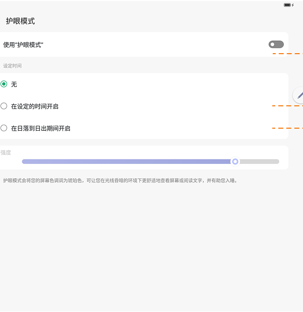
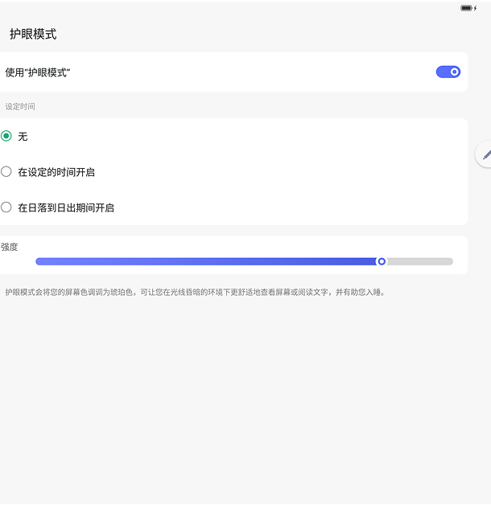

# 护眼模式

[App 入口](../../README.md) · [功能查找](../../functions.md) · [页面导航](../../navigation.md)

| 信息 | 内容 |
|---|---|
| 知识 ID | `settings.eye_comfort` |
| 功能入口 | 设置 > 显示和亮度 > 护眼模式 |
| 检索词 | 护眼 蓝光 强度 定时 日落 日出；防蓝光；护眼定时；护眼强度；夜间护眼 |

## 进入本页

| 定位要点 | 操作依据 |
|---|---|
| 推荐路径 | 设置 > 显示和亮度 > 护眼模式 |
| 直接上级／起点 | [显示和亮度](../display/README.md) |
| 要找的入口 | 护眼模式 |
| 形状与相对位置 | 显示内容区的子功能文字列表行，位于亮度等上方设置之后；右侧可带摘要或箭头。未显示时滚动内容区。 |
| 入口图示 | [上级页入口区域](../display/images/focus_02.png) |
| 到达确认 | 页面有总开关、强度调节和定时方式；定时可选无、自定义或日落日出。 |
| 资料覆盖 | 覆盖范围以本页列出的入口、控件和操作反馈为限；未列出的子流程不视为已知。 |

点击后先核对内容区标题及上述识别特征；双栏中左侧仍显示原导航属于正常布局，不要求整屏切换。多级路径中每一步均按当前界面重新定位。

## 页面识别与布局

页面有总开关、强度调节和定时方式；定时可选无、自定义或日落日出。

## 关键控件：形状、位置与操作目标

位置均相对**当前页面的内容区或弹窗**，不是固定屏幕坐标。颜色只是辅助线索；优先结合标签、控件形状及相邻元素识别。

| 控件／入口 | 外观特征 | 相对位置 | 操作目标／状态区别 | 局部图 |
|---|---|---|---|---|
| 总开关 | 使用护眼模式行右端的胶囊开关 | 标题下第一行 | 先打开，强度才可调整 | [图 1](./images/focus_01.png) |
| 定时选项 | 圆形单选标记＋文字的纵向列表 | 总开关下方白色卡片 | 在无／指定时间／日落日出中选择 | [图 2](./images/focus_02.png) |
| 强度滑块 | 细长水平轨道＋圆形滑块 | 定时卡片下方 | 沿实际轨道拖动；灰化时先查总开关 | [图 2](./images/focus_02.png) |

## 操作与结果

| 操作目的 | 如何操作 | 页面变化／结果 |
|---|---|---|
| 调整护眼强度 | 先打开护眼，再调整强度 | 强度控件可用，护眼效果变化 |
| 配置时间计划 | 选择自定义并设置起止时间，或选择日落日出 | 按选定计划管理护眼 |
| 立即启用护眼 | 手动打开总开关 | 即使处于计划时段外也立即生效 |

## 入口找不到时的排查顺序

1. 确认起点为[显示和亮度](../display/README.md)，在“进入本页”注明的区域定位／滚动。
2. 强度不可拖动先读护眼总开关；自动日落日出计划受位置服务影响。
3. 核对下方出现条件；仍无匹配时按[导航中的搜索与返回策略](../../navigation.md)诊断。只有用例允许时才改变前置条件或使用替代入口；无新线索则按[资料不足处理](../../limitations.md)记录阻塞。

## 交互常识与出现条件

总开关关闭时强度不可调。日落日出需核对位置服务。设计中自定义时段为 22:00–06:00，但操作前读取当前已保存的值。

## 返回与继续导航

上级资料：[显示和亮度](../display/README.md)。本文件若包含子页或弹窗，返回可能先到内部上一级；按实际标题确认，不假定一次返回就到上述起点。保存与取消规则见“操作与结果”，公共策略见[页面导航](../../navigation.md)。

## 相关页面

[位置信息](../../pages/location/README.md)、[显示和亮度](../../pages/display/README.md)。

## 控件局部图

每张图聚焦上表对应的页面区域，保留标题或相邻标签作为定位参照。原图里的编号、虚线和箭头是设计说明，不是 App 控件。

### 图 1：关闭时的护眼控件

### 图 2：开启时的护眼控件

## 资料来源（无需常规加载）

[S17](../../sources/S17.png)；原文件映射见[来源表](../../sources.md)。
