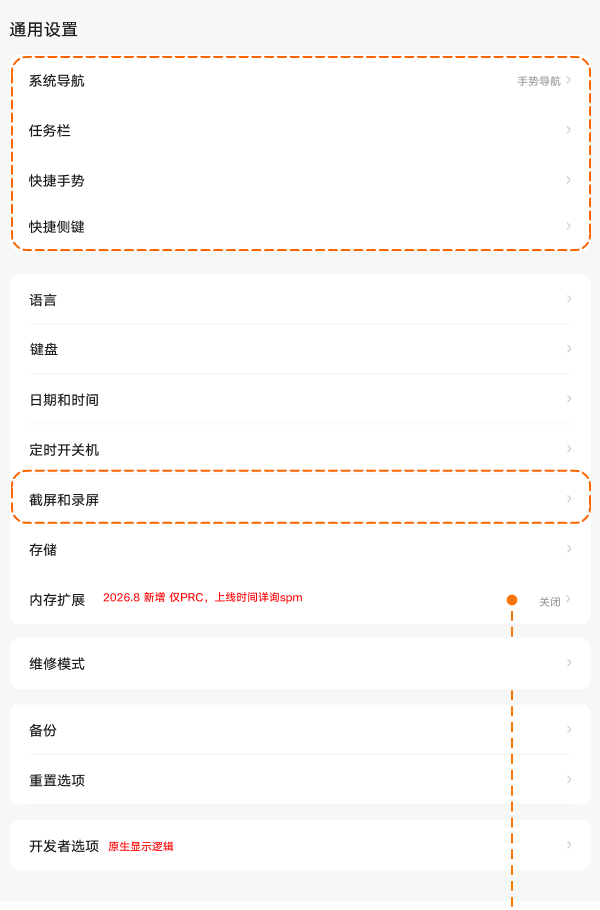
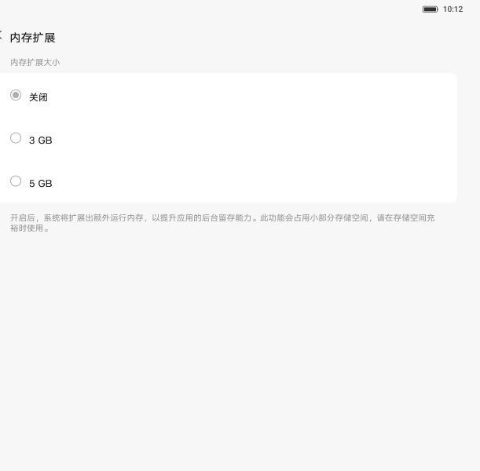
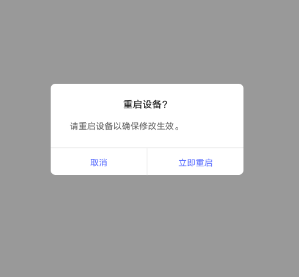

# 通用设置

[App 入口](../../README.md) · [功能查找](../../functions.md) · [页面导航](../../navigation.md)

| 信息 | 内容 |
|---|---|
| 知识 ID | `settings.general` |
| 功能入口 | 设置 > 通用设置 |
| 检索词 | 通用 导航 任务栏 快捷手势 截屏 录屏 开发者 内存扩展 维修 皮套；系统导航；任务栏；快捷手势；截屏录屏；内存扩展；开发者选项 |

## 进入本页

| 定位要点 | 操作依据 |
|---|---|
| 推荐路径 | 设置 > 通用设置 |
| 直接上级／起点 | [设置首页](../home/README.md) |
| 要找的入口 | 通用设置 |
| 形状与相对位置 | 首页的分组导航列表；图标＋模块名称所在行。双栏在左侧，向下滚动导航区查找。 |
| 入口图示 | [上级页入口区域](../home/images/focus_02.png) |
| 到达确认 | 通用列表包含系统导航、任务栏、快捷手势、语言、键盘、日期和时间、定时开关机、截屏录屏、存储、备份、重置、开发者选项等，需滚动查找下方条目。PRC 可有内存扩展，ROW 可有多用户。 |
| 资料覆盖 | 覆盖范围以本页列出的入口、控件和操作反馈为限；未列出的子流程不视为已知。 |

点击后先核对内容区标题及上述识别特征；双栏中左侧仍显示原导航属于正常布局，不要求整屏切换。多级路径中每一步均按当前界面重新定位。

## 页面识别与布局

通用列表包含系统导航、任务栏、快捷手势、语言、键盘、日期和时间、定时开关机、截屏录屏、存储、备份、重置、开发者选项等，需滚动查找下方条目。PRC 可有内存扩展，ROW 可有多用户。

## 关键控件：形状、位置与操作目标

位置均相对**当前页面的内容区或弹窗**，不是固定屏幕坐标。颜色只是辅助线索；优先结合标签、控件形状及相邻元素识别。

| 控件／入口 | 外观特征 | 相对位置 | 操作目标／状态区别 | 局部图 |
|---|---|---|---|---|
| 通用子页入口 | 白色圆角卡片内文字行，右侧摘要或箭头 | 内容从上到下分组 | 点击整行进入，向下滚动查备份／重置 | [图 1](./images/focus_01.png) |
| 语言／键盘 | 连续两行 | 导航／快捷手势分组下方 | 键盘在语言下方，避免混淆 | [图 1](./images/focus_01.png) |
| 内存容量 | 圆形单选标记＋容量值 | 内存扩展子页 | 按设备实际提供的容量选择 | [图 2](./images/focus_02.png) |
| 重启确认 | 居中弹窗，底部取消和立即重启 | 选择容量后出现 | 确认重启后才生效 | [图 3](./images/focus_03.png) |

## 操作与结果

| 操作目的 | 如何操作 | 页面变化／结果 |
|---|---|---|
| 进入通用子功能 | 在列表中按名称定位并点击 | 进入对应子页 |
| 调整内存扩展（PRC） | 进入内存扩展并选择可用容量 | 提示重启，重启后生效；存储不足时提示无法开启 |
| 使用皮套模式 | 在支持的商用设备找到皮套模式 | 开启时合盖使屏幕休眠 |

## 入口找不到时的排查顺序

1. 确认起点为[设置首页](../home/README.md)，在“进入本页”注明的区域定位／滚动。
2. 向下滚动内容列表找备份和重置；语言与键盘是相邻不同入口；按地区查内存扩展或多用户。
3. 核对下方出现条件；仍无匹配时按[导航中的搜索与返回策略](../../navigation.md)诊断。只有用例允许时才改变前置条件或使用替代入口；无新线索则按[资料不足处理](../../limitations.md)记录阻塞。

## 交互常识与出现条件

侧键、皮套、维修模式等按设备提供。内存扩展容量依机型。导航、任务栏、截屏录屏等仅提供入口线索。

## 返回与继续导航

上级资料：[设置首页](../home/README.md)。本文件若包含子页或弹窗，返回可能先到内部上一级；按实际标题确认，不假定一次返回就到上述起点。保存与取消规则见“操作与结果”，公共策略见[页面导航](../../navigation.md)。

## 从这里继续找子功能

下表链接到各目标页的进入方法；条件性分支以目标页为准。

| 要找的入口 | 目标资料 |
|---|---|
| 日期和时间 | [日期和时间](../date_time/README.md) |
| 定时开关机 | [定时开关机](../scheduled_power/README.md) |
| 存储 | [存储](../storage/README.md) |
| 备份 | [备份](../backup/README.md) |
| 重置选项 | [重置选项](../reset/README.md) |
| 语言 | [语言](../language/README.md) |
| 键盘 | [键盘、输入法与鼠标](../keyboard/README.md) |
| 多用户（ROW） | [多用户](../multi_user/README.md) |

## 相关页面

[日期和时间](../../pages/date_time/README.md)、[定时开关机](../../pages/scheduled_power/README.md)、[存储](../../pages/storage/README.md)、[备份](../../pages/backup/README.md)、[重置选项](../../pages/reset/README.md)、[语言](../../pages/language/README.md)、[键盘、输入法与鼠标](../../pages/keyboard/README.md)、[多用户](../../pages/multi_user/README.md)、[屏幕熄灭时间](../../pages/screen_timeout/README.md)。

## 控件局部图

每张图聚焦上表对应的页面区域，保留标题或相邻标签作为定位参照。原图里的编号、虚线和箭头是设计说明，不是 App 控件。

### 图 1：通用设置分组和入口

### 图 2：内存扩展单选列表

### 图 3：内存扩展重启确认

## 资料来源（无需常规加载）

[S06](../../sources/S06.png)、[S26](../../sources/S26.png)；原文件映射见[来源表](../../sources.md)。
