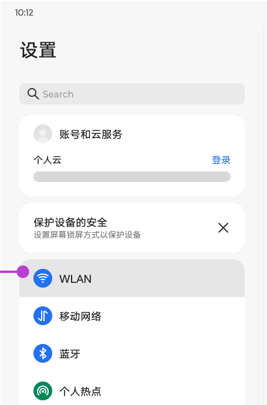
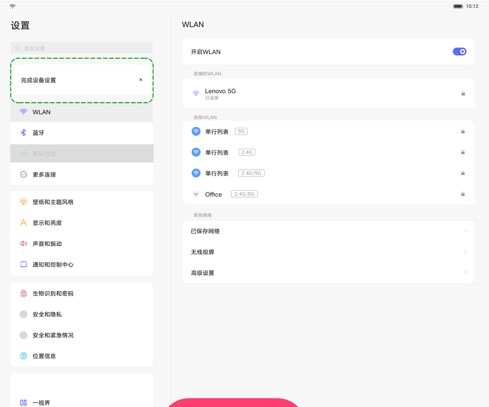

# 设置首页

[App 入口](../../README.md) · [功能查找](../../functions.md) · [页面导航](../../navigation.md)

| 信息 | 内容 |
|---|---|
| 知识 ID | `settings.home` |
| 功能入口 | 启动设置 |
| 检索词 | 系统设置 Settings 设置首页 一级菜单 双栏 分屏 WLAN；打开设置；进入系统设置；查找设置模块 |

## 进入本页

| 定位要点 | 操作依据 |
|---|---|
| 推荐路径 | 启动设置 |
| 直接上级／起点 | App 启动入口（本包不描述桌面图标排序） |
| 要找的入口 | 系统设置／设置 |
| 形状与相对位置 | 先由测试框架识别并打开待测设置 App；启动图标的具体位置不在本包证据范围内。 |
| 入口图示 | 使用当前界面识别 |
| 到达确认 | 出现设置模块导航和搜索框；双栏同时可见模块高亮与右侧内容标题，不限定初始模块。 |
| 资料覆盖 | 覆盖范围以本页列出的入口、控件和操作反馈为限；未列出的子流程不视为已知。 |

点击后先核对内容区标题及上述识别特征；双栏中左侧仍显示原导航属于正常布局，不要求整屏切换。多级路径中每一步均按当前界面重新定位。

## 页面识别与布局

左侧上方是搜索框、账号或建议卡片，下方是分组导航；双栏界面的右侧显示选中模块。导航高亮与右侧标题共同用于判断所在页面。

网络组含 WLAN、移动网络、蓝牙、热点、NFC、更多连接；其余组包含显示、声音、通知、安全隐私、位置、AI、高级功能、应用管理、通用设置和关于等。

## 关键控件：形状、位置与操作目标

位置均相对**当前页面的内容区或弹窗**，不是固定屏幕坐标。颜色只是辅助线索；优先结合标签、控件形状及相邻元素识别。

| 控件／入口 | 外观特征 | 相对位置 | 操作目标／状态区别 | 局部图 |
|---|---|---|---|---|
| 搜索 | 浅灰色圆角长输入框，带放大镜 | 左栏顶部，设置标题下方 | 点输入框进入搜索 | [图 1](./images/focus_01.png) |
| 账号／建议 | 圆角卡片，包含头像、登录文字或建议内容 | 搜索框下方、网络分组上方 | 区分卡片内容与关闭按钮 | [图 1](./images/focus_01.png) |
| 一级导航 | 左侧小图标＋模块名，按白色圆角卡片分组 | 左栏；选中项有灰色背景 | 点模块文字所在行，右栏显示该模块 | [图 2](./images/focus_02.png) |
| 当前内容 | 独立标题＋设置行 | 分隔线右侧 | 核对标题后在此区域查控件 | [图 2](./images/focus_02.png) |

## 操作与结果

| 操作目的 | 如何操作 | 页面变化／结果 |
|---|---|---|
| 进入功能模块 | 在导航列表中找到并点击模块名称 | 双栏右侧内容切换；单栏进入目标页，核对标题 |
| 首屏找不到入口 | 在导航列表区域滚动；也可使用顶部搜索 | 找到目标模块或对应搜索结果 |
| 直接查找功能 | 点击搜索框并输入功能名 | 进入搜索层 |

## 入口找不到时的排查顺序

1. 确认起点为App 启动入口（本包不描述桌面图标排序），在“进入本页”注明的区域定位／滚动。
2. 核对当前 App 身份及左侧模块高亮；一级模块不在首屏时滚动导航区，不能只滚右侧内容。
3. 核对下方出现条件；仍无匹配时按[导航中的搜索与返回策略](../../navigation.md)诊断。只有用例允许时才改变前置条件或使用替代入口；无新线索则按[资料不足处理](../../limitations.md)记录阻塞。

## 交互常识与出现条件

PRC 隐私保护为独立入口；ROW 可在“安全和隐私”中。PRC 顶部偏账号入口，ROW 可见建议卡片及账号和同步、Google 等条目。硬件不支持的网络项可隐藏。不要把右侧初始页面固定为 WLAN。

## 返回与继续导航

在设置首页按模块名继续导航；不要额外执行系统返回而退出设置。双栏转模块前若有弹窗，先根据用例处理弹窗。

## 从这里继续找子功能

下表链接到各目标页的进入方法；条件性分支以目标页为准。

| 要找的入口 | 目标资料 |
|---|---|
| 显示和亮度 | [显示和亮度](../display/README.md) |
| 声音和振动／声音 | [声音和振动](../sound/README.md) |
| 通知和控制中心 | [通知和控制中心](../notifications/README.md) |
| 位置信息 | [位置信息](../location/README.md) |
| 手写笔和键盘 | [手写笔和键盘](../stylus_keyboard/README.md) |
| 应用管理 | [应用管理](../app_management/README.md) |
| 通用设置 | [通用设置](../general/README.md) |
| 关于平板电脑 | [关于平板电脑](../about/README.md) |
| 搜索框 | [设置搜索](../search/README.md) |
| 账号卡片／账号和服务／账号和同步 | [账号和服务／账号和同步](../accounts/README.md) |
| PRC：隐私保护；ROW：安全和隐私内的隐私入口 | [隐私保护／隐私控制](../privacy/README.md) |
| 安全／安全和隐私／安全和紧急情况 | [安全、隐私与紧急情况](../safety/README.md) |
| PRC：AI 智慧服务 | [AI 智慧服务](../ai_services/README.md) |
| 高级功能 → 实验室功能（按任务需要） | [高级功能与实验室](../advanced/README.md) |

## 相关页面

[设置搜索](../../pages/search/README.md)、[设置自适应布局](../../features/adaptive_layout/README.md)、[首页设置建议](../../features/suggestions/README.md)、[通用设置](../../pages/general/README.md)。

## 控件局部图

每张图聚焦上表对应的页面区域，保留标题或相邻标签作为定位参照。原图里的编号、虚线和箭头是设计说明，不是 App 控件。

### 图 1：左侧搜索、账号与导航分组

### 图 2：左右分栏与模块内容

## 资料来源（无需常规加载）

[S13](../../sources/S13.png)；原文件映射见[来源表](../../sources.md)。
