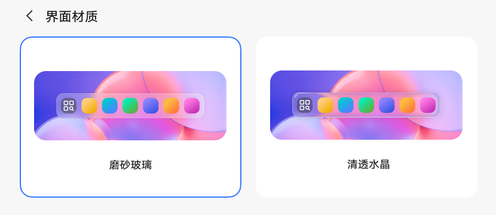

# 界面材质

[App 入口](../../README.md) · [功能查找](../../functions.md) · [页面导航](../../navigation.md)

| 信息 | 内容 |
|---|---|
| 知识 ID | `settings.interface_material` |
| 功能入口 | 设置 > 显示和亮度 > 界面材质 |
| 检索词 | 液态玻璃 高斯模糊 磨砂玻璃 清透水晶 柔雾雅境 材质；磨砂玻璃；清透水晶；界面透明效果；材质 |

## 进入本页

| 定位要点 | 操作依据 |
|---|---|
| 推荐路径 | 设置 > 显示和亮度 > 界面材质 |
| 直接上级／起点 | [显示和亮度](../display/README.md) |
| 要找的入口 | 界面材质 |
| 形状与相对位置 | 显示页中的界面材质文字行，右侧有当前材质摘要和箭头；以本页入口局部图核对位置。 |
| 入口图示 | [显示页材质入口](images/focus_02.png) |
| 到达确认 | 页面用卡片展示磨砂玻璃、清透水晶等材质效果。设置入口位于显示和亮度；开机引导也可能提供选择。 |
| 资料覆盖 | 覆盖显示页入口与材质卡片；开机引导仅有备选场景线索。 |

点击后先核对内容区标题及上述识别特征；双栏中左侧仍显示原导航属于正常布局，不要求整屏切换。多级路径中每一步均按当前界面重新定位。

## 页面识别与布局

页面用卡片展示磨砂玻璃、清透水晶等材质效果。设置入口位于显示和亮度；开机引导也可能提供选择。

## 关键控件：形状、位置与操作目标

位置均相对**当前页面的内容区或弹窗**，不是固定屏幕坐标。颜色只是辅助线索；优先结合标签、控件形状及相邻元素识别。

| 控件／入口 | 外观特征 | 相对位置 | 操作目标／状态区别 | 局部图 |
|---|---|---|---|---|
| 材质选择 | 两张并排圆角效果卡片，选中卡片有轮廓强调 | 内容上部；磨砂玻璃在左，清透水晶在右 | 点击效果卡片，按实际标签识别 | [图 1](./images/focus_01.png) |
| 入口提示 | 入口旁小红点 | 显示模块或材质入口旁（出现时） | 红点仅提示状态，不是独立入口 | [图 2](./images/focus_01.png) |

原图包含开机引导与设置两种场景，导航路径不同。若截图不能唯一识别具体卡片，先核对“磨砂玻璃／清透水晶”等文字。

## 操作与结果

| 操作目的 | 如何操作 | 页面变化／结果 |
|---|---|---|
| 切换材质 | 点击实际可见的效果卡片 | 切换界面材质 |
| 识别提示状态 | 若显示页或材质入口有红点，进入该入口 | 对应提示红点消失 |

## 入口找不到时的排查顺序

1. 确认起点为[显示和亮度](../display/README.md)，在“进入本页”注明的区域定位／滚动。
2. 按界面材质及当前材质摘要查找；柔雾雅境／高斯模糊仅为检索词，不能假定是可点击标签。
3. 核对下方出现条件；仍无匹配时按[导航中的搜索与返回策略](../../navigation.md)诊断。只有用例允许时才改变前置条件或使用替代入口；无新线索则按[资料不足处理](../../limitations.md)记录阻塞。

## 交互常识与出现条件

原图入口标为界面材质，实机仍需核对；高斯模糊、柔雾雅境等可作为辅助搜索词，不能代替屏幕上的点击文本。

## 返回与继续导航

上级资料：[显示和亮度](../display/README.md)。本文件若包含子页或弹窗，返回可能先到内部上一级；按实际标题确认，不假定一次返回就到上述起点。保存与取消规则见“操作与结果”，公共策略见[页面导航](../../navigation.md)。

## 相关页面

[显示和亮度](../../pages/display/README.md)。

## 控件局部图

每张图聚焦上表对应的页面区域，保留标题或相邻标签作为定位参照。原图里的编号、虚线和箭头是设计说明，不是 App 控件。

### 图 1：设置内的两张材质卡片

### 图 2：显示页面中的界面材质入口

## 资料来源（无需常规加载）

[S24](../../sources/S24.png)；原文件映射见[来源表](../../sources.md)。
