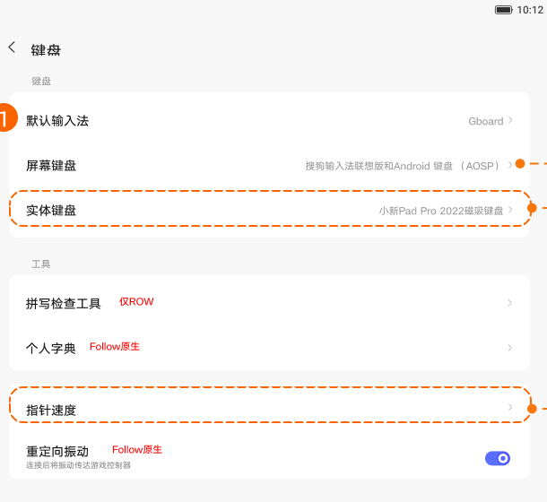
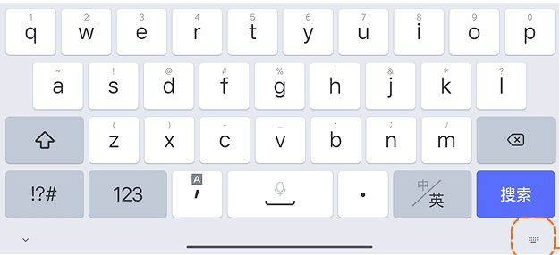
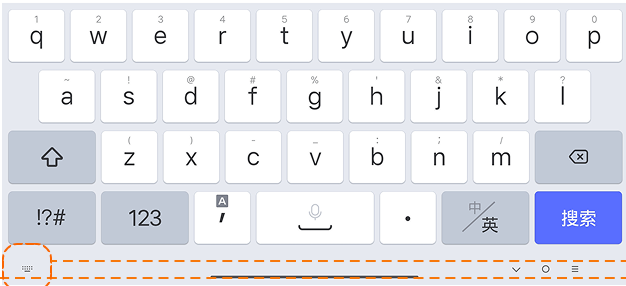
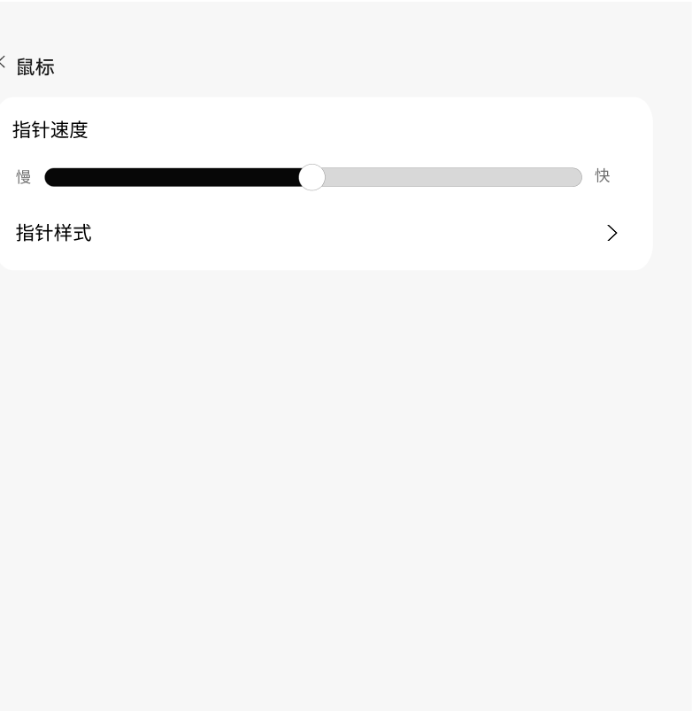

# 键盘、输入法与鼠标

[App 入口](../../README.md) · [功能查找](../../functions.md) · [页面导航](../../navigation.md)

| 信息 | 内容 |
|---|---|
| 知识 ID | `settings.keyboard` |
| 功能入口 | 设置 > 通用设置 > 键盘；鼠标入口按连接状态 |
| 检索词 | 输入法 屏幕键盘 物理键盘 搜狗 Gboard 鼠标 指针 速度 样式；切换输入法；管理屏幕键盘；实体键盘；鼠标速度 |

## 进入本页

| 定位要点 | 操作依据 |
|---|---|
| 推荐路径 | 设置 > 通用设置 > 键盘；鼠标入口按连接状态 |
| 直接上级／起点 | [通用设置](../general/README.md) |
| 要找的入口 | 键盘 |
| 形状与相对位置 | 通用设置内容区的分组文字列表，右侧摘要或箭头；备份／重置等下方条目需滚动内容区查找。 |
| 入口图示 | [上级页入口区域](../general/images/focus_01.png) |
| 到达确认 | 页面可见默认输入法、屏幕键盘管理、实体键盘及支持的拼写检查、词典等。导航区域还可能提供输入法切换图标。鼠标连接时可出现速度／样式设置。 |
| 资料覆盖 | 覆盖范围以本页列出的入口、控件和操作反馈为限；未列出的子流程不视为已知。 |

点击后先核对内容区标题及上述识别特征；双栏中左侧仍显示原导航属于正常布局，不要求整屏切换。多级路径中每一步均按当前界面重新定位。

## 页面识别与布局

页面可见默认输入法、屏幕键盘管理、实体键盘及支持的拼写检查、词典等。导航区域还可能提供输入法切换图标。鼠标连接时可出现速度／样式设置。

## 关键控件：形状、位置与操作目标

位置均相对**当前页面的内容区或弹窗**，不是固定屏幕坐标。颜色只是辅助线索；优先结合标签、控件形状及相邻元素识别。

| 控件／入口 | 外观特征 | 相对位置 | 操作目标／状态区别 | 局部图 |
|---|---|---|---|---|
| 默认输入法／屏幕键盘／实体键盘 | 带当前值和右箭头的文字行 | 键盘内容顶部 | 按功能名称进入对应子页 | [图 1](./images/focus_01.png) |
| 输入法切换 | 小键盘形图标 | 手势导航时键盘下面偏右；虚拟导航时在底部偏左 | 不要误点另一侧的向下箭头收起键盘 | [图 2](./images/focus_02.png) |
| 指针速度 | 水平滑轨、圆形滑块；左右标慢／快 | 鼠标页上方 | 沿轨道拖动，默认居中，实时生效 | [图 4](./images/focus_04.png) |
| 指针样式 | 行右端尖括号 | 速度滑块下方 | 点击行进入样式设置 | [图 4](./images/focus_04.png) |

## 操作与结果

| 操作目的 | 如何操作 | 页面变化／结果 |
|---|---|---|
| 管理输入法 | 进入屏幕键盘管理，操作目标输入方式 | 改变对应开关 |
| 切换当前输入法 | 在键盘已显示且有切换图标时点击图标 | 打开输入法选择弹窗 |
| 定位切换图标 | 先判断导航方式：手势导航在下方右侧，虚拟按键在下方左侧 | 按图标语义定位，避免固定屏幕坐标 |
| 调鼠标速度 | 连接鼠标后进入鼠标设置，拖动指针速度 | 实时生效 |

## 入口找不到时的排查顺序

1. 确认起点为[通用设置](../general/README.md)，在“进入本页”注明的区域定位／滚动。
2. 不要把手写笔和键盘硬件卡片当屏幕键盘管理；鼠标选项缺失时检查鼠标连接状态。
3. 核对下方出现条件；仍无匹配时按[导航中的搜索与返回策略](../../navigation.md)诊断。只有用例允许时才改变前置条件或使用替代入口；无新线索则按[资料不足处理](../../limitations.md)记录阻塞。

## 交互常识与出现条件

不支持手写笔时隐藏其输入项；鼠标未连接可无鼠标入口。默认输入法随地区和安装状态不同。实体键盘、指针样式详情未提供。

## 返回与继续导航

上级资料：[通用设置](../general/README.md)。本文件若包含子页或弹窗，返回可能先到内部上一级；按实际标题确认，不假定一次返回就到上述起点。保存与取消规则见“操作与结果”，公共策略见[页面导航](../../navigation.md)。

## 相关页面

[手写笔和键盘](../../pages/stylus_keyboard/README.md)、[语言](../../pages/language/README.md)。

## 控件局部图

每张图聚焦上表对应的页面区域，保留标题或相邻标签作为定位参照。原图里的编号、虚线和箭头是设计说明，不是 App 控件。

### 图 1：键盘设置入口区域

### 图 2：手势导航下的输入法切换图标

### 图 3：虚拟按键导航下的输入法切换图标

### 图 4：鼠标指针速度和样式

## 资料来源（无需常规加载）

[S07](../../sources/S07.png)、[S26](../../sources/S26.png)；原文件映射见[来源表](../../sources.md)。
