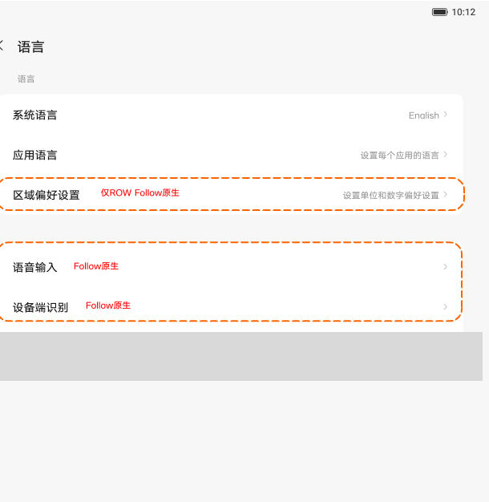
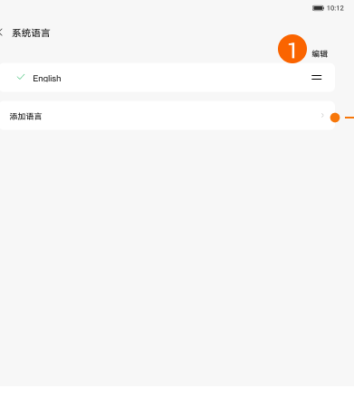
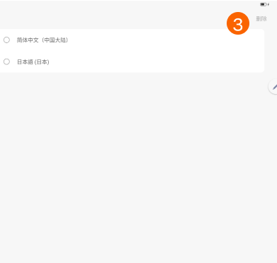

# 语言

[App 入口](../../README.md) · [功能查找](../../functions.md) · [页面导航](../../navigation.md)

| 信息 | 内容 |
|---|---|
| 知识 ID | `settings.language` |
| 功能入口 | 设置 > 通用设置 > 语言 |
| 检索词 | 系统语言 应用语言 添加语言 排序 删除 语音输入 识别 区域偏好；切换系统语言；添加语言；语言排序；删除语言 |

## 进入本页

| 定位要点 | 操作依据 |
|---|---|
| 推荐路径 | 设置 > 通用设置 > 语言 |
| 直接上级／起点 | [通用设置](../general/README.md) |
| 要找的入口 | 语言 |
| 形状与相对位置 | 通用设置内容区的分组文字列表，右侧摘要或箭头；备份／重置等下方条目需滚动内容区查找。 |
| 入口图示 | [上级页入口区域](../general/images/focus_01.png) |
| 到达确认 | 语言页按系统语言、应用语言、语音输入／识别、区域偏好等列项；具体组合取决于地区。系统语言子页可为直接选择，或支持添加与排序的语言列表。 |
| 资料覆盖 | 覆盖范围以本页列出的入口、控件和操作反馈为限；未列出的子流程不视为已知。 |

点击后先核对内容区标题及上述识别特征；双栏中左侧仍显示原导航属于正常布局，不要求整屏切换。多级路径中每一步均按当前界面重新定位。

## 页面识别与布局

语言页按系统语言、应用语言、语音输入／识别、区域偏好等列项；具体组合取决于地区。系统语言子页可为直接选择，或支持添加与排序的语言列表。

## 关键控件：形状、位置与操作目标

位置均相对**当前页面的内容区或弹窗**，不是固定屏幕坐标。颜色只是辅助线索；优先结合标签、控件形状及相邻元素识别。

| 控件／入口 | 外观特征 | 相对位置 | 操作目标／状态区别 | 局部图 |
|---|---|---|---|---|
| 系统语言 | 独立文字行，右侧当前语言／箭头 | 语言页最上方 | 点击进入系统语言列表 | [图 1](./images/focus_01.png) |
| 编辑 | 文字按钮 | 多语言列表标题行右侧 | 只有一种语言时不可用 | [图 2](./images/focus_02.png) |
| 拖动把手 | 短横线组成的把手 | 每个语言条目右侧 | 拖动把手排序，区别于点行选语言 | [图 2](./images/focus_02.png) |
| 删除选择 | 条目左侧圆形选择控件；右上方删除文字 | 编辑／删除模式 | 先选语言，删除才可用；至少保留一种 | [图 3](./images/focus_03.png) |

## 操作与结果

| 操作目的 | 如何操作 | 页面变化／结果 |
|---|---|---|
| 直接改变系统语言 | 在直接选择的列表点目标语言 | 立即切换 |
| 管理多语言列表 | 使用添加／搜索入口选择语言，处理是否更改系统语言的提示 | 语言加入列表，按选择决定是否成为系统语言 |
| 调整语言优先级 | 拖动把手；支持的列表也可点语言移到首位 | 列表顺序改变 |
| 删除语言 | 进入编辑，选中条目再删除 | 未选择时删除不可用；不能删除全部语言 |

## 入口找不到时的排查顺序

1. 确认起点为[通用设置](../general/README.md)，在“进入本页”注明的区域定位／滚动。
2. 先进入系统语言再操作列表；只有一种语言时编辑不可用；更换语言后重新识别界面文字。
3. 核对下方出现条件；仍无匹配时按[导航中的搜索与返回策略](../../navigation.md)诊断。只有用例允许时才改变前置条件或使用替代入口；无新线索则按[资料不足处理](../../limitations.md)记录阻塞。

## 交互常识与出现条件

仅一种语言时编辑不可用。语言改变后标签文本会变化，应重新识别页面。语音和应用语言完整子流程未提供。

## 返回与继续导航

上级资料：[通用设置](../general/README.md)。本文件若包含子页或弹窗，返回可能先到内部上一级；按实际标题确认，不假定一次返回就到上述起点。保存与取消规则见“操作与结果”，公共策略见[页面导航](../../navigation.md)。

## 相关页面

[键盘、输入法与鼠标](../../pages/keyboard/README.md)、[通用设置](../../pages/general/README.md)。

## 控件局部图

每张图聚焦上表对应的页面区域，保留标题或相邻标签作为定位参照。原图里的编号、虚线和箭头是设计说明，不是 App 控件。

### 图 1：语言设置的子入口

### 图 2：多语言列表的编辑和拖动把手

### 图 3：删除语言模式

## 资料来源（无需常规加载）

[S07](../../sources/S07.png)、[S36](../../sources/S36.png)；原文件映射见[来源表](../../sources.md)。
