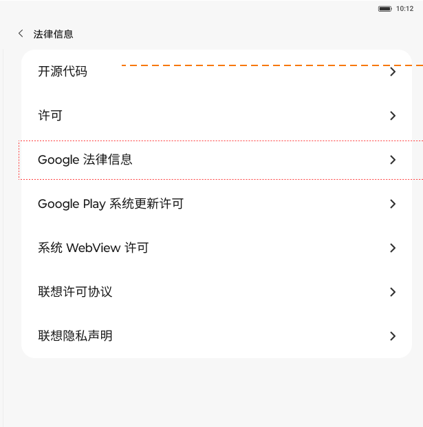

# 法律与监管信息

[App 入口](../../README.md) · [功能查找](../../functions.md) · [页面导航](../../navigation.md)

| 信息 | 内容 |
|---|---|
| 知识 ID | `settings.legal` |
| 功能入口 | 设置 > 关于平板电脑 > 法律信息／监管信息 |
| 检索词 | 开源 许可 法律 监管 进网许可 进网试用 Android 版本；开源许可；隐私政策；进网许可；监管信息 |

## 进入本页

| 定位要点 | 操作依据 |
|---|---|
| 推荐路径 | 设置 > 关于平板电脑 > 法律信息／监管信息 |
| 直接上级／起点 | [关于平板电脑](../about/README.md) |
| 要找的入口 | 法律信息／监管信息 |
| 形状与相对位置 | 关于页内容下部的两条不同入口行，右端箭头；根据用例选择，不要进入 Android 版本代替。 |
| 入口图示 | [上级页入口区域](../about/images/focus_01.png) |
| 到达确认 | 法律相关页面列出开源信息／开源代码、许可证、协议和隐私政策等；监管页展示设备对应的进网信息。 |
| 资料覆盖 | 覆盖范围以本页列出的入口、控件和操作反馈为限；未列出的子流程不视为已知。 |

点击后先核对内容区标题及上述识别特征；双栏中左侧仍显示原导航属于正常布局，不要求整屏切换。多级路径中每一步均按当前界面重新定位。

## 页面识别与布局

法律相关页面列出开源信息／开源代码、许可证、协议和隐私政策等；监管页展示设备对应的进网信息。

## 关键控件：形状、位置与操作目标

位置均相对**当前页面的内容区或弹窗**，不是固定屏幕坐标。颜色只是辅助线索；优先结合标签、控件形状及相邻元素识别。

| 控件／入口 | 外观特征 | 相对位置 | 操作目标／状态区别 | 局部图 |
|---|---|---|---|---|
| 协议／许可条目 | 简洁文字行，行末有右尖括号 | 法律信息列表 | 点击目标协议所在整行 | [图 1](./images/focus_01.png) |
| 返回 | 标题左侧箭头 | 内容区顶部 | 返回关于平板电脑 | [图 1](./images/focus_01.png) |

监管验证会跳往外部页面，本库没有该外部页面的完整交互；不把外部网页中的表单当作设置 App 的固定布局。

## 操作与结果

| 操作目的 | 如何操作 | 页面变化／结果 |
|---|---|---|
| 查协议或许可 | 按当前页面文字点击目标条目 | 显示相关内容 |
| 验证监管信息 | 在提供验证入口的设备点击验证 | 跳外部监管验证服务 |

## 入口找不到时的排查顺序

1. 确认起点为[关于平板电脑](../about/README.md)，在“进入本页”注明的区域定位／滚动。
2. 法律、监管和Android版本是不同入口；按实际标题确认，LTE和5G监管标签可能不同。
3. 核对下方出现条件；仍无匹配时按[导航中的搜索与返回策略](../../navigation.md)诊断。只有用例允许时才改变前置条件或使用替代入口；无新线索则按[资料不足处理](../../limitations.md)记录阻塞。

## 交互常识与出现条件

PRC 与 ROW 标签不同；LTE 可写进网许可，5G 可写进网试用。Android 版本、法律和监管为不同子页，需核对标题。外部网站完整流程未提供。

## 返回与继续导航

上级资料：[关于平板电脑](../about/README.md)。本文件若包含子页或弹窗，返回可能先到内部上一级；按实际标题确认，不假定一次返回就到上述起点。保存与取消规则见“操作与结果”，公共策略见[页面导航](../../navigation.md)。

## 相关页面

[关于平板电脑](../../pages/about/README.md)、[状态信息](../../pages/status/README.md)。

## 控件局部图

每张图聚焦上表对应的页面区域，保留标题或相邻标签作为定位参照。原图里的编号、虚线和箭头是设计说明，不是 App 控件。

### 图 1：法律相关条目与箭头

## 资料来源（无需常规加载）

[S10](../../sources/S10.png)；原文件映射见[来源表](../../sources.md)。
