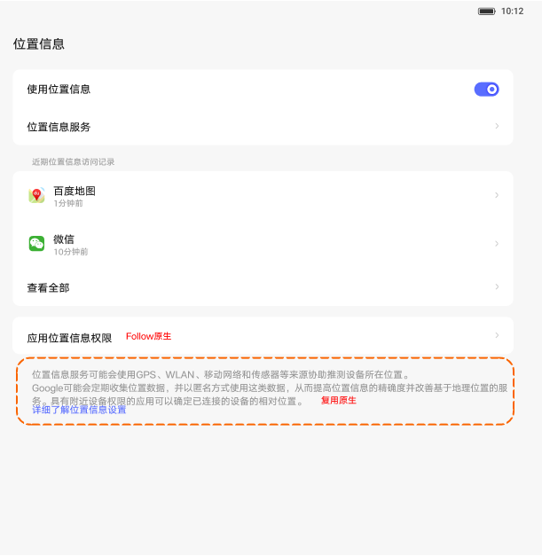
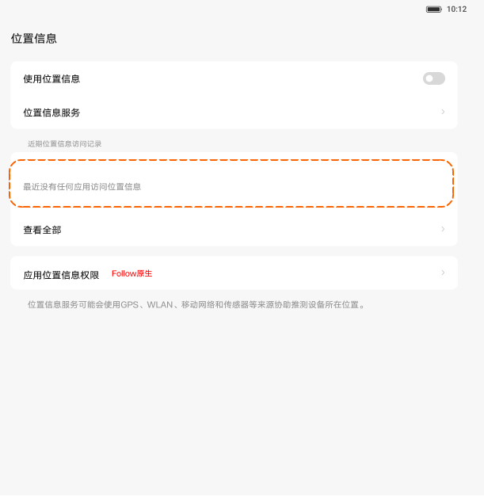

# 位置信息

[App 入口](../../README.md) · [功能查找](../../functions.md) · [页面导航](../../navigation.md)

| 信息 | 内容 |
|---|---|
| 知识 ID | `settings.location` |
| 功能入口 | 设置 > 位置信息 |
| 检索词 | 位置 定位 GPS 最近访问 应用权限 日落 日出；GPS；定位开关；位置权限；最近使用位置 |

## 进入本页

| 定位要点 | 操作依据 |
|---|---|
| 推荐路径 | 设置 > 位置信息 |
| 直接上级／起点 | [设置首页](../home/README.md) |
| 要找的入口 | 位置信息 |
| 形状与相对位置 | 首页的分组导航列表；图标＋模块名称所在行。双栏在左侧，向下滚动导航区查找。 |
| 入口图示 | [上级页入口区域](../home/images/focus_02.png) |
| 到达确认 | 顶部为使用位置信息总开关，下方有位置服务、最近访问位置的应用／查看全部、应用位置权限。最近无访问时出现空态。 |
| 资料覆盖 | 覆盖范围以本页列出的入口、控件和操作反馈为限；未列出的子流程不视为已知。 |

点击后先核对内容区标题及上述识别特征；双栏中左侧仍显示原导航属于正常布局，不要求整屏切换。多级路径中每一步均按当前界面重新定位。

## 页面识别与布局

顶部为使用位置信息总开关，下方有位置服务、最近访问位置的应用／查看全部、应用位置权限。最近无访问时出现空态。

## 关键控件：形状、位置与操作目标

位置均相对**当前页面的内容区或弹窗**，不是固定屏幕坐标。颜色只是辅助线索；优先结合标签、控件形状及相邻元素识别。

| 控件／入口 | 外观特征 | 相对位置 | 操作目标／状态区别 | 局部图 |
|---|---|---|---|---|
| 使用位置信息 | 首行文字＋右侧胶囊开关 | 内容顶部 | 先读开关当前状态 | [图 1](./images/focus_01.png) |
| 最近访问 | 应用图标、名称、时间组成的列表 | 位置服务下面 | 点目标应用／查看全部 | [图 1](./images/focus_01.png) |
| 应用位置权限 | 独立圆角文字行，右侧箭头 | 最近访问卡片下面 | 进入原生权限管理 | [图 1](./images/focus_01.png) |
| 空态说明 | 无最近访问的提示文本 | 原应用列表区域 | 是空态而非可点击应用 | [图 2](./images/focus_02.png) |

## 操作与结果

| 操作目的 | 如何操作 | 页面变化／结果 |
|---|---|---|
| 启用或关闭定位 | 操作顶部使用位置信息开关 | 定位状态改变，也可能影响依赖位置的设置 |
| 查看哪些应用访问位置 | 查看最近访问列表，必要时点查看全部 | 展示访问应用记录 |
| 配置应用位置权限 | 进入应用位置权限并识别目标应用 | 进入原生权限界面 |

## 入口找不到时的排查顺序

1. 确认起点为[设置首页](../home/README.md)，在“进入本页”注明的区域定位／滚动。
2. 最近访问列表为空不等于定位总开关关闭；先读取顶部开关，再区分权限页与位置服务页。
3. 核对下方出现条件；仍无匹配时按[导航中的搜索与返回策略](../../navigation.md)诊断。只有用例允许时才改变前置条件或使用替代入口；无新线索则按[资料不足处理](../../limitations.md)记录阻塞。

## 交互常识与出现条件

初始设计 PRC 关闭、ROW 开启，但操作前应读取当前状态。日落日出外观／护眼和位置时区可能依赖定位。访问时间和应用列表为动态数据。

## 返回与继续导航

上级资料：[设置首页](../home/README.md)。本文件若包含子页或弹窗，返回可能先到内部上一级；按实际标题确认，不假定一次返回就到上述起点。保存与取消规则见“操作与结果”，公共策略见[页面导航](../../navigation.md)。

## 相关页面

[深浅色自动切换](../../pages/dark_mode/README.md)、[护眼模式](../../pages/eye_comfort/README.md)、[日期和时间](../../pages/date_time/README.md)。

## 控件局部图

每张图聚焦上表对应的页面区域，保留标题或相邻标签作为定位参照。原图里的编号、虚线和箭头是设计说明，不是 App 控件。

### 图 1：位置总开关与访问列表

### 图 2：最近访问空态

## 资料来源（无需常规加载）

[S02](../../sources/S02.png)；原文件映射见[来源表](../../sources.md)。
