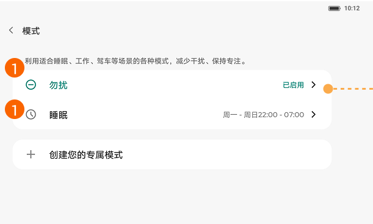

# 模式与勿扰

[App 入口](../../README.md) · [功能查找](../../functions.md) · [页面导航](../../navigation.md)

| 信息 | 内容 |
|---|---|
| 知识 ID | `settings.modes` |
| 功能入口 | 设置 > 声音和振动 > 模式 > 勿扰／睡眠 |
| 检索词 | 勿扰 模式 睡眠 免打扰 例外；免打扰；勿扰；睡眠模式；允许打扰 |

## 进入本页

| 定位要点 | 操作依据 |
|---|---|
| 推荐路径 | 设置 > 声音和振动 > 模式 > 勿扰／睡眠 |
| 直接上级／起点 | [声音和振动](../sound/README.md) |
| 要找的入口 | 模式 → 勿扰／睡眠 |
| 形状与相对位置 | 声音内容区的功能列表。杜比和模式位于静音卡片下面；背景音仅在实际提供该入口时进入，固定排序未确认。 |
| 入口图示 | [上级页入口区域](../sound/images/focus_02.png) |
| 到达确认 | 模式页提供勿扰、睡眠及自定义相关入口；进入具体模式后管理允许打扰的对象和条件。 |
| 资料覆盖 | 部分覆盖：模式入口及设置方向；白名单等更深子流程未完整提供。 |

点击后先核对内容区标题及上述识别特征；双栏中左侧仍显示原导航属于正常布局，不要求整屏切换。多级路径中每一步均按当前界面重新定位。

## 页面识别与布局

模式页提供勿扰、睡眠及自定义相关入口；进入具体模式后管理允许打扰的对象和条件。

## 关键控件：形状、位置与操作目标

位置均相对**当前页面的内容区或弹窗**，不是固定屏幕坐标。颜色只是辅助线索；优先结合标签、控件形状及相邻元素识别。

| 控件／入口 | 外观特征 | 相对位置 | 操作目标／状态区别 | 局部图 |
|---|---|---|---|---|
| 勿扰／睡眠 | 图标＋名称的圆角列表行，右端为状态摘要和箭头 | 模式页上部 | 点行进入对应模式 | [图 1](./images/focus_01.png) |
| 创建模式 | 左侧加号＋创建文字的独立行 | 现有模式列表下面 | 作为自定义模式入口；内部流程未提供 | [图 1](./images/focus_01.png) |

## 操作与结果

| 操作目的 | 如何操作 | 页面变化／结果 |
|---|---|---|
| 查找勿扰设置 | 在模式列表点击勿扰 | 进入勿扰配置 |
| 检查通知是否应被抑制 | 同时查看模式规则、静音、音量和振动 | 区分允许打扰范围与声音／振动偏好 |

## 入口找不到时的排查顺序

1. 确认起点为[声音和振动](../sound/README.md)，在“进入本页”注明的区域定位／滚动。
2. 先进入模式，再选勿扰或睡眠；更深层白名单流程缺失时不能猜控件位置。
3. 核对下方出现条件；仍无匹配时按[导航中的搜索与返回策略](../../navigation.md)诊断。只有用例允许时才改变前置条件或使用替代入口；无新线索则按[资料不足处理](../../limitations.md)记录阻塞。

## 交互常识与出现条件

本包未给出完整白名单配置和重复来电等子流程。不能把启用勿扰理解为改写静音／振动的存储偏好。

## 返回与继续导航

上级资料：[声音和振动](../sound/README.md)。本文件若包含子页或弹窗，返回可能先到内部上一级；按实际标题确认，不假定一次返回就到上述起点。保存与取消规则见“操作与结果”，公共策略见[页面导航](../../navigation.md)。

## 相关页面

[声音和振动](../../pages/sound/README.md)、[振动设置](../../pages/vibration/README.md)。

## 控件局部图

每张图聚焦上表对应的页面区域，保留标题或相邻标签作为定位参照。原图里的编号、虚线和箭头是设计说明，不是 App 控件。

### 图 1：勿扰、睡眠与创建模式

## 资料来源（无需常规加载）

[S18](../../sources/S18.png)；原文件映射见[来源表](../../sources.md)。
