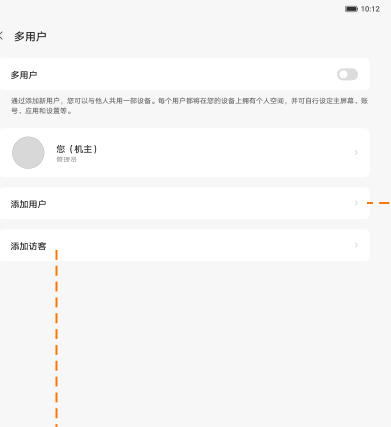
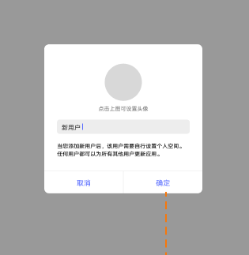
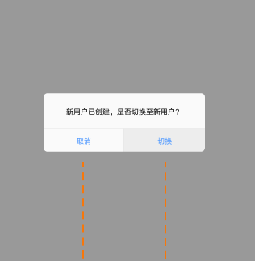

# 多用户

[App 入口](../../README.md) · [功能查找](../../functions.md) · [页面导航](../../navigation.md)

| 信息 | 内容 |
|---|---|
| 知识 ID | `settings.multi_user` |
| 功能入口 | ROW：设置 > 通用设置 > 多用户 |
| 检索词 | 用户 访客 机主 切换 头像 添加 删除；添加用户；访客模式；切换用户；修改头像 |

## 进入本页

| 定位要点 | 操作依据 |
|---|---|
| 推荐路径 | ROW：设置 > 通用设置 > 多用户 |
| 直接上级／起点 | [通用设置](../general/README.md) |
| 要找的入口 | 多用户（ROW） |
| 形状与相对位置 | 通用设置内容区的分组文字列表，右侧摘要或箭头；备份／重置等下方条目需滚动内容区查找。 |
| 入口图示 | [上级页入口区域](../general/images/focus_01.png) |
| 到达确认 | 页面有多用户总开关、机主和用户列表、添加用户／访客。创建界面填写名称、头像；随后有是否切换的选择。 |
| 资料覆盖 | 覆盖范围以本页列出的入口、控件和操作反馈为限；未列出的子流程不视为已知。 |

点击后先核对内容区标题及上述识别特征；双栏中左侧仍显示原导航属于正常布局，不要求整屏切换。多级路径中每一步均按当前界面重新定位。

## 页面识别与布局

页面有多用户总开关、机主和用户列表、添加用户／访客。创建界面填写名称、头像；随后有是否切换的选择。

## 关键控件：形状、位置与操作目标

位置均相对**当前页面的内容区或弹窗**，不是固定屏幕坐标。颜色只是辅助线索；优先结合标签、控件形状及相邻元素识别。

| 控件／入口 | 外观特征 | 相对位置 | 操作目标／状态区别 | 局部图 |
|---|---|---|---|---|
| 主开关 | 多用户行右端胶囊开关 | 页面上方 | 确认已启用后查用户列表 | [图 1](./images/focus_01.png) |
| 用户卡片 | 圆形头像＋名称＋身份说明 | 开关说明下方 | 点击对应用户 | [图 1](./images/focus_01.png) |
| 添加入口 | 添加用户／添加访客两行，右端箭头 | 用户卡片下方 | 普通用户与访客是不同入口 | [图 1](./images/focus_01.png) |
| 新建弹窗 | 顶部圆形头像，中间名称输入框，底部按钮 | 居中弹窗 | 先填名称；取消在左、确定在右 | [图 2](./images/focus_02.png) |
| 切换询问 | 短说明＋两个文字按钮 | 创建完成后新弹窗 | 取消只取消切换，不撤销用户创建 | [图 3](./images/focus_03.png) |

## 操作与结果

| 操作目的 | 如何操作 | 页面变化／结果 |
|---|---|---|
| 添加用户 | 选择添加用户，填写名称／头像并确定 | 加载完成后询问是否切换 |
| 只创建、不切换 | 在后续切换询问中取消 | 留在当前用户，已创建用户仍保留 |
| 进入新用户或访客 | 在切换询问中选择切换 | 进入用户切换进度 |
| 编辑机主信息 | 打开机主资料，修改名称或头像 | 头像可拍照、选图或使用预置图 |

## 入口找不到时的排查顺序

1. 确认起点为[通用设置](../general/README.md)，在“进入本页”注明的区域定位／滚动。
2. 先核对ROW路径及多用户开关；区分添加用户与访客；创建后取消切换不会撤销创建。
3. 核对下方出现条件；仍无匹配时按[导航中的搜索与返回策略](../../navigation.md)诊断。只有用例允许时才改变前置条件或使用替代入口；无新线索则按[资料不足处理](../../limitations.md)记录阻塞。

## 交互常识与出现条件

ROW 方案容量为 1 个机主、3 个普通用户、1 个访客。头像选择可进入其他 App，需重新确认目标页面。删除权限和全部异常流程未提供。

## 返回与继续导航

上级资料：[通用设置](../general/README.md)。本文件若包含子页或弹窗，返回可能先到内部上一级；按实际标题确认，不假定一次返回就到上述起点。保存与取消规则见“操作与结果”，公共策略见[页面导航](../../navigation.md)。

## 相关页面

[通用设置](../../pages/general/README.md)、[背景音（仅入口存在时）](../../pages/background_sound/README.md)。

## 控件局部图

每张图聚焦上表对应的页面区域，保留标题或相邻标签作为定位参照。原图里的编号、虚线和箭头是设计说明，不是 App 控件。

### 图 1：多用户列表

### 图 2：新建用户的头像、名称和按钮

### 图 3：创建完成后的切换确认

## 资料来源（无需常规加载）

[S08](../../sources/S08.png)；原文件映射见[来源表](../../sources.md)。
