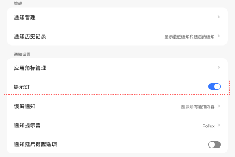
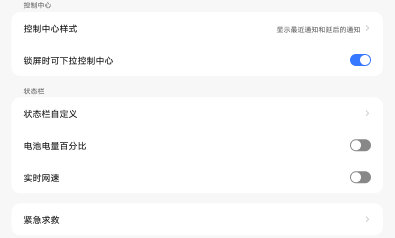

# 通知和控制中心

[App 入口](../../README.md) · [功能查找](../../functions.md) · [页面导航](../../navigation.md)

| 信息 | 内容 |
|---|---|
| 知识 ID | `settings.notifications` |
| 功能入口 | 设置 > 通知和控制中心 |
| 检索词 | 通知 管理 历史 角标 提示灯 锁屏 下拉 控制中心 电量 网速；锁屏通知；通知历史；角标；电量百分比；实时网速；控制中心样式 |

## 进入本页

| 定位要点 | 操作依据 |
|---|---|
| 推荐路径 | 设置 > 通知和控制中心 |
| 直接上级／起点 | [设置首页](../home/README.md) |
| 要找的入口 | 通知和控制中心 |
| 形状与相对位置 | 首页的分组导航列表；图标＋模块名称所在行。双栏在左侧，向下滚动导航区查找。 |
| 入口图示 | [上级页入口区域](../home/images/focus_02.png) |
| 到达确认 | 页面依次分为通知、控制中心、状态栏相关区域。通知管理／历史在前部；通知组有角标、提示灯、锁屏通知、声音、稍后提醒；控制中心组有样式和锁屏下拉；状态栏组有电量百分比、实时网速。 |
| 资料覆盖 | 部分覆盖：分组和控件；通知管理、控制中心样式详情未完整提供。 |

点击后先核对内容区标题及上述识别特征；双栏中左侧仍显示原导航属于正常布局，不要求整屏切换。多级路径中每一步均按当前界面重新定位。

## 页面识别与布局

页面依次分为通知、控制中心、状态栏相关区域。通知管理／历史在前部；通知组有角标、提示灯、锁屏通知、声音、稍后提醒；控制中心组有样式和锁屏下拉；状态栏组有电量百分比、实时网速。

## 关键控件：形状、位置与操作目标

位置均相对**当前页面的内容区或弹窗**，不是固定屏幕坐标。颜色只是辅助线索；优先结合标签、控件形状及相邻元素识别。

| 控件／入口 | 外观特征 | 相对位置 | 操作目标／状态区别 | 局部图 |
|---|---|---|---|---|
| 通知管理／历史 | 带右箭头的文字行 | 内容顶部的管理卡片 | 点整行进入 | [图 1](./images/focus_01.png) |
| 提示灯／稍后提醒 | 行右端胶囊开关 | 通知设置卡片内 | 与带箭头的子页入口区分 | [图 1](./images/focus_01.png) |
| 锁屏通知 | 右侧显示当前选项文字与箭头 | 提示灯下面、通知声音上面 | 点击行进入内容选项 | [图 1](./images/focus_01.png) |
| 锁屏下拉 | 胶囊开关 | 控制中心卡片底部 | 控制中心样式是上一行的子页入口 | [图 2](./images/focus_02.png) |
| 电量百分比／实时网速 | 两行开关 | 状态栏区域下部 | 按标签选择相应开关 | [图 2](./images/focus_02.png) |

## 操作与结果

| 操作目的 | 如何操作 | 页面变化／结果 |
|---|---|---|
| 修改锁屏通知 | 找到锁屏通知行并进入选项 | 可选项随锁屏密码状态变化，与隐私页同步 |
| 调整状态栏信息 | 滚动至状态栏相关区域，操作目标开关 | 检查状态栏显示变化 |
| 调整锁屏下拉 | 在控制中心组操作允许锁屏下拉开关 | 检查锁屏状态下的下拉行为 |

## 入口找不到时的排查顺序

1. 确认起点为[设置首页](../home/README.md)，在“进入本页”注明的区域定位／滚动。
2. 按通知、控制中心、状态栏分组查找；提示灯缺失可能是硬件不支持；AI字幕不属于此处的通知功能。
3. 核对下方出现条件；仍无匹配时按[导航中的搜索与返回策略](../../navigation.md)诊断。只有用例允许时才改变前置条件或使用替代入口；无新线索则按[资料不足处理](../../limitations.md)记录阻塞。

## 交互常识与出现条件

提示灯依设备支持。通知管理与控制中心样式的完整子页未提供；不要按图中的开关样例推断初始状态。

## 返回与继续导航

上级资料：[设置首页](../home/README.md)。本文件若包含子页或弹窗，返回可能先到内部上一级；按实际标题确认，不假定一次返回就到上述起点。保存与取消规则见“操作与结果”，公共策略见[页面导航](../../navigation.md)。

## 相关页面

[隐私保护／隐私控制](../../pages/privacy/README.md)、[控制中心及跨页状态同步](../../features/control_center_sync/README.md)。

## 控件局部图

每张图聚焦上表对应的页面区域，保留标题或相邻标签作为定位参照。原图里的编号、虚线和箭头是设计说明，不是 App 控件。

### 图 1：通知管理与通知设置

### 图 2：控制中心与状态栏设置

## 资料来源（无需常规加载）

[S14](../../sources/S14.png)、[S38](../../sources/S38.png)、[S39](../../sources/S39.png)、[S01](../../sources/S01.png)；原文件映射见[来源表](../../sources.md)。
