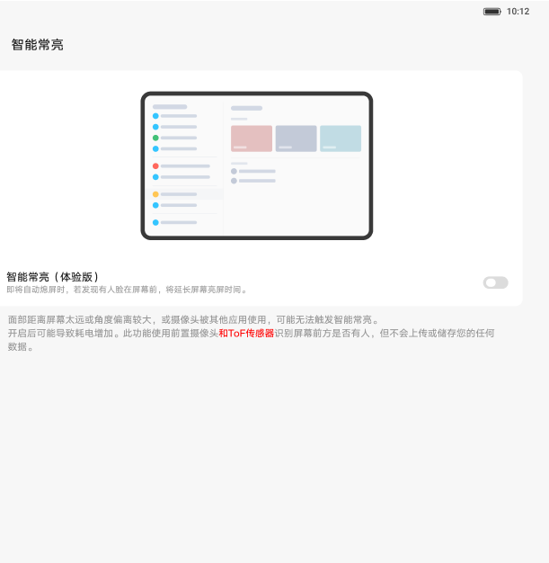
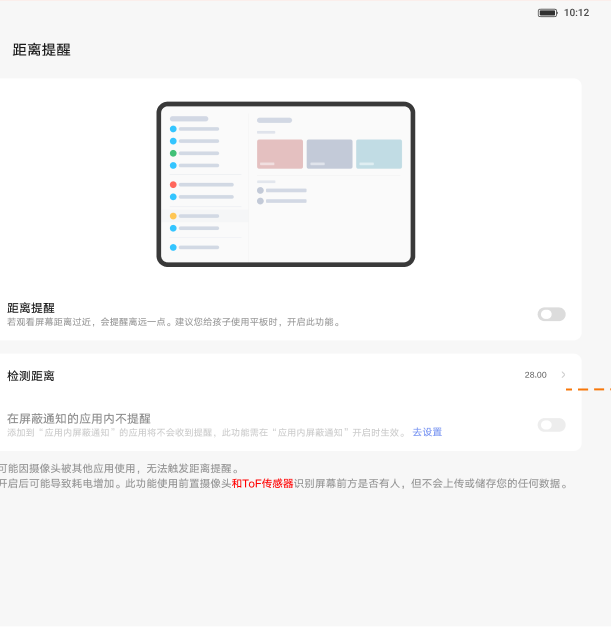
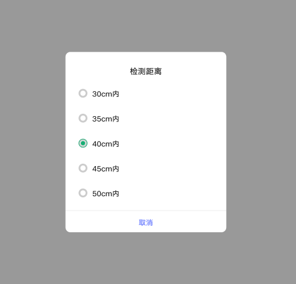

# 智能常亮、靠近亮屏与距离提醒

[App 入口](../../README.md) · [功能查找](../../functions.md) · [页面导航](../../navigation.md)

| 信息 | 内容 |
|---|---|
| 知识 ID | `settings.presence` |
| 功能入口 | 高级功能 > 实验室；PRC 距离提醒在学习助手 > 健康护眼 |
| 检索词 | 常亮 靠近 亮屏 距离 TOF 注视 KidsSpace 外接显示器；注视不息屏；靠近亮屏；距离提醒；护眼距离 |

## 进入本页

| 定位要点 | 操作依据 |
|---|---|
| 推荐路径 | 高级功能 > 实验室；PRC 距离提醒在学习助手 > 健康护眼 |
| 直接上级／起点 | [高级功能与实验室](../advanced/README.md) |
| 要找的入口 | ROW：实验室内智能常亮／靠近亮屏／距离提醒 |
| 形状与相对位置 | ROW 先进入实验室，查图标＋标题的功能行；PRC 的距离提醒位于学习助手 → 健康护眼，该段完整布局未提供。 |
| 入口图示 | [上级页入口区域](../advanced/images/focus_02.png) |
| 到达确认 | 进入智能常亮或靠近亮屏页时核对功能标题与插画下方开关；距离提醒页核对主开关及检测距离行。 |
| 资料覆盖 | 部分覆盖：ROW实验室入口和距离页；PRC学习助手 → 健康护眼只给路径，缺完整上级布局。 |

点击后先核对内容区标题及上述识别特征；双栏中左侧仍显示原导航属于正常布局，不要求整屏切换。多级路径中每一步均按当前界面重新定位。

PRC 距离提醒应使用“学习助手 → 健康护眼”路径；上表实验室位置图用于 ROW，不作为 PRC 路径的视觉证据。

## 页面识别与布局

ROW 从实验室找到智能常亮、靠近亮屏、距离提醒；PRC 距离提醒在学习助手 > 健康护眼。距离页有总开关及距离选择。

## 关键控件：形状、位置与操作目标

位置均相对**当前页面的内容区或弹窗**，不是固定屏幕坐标。颜色只是辅助线索；优先结合标签、控件形状及相邻元素识别。

| 控件／入口 | 外观特征 | 相对位置 | 操作目标／状态区别 | 局部图 |
|---|---|---|---|---|
| 常亮／靠近开关 | 上方设备插画，下方文字行末端胶囊开关 | 对应功能页中上部 | 插画用于解释，实际开关在文字行右侧 | [图 1](./images/focus_01.png) |
| 距离提醒 | 主开关行和检测距离行 | 距离提醒插画下方 | 先开提醒再点检测距离 | [图 2](./images/focus_02.png) |
| 距离选项 | 居中白色弹窗，圆形单选标记＋厘米值 | 弹窗纵向列表 | 点 30／35／40／45／50 cm；取消在底部 | [图 3](./images/focus_03.png) |

## 操作与结果

| 操作目的 | 如何操作 | 页面变化／结果 |
|---|---|---|
| 开启智能常亮 | 操作智能常亮开关 | 熄屏前检测注视并可延长亮屏 |
| 开启靠近唤醒 | 操作靠近亮屏开关 | 屏幕熄灭时检测靠近人脸并唤醒 |
| 设定提醒距离 | 先打开距离提醒，再打开距离选项，选择 30／35／40／45／50 cm | 保存并关闭；取消不改值 |
| 处理 KidsSpace 提醒 | 选择不用了或前往设置 | 分别继续进入 KidsSpace 或跳转距离设置 |
| 相关功能置灰 | 检查是否连接外接显示器 | 点击可解释不可用；断开后恢复原状态 |

## 入口找不到时的排查顺序

1. 确认起点为ROW：[高级功能与实验室](../advanced/README.md)；PRC距离提醒：学习助手 → 健康护眼（缺完整布局），在“进入本页”注明的区域定位／滚动。
2. 先按地区区分实验室与学习助手路径；置灰时检查外接显示器；距离子项禁用时检查总开关。
3. 核对下方出现条件；仍无匹配时按[导航中的搜索与返回策略](../../navigation.md)诊断。只有用例允许时才改变前置条件或使用替代入口；无新线索则按[资料不足处理](../../limitations.md)记录阻塞。

## 交互常识与出现条件

依赖 TOF／摄像头等支持；距离与常亮检测在熄屏时不生效。距离总开关关闭时子项禁用。豁免应用中可不提醒，名单未提供。

## 返回与继续导航

上级资料：ROW：[高级功能与实验室](../advanced/README.md)；PRC距离提醒：学习助手 → 健康护眼（缺完整布局）。本文件若包含子页或弹窗，返回可能先到内部上一级；按实际标题确认，不假定一次返回就到上述起点。保存与取消规则见“操作与结果”，公共策略见[页面导航](../../navigation.md)。

## 相关页面

[屏幕熄灭时间](../../pages/screen_timeout/README.md)、[高级功能与实验室](../../pages/advanced/README.md)。

## 控件局部图

每张图聚焦上表对应的页面区域，保留标题或相邻标签作为定位参照。原图里的编号、虚线和箭头是设计说明，不是 App 控件。

### 图 1：智能常亮开关

### 图 2：距离提醒入口和距离行

### 图 3：距离单选弹窗

## 资料来源（无需常规加载）

[S04](../../sources/S04.png)；原文件映射见[来源表](../../sources.md)。
