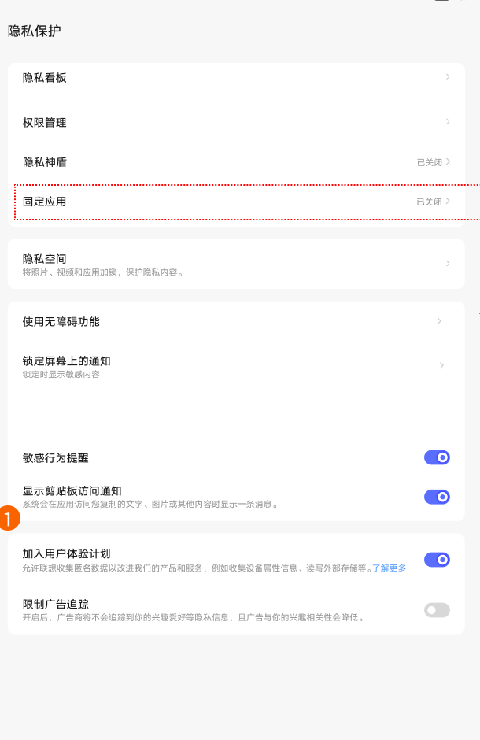
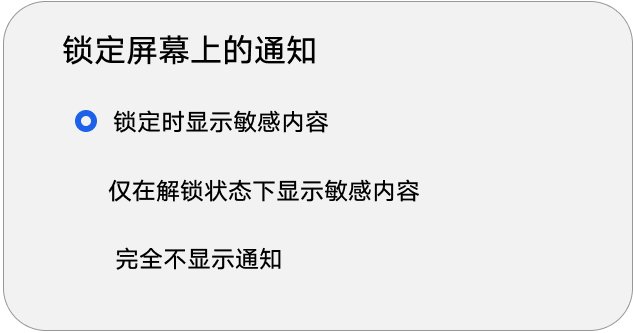
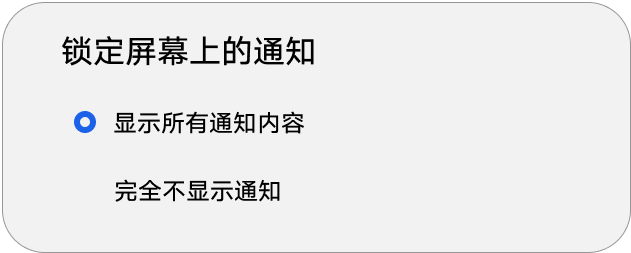

# 隐私保护／隐私控制

[App 入口](../../README.md) · [功能查找](../../functions.md) · [页面导航](../../navigation.md)

| 信息 | 内容 |
|---|---|
| 知识 ID | `settings.privacy` |
| 功能入口 | PRC：设置 > 隐私保护；ROW：安全和隐私内相关入口 |
| 检索词 | 隐私 权限 剪贴板 固定应用 隐私空间 广告追踪 用户体验 锁屏敏感通知；隐私看板；剪贴板提示；锁屏隐藏敏感信息；用户体验计划 |

## 进入本页

| 定位要点 | 操作依据 |
|---|---|
| 推荐路径 | PRC：设置 > 隐私保护；ROW：安全和隐私内相关入口 |
| 直接上级／起点 | [设置首页](../home/README.md) |
| 要找的入口 | PRC：隐私保护；ROW：安全和隐私内的隐私入口 |
| 形状与相对位置 | PRC 是分组导航中的文字行；ROW 先进入安全和隐私，再按实际隐私条目进入。ROW 的逐级控件定位未完整提供。 |
| 入口图示 | [上级页入口区域](../home/images/focus_02.png) |
| 到达确认 | 核对当前隐私相关标题，内容出现隐私看板、权限、剪贴板或锁屏通知等实际提供的项目；按地区分支识别。 |
| 资料覆盖 | 覆盖范围以本页列出的入口、控件和操作反馈为限；未列出的子流程不视为已知。 |

点击后先核对内容区标题及上述识别特征；双栏中左侧仍显示原导航属于正常布局，不要求整屏切换。多级路径中每一步均按当前界面重新定位。

## 页面识别与布局

PRC 在隐私保护中，ROW 可从安全和隐私进入相关设置。列表可见隐私看板、权限、固定应用、隐私空间、锁定屏幕上的通知、剪贴板访问提示、用户体验计划等。

## 关键控件：形状、位置与操作目标

位置均相对**当前页面的内容区或弹窗**，不是固定屏幕坐标。颜色只是辅助线索；优先结合标签、控件形状及相邻元素识别。

| 控件／入口 | 外观特征 | 相对位置 | 操作目标／状态区别 | 局部图 |
|---|---|---|---|---|
| 隐私功能入口 | 文字行，右侧箭头或状态摘要 | 列表上部 | 点权限、固定应用或隐私空间等目标行 | [图 1](./images/focus_01.png) |
| 锁屏通知 | 文字＋当前选择摘要的行 | 使用无障碍功能附近 | 点行打开选项弹窗 | [图 1](./images/focus_01.png) |
| 通知选择 | 圆角弹窗内纵向单选项 | 弹窗中央区域 | 按有／无密码选择对应选项，不固定行号 | [图 2](./images/focus_02.png) |
| 体验计划 | 开关行内说明文字，附了解更多链接 | 隐私列表下部 | 了解更多与开关是不同操作目标 | [图 1](./images/focus_01.png) |

## 操作与结果

| 操作目的 | 如何操作 | 页面变化／结果 |
|---|---|---|
| 设置锁屏通知内容 | 点击锁定屏幕上的通知，按当前密码状态选择 | 有密码时可区分敏感内容显示时机；无密码时主要为显示全部／不显示 |
| 查看体验计划协议 | 点击了解更多 | 打开协议；同意开启，不同意关闭 |
| 更改固定应用设置 | 找到固定应用入口 | 进入原生设置；完整下一级流程未提供 |

## 入口找不到时的排查顺序

1. 确认起点为[设置首页](../home/README.md)，在“进入本页”注明的区域定位／滚动。
2. 先确定PRC独立隐私保护与ROW安全和隐私两种路径；锁屏通知也可从通知页访问。
3. 核对下方出现条件；仍无匹配时按[导航中的搜索与返回策略](../../navigation.md)诊断。只有用例允许时才改变前置条件或使用替代入口；无新线索则按[资料不足处理](../../limitations.md)记录阻塞。

## 交互常识与出现条件

锁屏通知与通知页同步。解除临时限制可恢复之前选择，但期间用户手动改动应保留。列表项是否存在受设备能力影响。

## 返回与继续导航

上级资料：[设置首页](../home/README.md)。本文件若包含子页或弹窗，返回可能先到内部上一级；按实际标题确认，不假定一次返回就到上述起点。保存与取消规则见“操作与结果”，公共策略见[页面导航](../../navigation.md)。

## 相关页面

[通知和控制中心](../../pages/notifications/README.md)、[安全、隐私与紧急情况](../../pages/safety/README.md)、[首页设置建议](../../features/suggestions/README.md)。

## 控件局部图

每张图聚焦上表对应的页面区域，保留标题或相邻标签作为定位参照。原图里的编号、虚线和箭头是设计说明，不是 App 控件。

### 图 1：隐私列表与用户体验计划

### 图 2：有密码时的通知选择

### 图 3：无密码时的通知选择

## 资料来源（无需常规加载）

[S01](../../sources/S01.png)、[S13](../../sources/S13.png)；原文件映射见[来源表](../../sources.md)。
