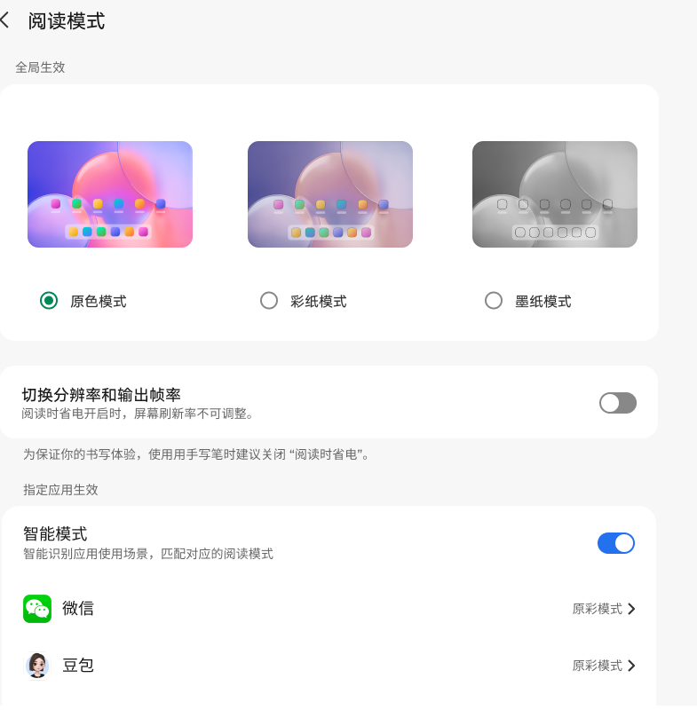
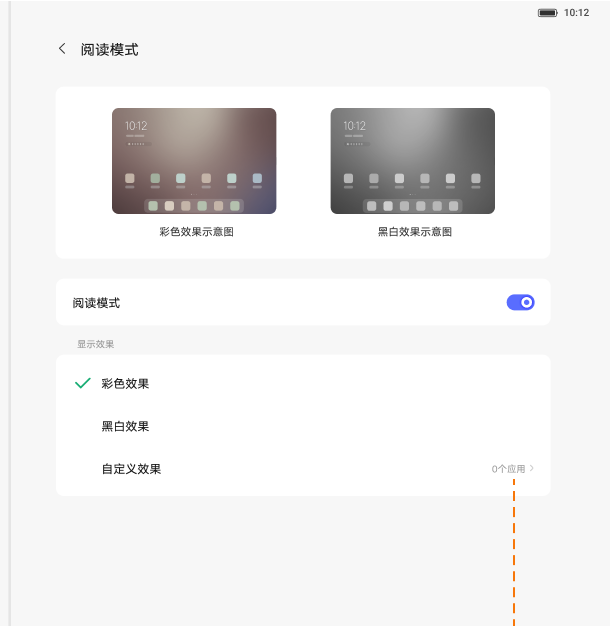
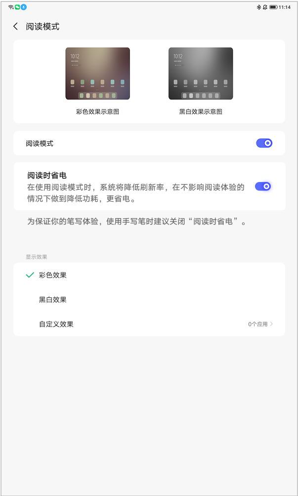

# 阅读模式

[App 入口](../../README.md) · [功能查找](../../functions.md) · [页面导航](../../navigation.md)

| 信息 | 内容 |
|---|---|
| 知识 ID | `settings.reading_mode` |
| 功能入口 | 设置 > 显示和亮度 > 阅读模式 |
| 检索词 | 阅读 原色 彩纸 墨纸 智能阅读 黑白 自定义 阅读省电；阅读黑白；电子书显示；墨纸；彩纸；阅读省电 |

## 进入本页

| 定位要点 | 操作依据 |
|---|---|
| 推荐路径 | 设置 > 显示和亮度 > 阅读模式 |
| 直接上级／起点 | [显示和亮度](../display/README.md) |
| 要找的入口 | 阅读模式 |
| 形状与相对位置 | 显示内容区的子功能文字列表行，位于亮度等上方设置之后；右侧可带摘要或箭头。未显示时滚动内容区。 |
| 入口图示 | [上级页入口区域](../display/images/focus_02.png) |
| 到达确认 | 内容区出现阅读模式对应控件：原色／彩纸／墨纸卡片，或总开关＋彩色／黑白＋自定义应用；按实际布局选择分支。 |
| 资料覆盖 | 覆盖范围以本页列出的入口、控件和操作反馈为限；未列出的子流程不视为已知。 |

点击后先核对内容区标题及上述识别特征；双栏中左侧仍显示原导航属于正常布局，不要求整屏切换。多级路径中每一步均按当前界面重新定位。

## 页面识别与布局

按当前屏幕识别两类布局：

| 可见控件 | 使用的操作路径 |
|---|---|
| 原色、彩纸、墨纸卡片与智能阅读 | 直接选择模式卡片；智能阅读依赖原色 |
| 总开关、彩色／黑白、自定义应用 | 先打开总开关，再选效果或配置应用 |

## 关键控件：形状、位置与操作目标

位置均相对**当前页面的内容区或弹窗**，不是固定屏幕坐标。颜色只是辅助线索；优先结合标签、控件形状及相邻元素识别。

| 控件／入口 | 外观特征 | 相对位置 | 操作目标／状态区别 | 局部图 |
|---|---|---|---|---|
| 纸张模式 | 三张横向预览图，图下有圆形单选标记和模式名 | 卡片布局顶部；原色、彩纸、墨纸从左到右 | 按名称选择效果，不只根据图片颜色 | [图 1](./images/focus_01.png) |
| 阅读省电 | 独立圆角行，右侧胶囊开关 | 模式卡片下方 | 可能限制刷新率；标签可为切换分辨率和帧率 | [图 1](./images/focus_01.png) |
| 智能模式 | 右端胶囊开关，下面接应用列表 | 指定应用生效区域的顶部 | 先选原色使其可用；应用行右端有模式和箭头 | [图 1](./images/focus_01.png) |
| 总开关式布局 | 两张效果图下有阅读模式开关，再下方为彩色／黑白／自定义行 | 仅用于当前屏幕确实为两图布局时 | 先开主开关，再选效果或进入自定义应用 | [图 2](./images/focus_02.png) |

在智能模式布局中，应用条目包含应用图标、名称与当前效果；应点击目标应用这一行。总开关关闭后的灰化只说明暂不可操作，不应自动推断保存的子项被清空。

## 操作与结果

| 操作目的 | 如何操作 | 页面变化／结果 |
|---|---|---|
| 切换纸张效果 | 在卡片布局中点击彩纸／墨纸 | 彩纸呈纸张效果并降低亮度；墨纸呈黑白效果 |
| 开启智能阅读 | 先选原色，再打开智能阅读 | 按应用映射应用效果；选择彩纸／墨纸时智能阅读置灰 |
| 处理首次介绍 | 若出现介绍弹窗，点击知道了 | 关闭弹窗，再操作页面 |
| 按应用指定阅读效果 | 在提供自定义应用的布局中进入应用设置，选择彩色／黑白／无 | 保存对应应用选择 |
| 使用阅读省电 | 仅在存在该开关的页面调整 | 可能限制刷新率；总开关关闭时相关子项禁用并记忆原状态 |

## 入口找不到时的排查顺序

1. 确认起点为[显示和亮度](../display/README.md)，在“进入本页”注明的区域定位／滚动。
2. 先识别卡片式还是总开关式布局，只执行对应分支；智能阅读依赖原色，勿将两套开关拼接。
3. 核对下方出现条件；仍无匹配时按[导航中的搜索与返回策略](../../navigation.md)诊断。只有用例允许时才改变前置条件或使用替代入口；无新线索则按[资料不足处理](../../limitations.md)记录阻塞。

## 交互常识与出现条件

不要把两类布局的开关组合成同一个流程。智能阅读应用映射名单、各设备省电帧率未给出。刷新率无法修改时先查看阅读省电。介绍弹窗只在实际出现时处理，不把它当作每次进入必经步骤。

## 返回与继续导航

上级资料：[显示和亮度](../display/README.md)。本文件若包含子页或弹窗，返回可能先到内部上一级；按实际标题确认，不假定一次返回就到上述起点。保存与取消规则见“操作与结果”，公共策略见[页面导航](../../navigation.md)。

## 相关页面

[屏幕刷新率](../../pages/refresh_rate/README.md)、[显示和亮度](../../pages/display/README.md)。

## 控件局部图

每张图聚焦上表对应的页面区域，保留标题或相邻标签作为定位参照。原图里的编号、虚线和箭头是设计说明，不是 App 控件。

### 图 1：原色、彩纸、墨纸及智能模式

### 图 2：总开关与彩色／黑白布局

### 图 3：阅读省电与主开关联动

## 资料来源（无需常规加载）

[S17](../../sources/S17.png)、[S41](../../sources/S41.png)；原文件映射见[来源表](../../sources.md)。
