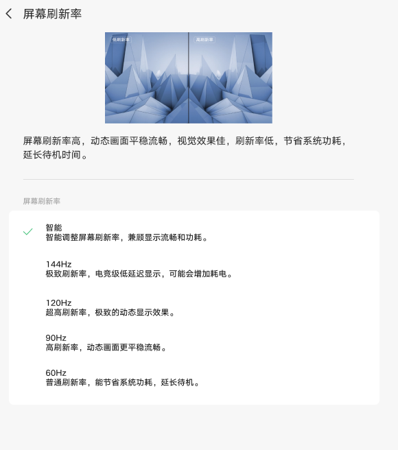

# 屏幕刷新率

[App 入口](../../README.md) · [功能查找](../../functions.md) · [页面导航](../../navigation.md)

| 信息 | 内容 |
|---|---|
| 知识 ID | `settings.refresh_rate` |
| 功能入口 | 设置 > 显示和亮度 > 屏幕刷新率 |
| 检索词 | 刷新率 60Hz 120Hz 144Hz 165Hz 智能 极致 普通 全局手写笔 高刷；高刷；调刷新率；限制帧率；设置120Hz；高刷新率应用 |

## 进入本页

| 定位要点 | 操作依据 |
|---|---|
| 推荐路径 | 设置 > 显示和亮度 > 屏幕刷新率 |
| 直接上级／起点 | [显示和亮度](../display/README.md) |
| 要找的入口 | 屏幕刷新率 |
| 形状与相对位置 | 显示内容区的子功能文字列表行，位于亮度等上方设置之后；右侧可带摘要或箭头。未显示时滚动内容区。 |
| 入口图示 | [上级页入口区域](../display/images/focus_02.png) |
| 到达确认 | 先识别当前控件：一类列出智能及 144／120／90／60 Hz 等数值；另一类列出智能、极致、普通。部分页面还有高刷新率应用和全局手写笔入口。 |
| 资料覆盖 | 覆盖范围以本页列出的入口、控件和操作反馈为限；未列出的子流程不视为已知。 |

点击后先核对内容区标题及上述识别特征；双栏中左侧仍显示原导航属于正常布局，不要求整屏切换。多级路径中每一步均按当前界面重新定位。

## 页面识别与布局

先识别当前控件：一类列出智能及 144／120／90／60 Hz 等数值；另一类列出智能、极致、普通。部分页面还有高刷新率应用和全局手写笔入口。

## 关键控件：形状、位置与操作目标

位置均相对**当前页面的内容区或弹窗**，不是固定屏幕坐标。颜色只是辅助线索；优先结合标签、控件形状及相邻元素识别。

| 控件／入口 | 外观特征 | 相对位置 | 操作目标／状态区别 | 局部图 |
|---|---|---|---|---|
| 刷新率选项 | 竖向文字行，选中项旁有勾选或圆形单选标记 | 上方效果预览和说明下 | 按档位文字选择 | [图 1](./images/focus_01.png) |
| 全局手写笔 | 圆角设置行，右端胶囊开关 | 刷新率档位卡片下方（存在时） | 切换前核对联动提示 | [图 1](./images/focus_01.png) |
| 使用高刷新率的应用 | 标题＋说明的圆角行，最右侧尖括号 | 页面下部（支持时） | 点击整行进入应用列表 | [图 1](./images/focus_01.png) |
| 数值方案 | 144／120／90／60 Hz 等单选项 | 同一刷新率选项区域 | 按实际数值识别，不能按行号跨设备定位 | [图 2](./images/focus_02.png) |

## 操作与结果

| 操作目的 | 如何操作 | 页面变化／结果 |
|---|---|---|
| 改变刷新率 | 选择当前设备提供的刷新率档位 | 应用所选模式；出现联动确认时先处理弹窗 |
| 设置单个应用高刷 | 在支持的智能／极致模式下进入高刷新率应用 | 显示应用列表；可用字母索引定位 |
| 查找列表中的应用 | 点击或滑动字母索引 | 列表定位到对应或邻近字母，并显示字母提示 |
| 启用全局手写笔 | 在支持该开关的页面打开并确认 | 对应方案最高刷新率受限至 120 Hz |

## 入口找不到时的排查顺序

1. 确认起点为[显示和亮度](../display/README.md)，在“进入本页”注明的区域定位／滚动。
2. 目标档位缺失先核对设备可选列表；无法编辑再查阅读省电、全局手写笔，不连续重试灰色项。
3. 核对下方出现条件；仍无匹配时按[导航中的搜索与返回策略](../../navigation.md)诊断。只有用例允许时才改变前置条件或使用替代入口；无新线索则按[资料不足处理](../../limitations.md)记录阻塞。

## 交互常识与出现条件

数值上限依设备，不能要求都有 165 Hz。普通模式可能不显示高刷应用。阅读省电或全局手写笔可能限制刷新率；控件不可用时先查这些联动。

## 返回与继续导航

上级资料：[显示和亮度](../display/README.md)。本文件若包含子页或弹窗，返回可能先到内部上一级；按实际标题确认，不假定一次返回就到上述起点。保存与取消规则见“操作与结果”，公共策略见[页面导航](../../navigation.md)。

## 相关页面

[阅读模式](../../pages/reading_mode/README.md)、[手写笔和键盘](../../pages/stylus_keyboard/README.md)。

## 控件局部图

每张图聚焦上表对应的页面区域，保留标题或相邻标签作为定位参照。原图里的编号、虚线和箭头是设计说明，不是 App 控件。

### 图 1：命名档位、手写笔与应用入口

### 图 2：数值档位

## 资料来源（无需常规加载）

[S17](../../sources/S17.png)、[S22](../../sources/S22.png)、[S23](../../sources/S23.png)；原文件映射见[来源表](../../sources.md)。
