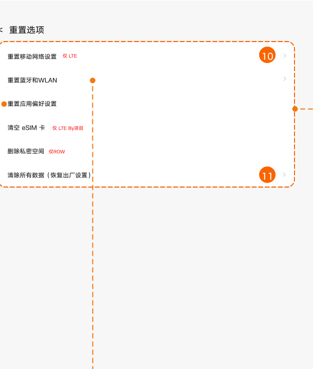
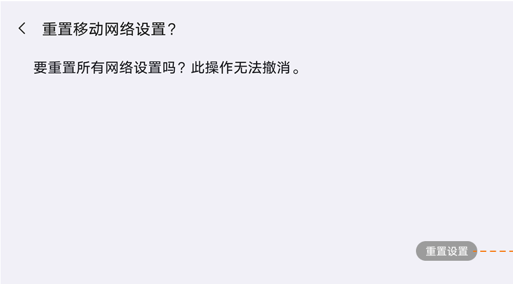

# 重置选项

[App 入口](../../README.md) · [功能查找](../../functions.md) · [页面导航](../../navigation.md)

| 信息 | 内容 |
|---|---|
| 知识 ID | `settings.reset` |
| 功能入口 | 设置 > 通用设置 > 重置选项 |
| 检索词 | 重置 恢复出厂 清除数据 网络 应用偏好 eSIM 私密空间；恢复出厂；重置网络；重置应用偏好；清除所有数据 |

## 进入本页

| 定位要点 | 操作依据 |
|---|---|
| 推荐路径 | 设置 > 通用设置 > 重置选项 |
| 直接上级／起点 | [通用设置](../general/README.md) |
| 要找的入口 | 重置选项 |
| 形状与相对位置 | 通用设置内容区的分组文字列表，右侧摘要或箭头；备份／重置等下方条目需滚动内容区查找。 |
| 入口图示 | [上级页入口区域](../general/images/focus_01.png) |
| 到达确认 | 列表区分移动网络、蓝牙和 WLAN、应用偏好、eSIM、私密空间及清除所有数据等操作，按设备显示。 |
| 资料覆盖 | 覆盖范围以本页列出的入口、控件和操作反馈为限；未列出的子流程不视为已知。 |

点击后先核对内容区标题及上述识别特征；双栏中左侧仍显示原导航属于正常布局，不要求整屏切换。多级路径中每一步均按当前界面重新定位。

## 页面识别与布局

列表区分移动网络、蓝牙和 WLAN、应用偏好、eSIM、私密空间及清除所有数据等操作，按设备显示。

## 关键控件：形状、位置与操作目标

位置均相对**当前页面的内容区或弹窗**，不是固定屏幕坐标。颜色只是辅助线索；优先结合标签、控件形状及相邻元素识别。

| 控件／入口 | 外观特征 | 相对位置 | 操作目标／状态区别 | 局部图 |
|---|---|---|---|---|
| 重置类型 | 纵向列表行，名称区分移动网络、蓝牙 WLAN、应用偏好等 | 重置选项内容上部 | 读完整名称后进入 | [图 1](./images/focus_01.png) |
| 网络确认 | 解释文本＋右下方胶囊按钮 | 网络重置确认页 | 按钮可能因前置条件禁用，不能当普通返回 | [图 2](./images/focus_02.png) |
| 清除所有数据 | 文字入口，可能有恢复出厂补充说明 | 重置列表下部 | 与应用偏好重置严格区分 | [图 1](./images/focus_01.png) |

## 操作与结果

| 操作目的 | 如何操作 | 页面变化／结果 |
|---|---|---|
| 重置网络 | 选择对应网络重置项，按确认页操作 | 处理后提示完成 |
| 重置应用偏好 | 选择重置应用偏好并确认 | 重置偏好，不丢失应用数据 |
| 恢复出厂 | 进入清除所有数据，按要求验证密码，再处理最终确认 | 确认擦除后重启；电量低于 30% 时不可执行 |

## 入口找不到时的排查顺序

1. 确认起点为[通用设置](../general/README.md)，在“进入本页”注明的区域定位／滚动。
2. 按操作范围选择网络、应用偏好或清除所有数据；移动网络/eSIM等缺项时核对设备支持。
3. 核对下方出现条件；仍无匹配时按[导航中的搜索与返回策略](../../navigation.md)诊断。只有用例允许时才改变前置条件或使用替代入口；无新线索则按[资料不足处理](../../limitations.md)记录阻塞。

## 交互常识与出现条件

移动网络／eSIM 依 LTE 支持，私密空间为 ROW 分支。选择前区分操作范围，不把重置应用偏好当作清空应用数据。

## 返回与继续导航

上级资料：[通用设置](../general/README.md)。本文件若包含子页或弹窗，返回可能先到内部上一级；按实际标题确认，不假定一次返回就到上述起点。保存与取消规则见“操作与结果”，公共策略见[页面导航](../../navigation.md)。

## 相关页面

[应用管理](../../pages/app_management/README.md)、[备份](../../pages/backup/README.md)、[存储](../../pages/storage/README.md)。

## 控件局部图

每张图聚焦上表对应的页面区域，保留标题或相邻标签作为定位参照。原图里的编号、虚线和箭头是设计说明，不是 App 控件。

### 图 1：重置选项列表

### 图 2：网络重置确认页

## 资料来源（无需常规加载）

[S06](../../sources/S06.png)；原文件映射见[来源表](../../sources.md)。
