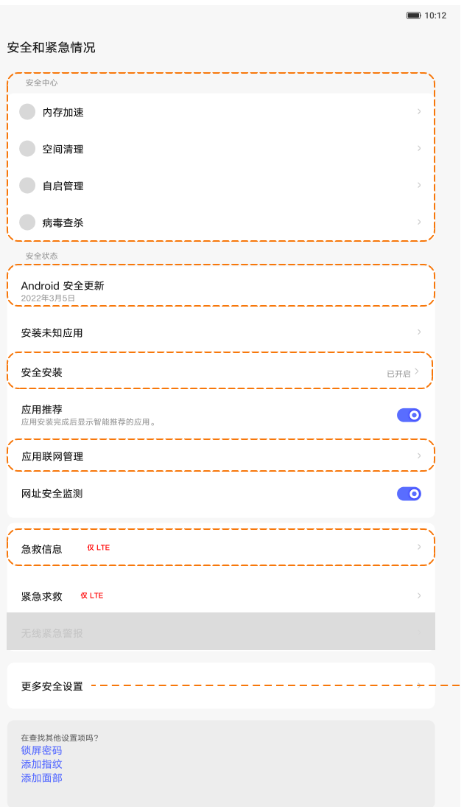
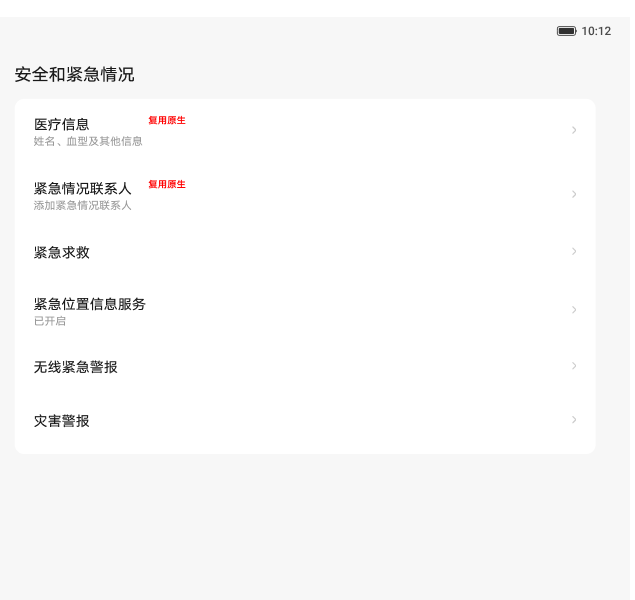

# 安全、隐私与紧急情况

[App 入口](../../README.md) · [功能查找](../../functions.md) · [页面导航](../../navigation.md)

| 信息 | 内容 |
|---|---|
| 知识 ID | `settings.safety` |
| 功能入口 | PRC：设置 > 安全；ROW：安全和隐私／安全和紧急情况 |
| 检索词 | 安全 紧急 SOS 医疗信息 安全中心 未知来源 密码 SIM 紧急联系人；安装未知应用；安全中心；紧急联系人；SOS；医疗信息 |

## 进入本页

| 定位要点 | 操作依据 |
|---|---|
| 推荐路径 | PRC：设置 > 安全；ROW：安全和隐私／安全和紧急情况 |
| 直接上级／起点 | [设置首页](../home/README.md) |
| 要找的入口 | 安全／安全和隐私／安全和紧急情况 |
| 形状与相对位置 | 分组导航中的模块行。先按测试目标区分安全设置与紧急情况，不把它们作为同一按钮。 |
| 入口图示 | [上级页入口区域](../home/images/focus_02.png) |
| 到达确认 | 安全页与紧急页分别核对标题；前者可见安全相关列表，后者可见医疗信息、紧急联系人、SOS等项目。 |
| 资料覆盖 | 部分覆盖：安全及紧急入口；完整紧急操作流程未提供。 |

点击后先核对内容区标题及上述识别特征；双栏中左侧仍显示原导航属于正常布局，不要求整屏切换。多级路径中每一步均按当前界面重新定位。

## 页面识别与布局

PRC 安全页可见安全中心快捷项、安全更新、安装未知应用、网址检测、更多安全等；ROW 可使用安全和隐私分组。紧急页可见医疗信息、紧急联系人、SOS、紧急位置服务和警报。

## 关键控件：形状、位置与操作目标

位置均相对**当前页面的内容区或弹窗**，不是固定屏幕坐标。颜色只是辅助线索；优先结合标签、控件形状及相邻元素识别。

| 控件／入口 | 外观特征 | 相对位置 | 操作目标／状态区别 | 局部图 |
|---|---|---|---|---|
| 安全快捷入口 | 图标或文字组成的入口项 | 安全页上部 | 区分是否跳往安全中心 | [图 1](./images/focus_01.png) |
| 更多安全设置 | 带箭头的列表行 | 安全相关列表内 | 进入后查显示密码、固定应用、SIM 等 | [图 1](./images/focus_01.png) |
| 紧急资料 | 医疗信息／联系人等文字行 | 安全和紧急情况内容区 | 仅按目标标签定位；完整下级流程未提供 | [图 2](./images/focus_02.png) |

## 操作与结果

| 操作目的 | 如何操作 | 页面变化／结果 |
|---|---|---|
| 查找更多安全选项 | 点击更多安全设置 | 可查显示密码、设备管理、固定应用、SIM 安全等支持项 |
| 进入安全中心能力 | 点击清理、自启动、病毒检测等入口 | 跳转相关安全能力，目标页需另行识别 |
| 查找紧急资料设置 | 进入安全和紧急情况，选择医疗信息或紧急联系人 | 进入对应原生页面 |

## 入口找不到时的排查顺序

1. 确认起点为[设置首页](../home/README.md)，在“进入本页”注明的区域定位／滚动。
2. 先区分安全设置与安全和紧急情况；安全中心快捷入口可能因应用卸载而隐藏；SIM相关项受LTE支持影响。
3. 核对下方出现条件；仍无匹配时按[导航中的搜索与返回策略](../../navigation.md)诊断。只有用例允许时才改变前置条件或使用替代入口；无新线索则按[资料不足处理](../../limitations.md)记录阻塞。

## 交互常识与出现条件

SIM／部分 SOS 项依 LTE 能力，安全中心卸载后快捷入口可隐藏。ROW 列表受 GMS 和设备支持影响。紧急操作完整流程未提供。

## 返回与继续导航

上级资料：[设置首页](../home/README.md)。本文件若包含子页或弹窗，返回可能先到内部上一级；按实际标题确认，不假定一次返回就到上述起点。保存与取消规则见“操作与结果”，公共策略见[页面导航](../../navigation.md)。

## 相关页面

[隐私保护／隐私控制](../../pages/privacy/README.md)、[通知和控制中心](../../pages/notifications/README.md)。

## 控件局部图

每张图聚焦上表对应的页面区域，保留标题或相邻标签作为定位参照。原图里的编号、虚线和箭头是设计说明，不是 App 控件。

### 图 1：安全相关入口区域

### 图 2：紧急情况相关入口区域

## 资料来源（无需常规加载）

[S20](../../sources/S20.png)、[S01](../../sources/S01.png)；原文件映射见[来源表](../../sources.md)。
