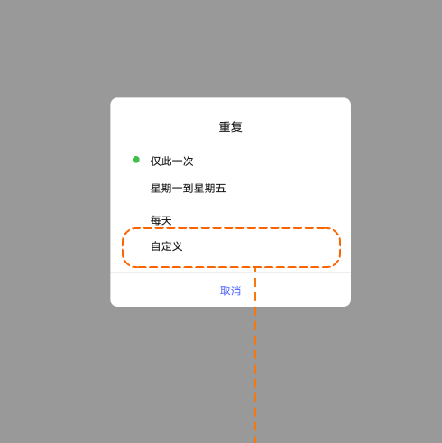
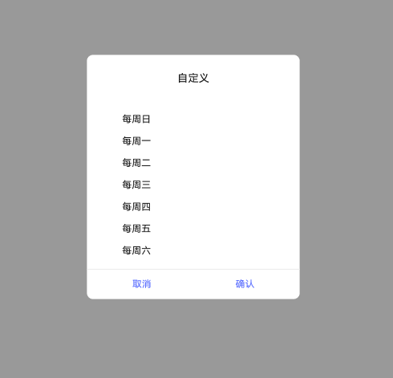

# 定时开关机

[App 入口](../../README.md) · [功能查找](../../functions.md) · [页面导航](../../navigation.md)

| 信息 | 内容 |
|---|---|
| 知识 ID | `settings.scheduled_power` |
| 功能入口 | 设置 > 通用设置 > 定时开关机 |
| 检索词 | 定时 开机 关机 重复 星期 自定义 倒计时；自动开机；自动关机；定时重复；设置工作日关机 |

## 进入本页

| 定位要点 | 操作依据 |
|---|---|
| 推荐路径 | 设置 > 通用设置 > 定时开关机 |
| 直接上级／起点 | [通用设置](../general/README.md) |
| 要找的入口 | 定时开关机 |
| 形状与相对位置 | 通用设置内容区的分组文字列表，右侧摘要或箭头；备份／重置等下方条目需滚动内容区查找。 |
| 入口图示 | [上级页入口区域](../general/images/focus_01.png) |
| 到达确认 | 页面分定时开机、定时关机两组，各有开关、时间和重复设置。 |
| 资料覆盖 | 覆盖范围以本页列出的入口、控件和操作反馈为限；未列出的子流程不视为已知。 |

点击后先核对内容区标题及上述识别特征；双栏中左侧仍显示原导航属于正常布局，不要求整屏切换。多级路径中每一步均按当前界面重新定位。

## 页面识别与布局

页面分定时开机、定时关机两组，各有开关、时间和重复设置。

## 关键控件：形状、位置与操作目标

位置均相对**当前页面的内容区或弹窗**，不是固定屏幕坐标。颜色只是辅助线索；优先结合标签、控件形状及相邻元素识别。

| 控件／入口 | 外观特征 | 相对位置 | 操作目标／状态区别 | 局部图 |
|---|---|---|---|---|
| 两个计划开关 | 开机和关机各一个圆角卡片，右端开关 | 开机在上、关机在下 | 先定位正确计划组再打开 | [图 1](./images/focus_01.png) |
| 时间／重复 | 主开关下面的文字行，右端为值 | 各自计划卡片内部 | 不可编辑时检查同组主开关 | [图 1](./images/focus_01.png) |
| 重复选择 | 居中弹窗的纵向选项 | 点击重复后 | 自定义在预设选项下面 | [图 2](./images/focus_02.png) |
| 自定义星期 | 星期一到星期日纵向选择，底部按钮 | 自定义弹窗 | 左侧取消、右侧确认 | [图 3](./images/focus_03.png) |
| 倒计时按钮 | 弹窗底部并排文字按钮 | 到关机时间时出现 | 取消关机在左、立即关机在右 | [图 4](./images/focus_04.png) |

## 操作与结果

| 操作目的 | 如何操作 | 页面变化／结果 |
|---|---|---|
| 设置开机或关机计划 | 先打开对应开关，再设置时间及重复 | 子项可编辑，保存计划 |
| 选择预设重复 | 选择一次、工作日或每天 | 保存并关闭选择界面 |
| 自定义星期 | 进入自定义，选择星期并确定 | 确定保存，取消不改值 |
| 处理到时关机 | 在倒计时界面选择取消或立即关机 | 取消本次关机或马上关机；不操作则到时关闭 |

## 入口找不到时的排查顺序

1. 确认起点为[通用设置](../general/README.md)，在“进入本页”注明的区域定位／滚动。
2. 时间或重复项不可点，先确认同一张计划卡片的主开关；开机与关机分组分别操作。
3. 核对下方出现条件；仍无匹配时按[导航中的搜索与返回策略](../../navigation.md)诊断。只有用例允许时才改变前置条件或使用替代入口；无新线索则按[资料不足处理](../../limitations.md)记录阻塞。

## 交互常识与出现条件

关闭计划时对应时间／重复项禁用。锁屏期间倒计时继续，解锁显示剩余时间。设计默认开机 07:00、关机 23:00、重复一次，但执行前读取当前值。

## 返回与继续导航

上级资料：[通用设置](../general/README.md)。本文件若包含子页或弹窗，返回可能先到内部上一级；按实际标题确认，不假定一次返回就到上述起点。保存与取消规则见“操作与结果”，公共策略见[页面导航](../../navigation.md)。

## 相关页面

[日期和时间](../../pages/date_time/README.md)。

## 控件局部图

每张图聚焦上表对应的页面区域，保留标题或相邻标签作为定位参照。原图里的编号、虚线和箭头是设计说明，不是 App 控件。

### 图 1：开机／关机分组

### 图 2：重复方式弹窗

### 图 3：自定义星期弹窗

### 图 4：关机倒计时弹窗

## 资料来源（无需常规加载）

[S06](../../sources/S06.png)；原文件映射见[来源表](../../sources.md)。
