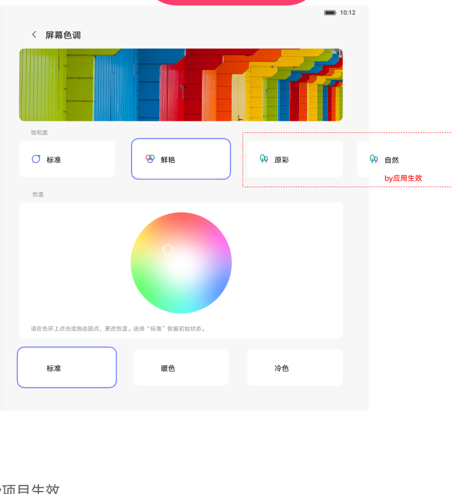

# 屏幕色调

[App 入口](../../README.md) · [功能查找](../../functions.md) · [页面导航](../../navigation.md)

| 信息 | 内容 |
|---|---|
| 知识 ID | `settings.screen_color` |
| 功能入口 | 设置 > 显示和亮度 > 屏幕色调 |
| 检索词 | 色调 色温 鲜艳 标准 原彩 自然 色轮；屏幕偏黄；调色温；冷暖色；色彩模式 |

## 进入本页

| 定位要点 | 操作依据 |
|---|---|
| 推荐路径 | 设置 > 显示和亮度 > 屏幕色调 |
| 直接上级／起点 | [显示和亮度](../display/README.md) |
| 要找的入口 | 屏幕色调 |
| 形状与相对位置 | 显示内容区的子功能文字列表行，位于亮度等上方设置之后；右侧可带摘要或箭头。未显示时滚动内容区。 |
| 入口图示 | [上级页入口区域](../display/images/focus_02.png) |
| 到达确认 | 上方为色彩样例，下方为色彩模式卡片、色轮与冷暖选择。模式可能显示标准、鲜艳、原彩或自然。 |
| 资料覆盖 | 覆盖范围以本页列出的入口、控件和操作反馈为限；未列出的子流程不视为已知。 |

点击后先核对内容区标题及上述识别特征；双栏中左侧仍显示原导航属于正常布局，不要求整屏切换。多级路径中每一步均按当前界面重新定位。

## 页面识别与布局

上方为色彩样例，下方为色彩模式卡片、色轮与冷暖选择。模式可能显示标准、鲜艳、原彩或自然。

## 关键控件：形状、位置与操作目标

位置均相对**当前页面的内容区或弹窗**，不是固定屏幕坐标。颜色只是辅助线索；优先结合标签、控件形状及相邻元素识别。

| 控件／入口 | 外观特征 | 相对位置 | 操作目标／状态区别 | 局部图 |
|---|---|---|---|---|
| 色彩模式 | 横向圆角卡片，带圆形选中标记 | 色彩样例图片下方 | 按标准、鲜艳、原彩／自然标签选取 | [图 1](./images/focus_01.png) |
| 色轮 | 圆形渐变色盘，内部有小圆定位点 | 模式卡片下方 | 根据当前色轮位置调整，不把样例点当默认 | [图 1](./images/focus_01.png) |
| 色温预设 | 并排的标准、暖色、冷色卡片 | 色轮下方 | 点击目标预设并观察效果 | [图 1](./images/focus_01.png) |

## 操作与结果

| 操作目的 | 如何操作 | 页面变化／结果 |
|---|---|---|
| 切换色彩风格 | 点击实际可见的模式卡片 | 实时应用并观察样例效果 |
| 调整色温 | 操作色轮或暖色／冷色选项 | 实时变化 |

## 入口找不到时的排查顺序

1. 确认起点为[显示和亮度](../display/README.md)，在“进入本页”注明的区域定位／滚动。
2. 按当前实际提供的模式标签选择；不要用固定的第几个卡片代替标签。
3. 核对下方出现条件；仍无匹配时按[导航中的搜索与返回策略](../../navigation.md)诊断。只有用例允许时才改变前置条件或使用替代入口；无新线索则按[资料不足处理](../../limitations.md)记录阻塞。

## 交互常识与出现条件

模式集合取决于设备。通过实际标签识别，不按截图中的固定卡片序号定位。

## 返回与继续导航

上级资料：[显示和亮度](../display/README.md)。本文件若包含子页或弹窗，返回可能先到内部上一级；按实际标题确认，不假定一次返回就到上述起点。保存与取消规则见“操作与结果”，公共策略见[页面导航](../../navigation.md)。

## 相关页面

[显示和亮度](../../pages/display/README.md)。

## 控件局部图

每张图聚焦上表对应的页面区域，保留标题或相邻标签作为定位参照。原图里的编号、虚线和箭头是设计说明，不是 App 控件。

### 图 1：屏幕色调卡片与色轮

## 资料来源（无需常规加载）

[S17](../../sources/S17.png)；原文件映射见[来源表](../../sources.md)。
