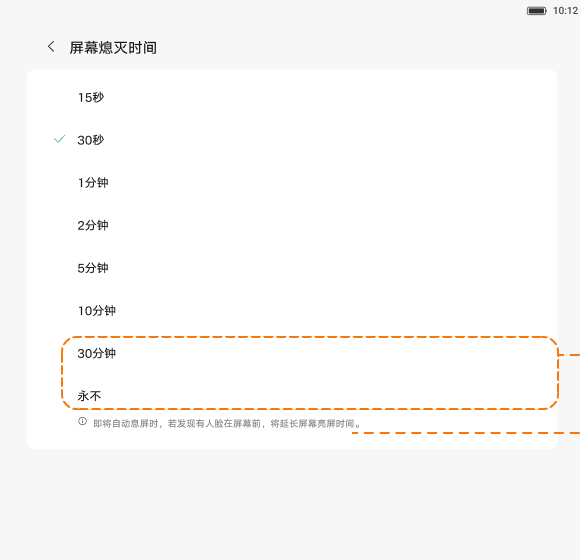

# 屏幕熄灭时间

[App 入口](../../README.md) · [功能查找](../../functions.md) · [页面导航](../../navigation.md)

| 信息 | 内容 |
|---|---|
| 知识 ID | `settings.screen_timeout` |
| 功能入口 | 设置 > 显示和亮度 > 屏幕熄灭时间 |
| 检索词 | 锁屏 自动息屏 熄屏 15秒 30秒 永不 开发者选项 常亮；自动锁屏时间；休眠时间；自动息屏；屏幕超时；保持屏幕亮 |

## 进入本页

| 定位要点 | 操作依据 |
|---|---|
| 推荐路径 | 设置 > 显示和亮度 > 屏幕熄灭时间 |
| 直接上级／起点 | [显示和亮度](../display/README.md) |
| 要找的入口 | 屏幕熄灭时间 |
| 形状与相对位置 | 显示内容区的子功能文字列表行，位于亮度等上方设置之后；右侧可带摘要或箭头。未显示时滚动内容区。 |
| 入口图示 | [上级页入口区域](../display/images/focus_02.png) |
| 到达确认 | 页面列出熄屏时间选项，包含秒和分钟档位。设计默认 30 秒，最小 15 秒；30 分钟／永不是否出现取决于设备与开发者设置。 |
| 资料覆盖 | 覆盖范围以本页列出的入口、控件和操作反馈为限；未列出的子流程不视为已知。 |

点击后先核对内容区标题及上述识别特征；双栏中左侧仍显示原导航属于正常布局，不要求整屏切换。多级路径中每一步均按当前界面重新定位。

## 页面识别与布局

页面列出熄屏时间选项，包含秒和分钟档位。设计默认 30 秒，最小 15 秒；30 分钟／永不是否出现取决于设备与开发者设置。

## 关键控件：形状、位置与操作目标

位置均相对**当前页面的内容区或弹窗**，不是固定屏幕坐标。颜色只是辅助线索；优先结合标签、控件形状及相邻元素识别。

| 控件／入口 | 外观特征 | 相对位置 | 操作目标／状态区别 | 局部图 |
|---|---|---|---|---|
| 时长列表 | 每行一个时长，当前项旁显示选中标记 | 标题下的白色设置区域 | 按秒／分钟文字选择，不根据示例勾选位置 | [图 1](./images/focus_01.png) |
| 常亮说明 | 较小的解释文字 | 列表附近，智能常亮开启时可出现 | 说明不是按钮；同时核对智能常亮状态 | [图 1](./images/focus_01.png) |

## 操作与结果

| 操作目的 | 如何操作 | 页面变化／结果 |
|---|---|---|
| 修改自动熄屏时长 | 点击当前可见的目标时长 | 所选时长成为熄屏设置 |
| 找不到永不等长时选项 | 检查设备支持及相关开发者选项 | 确认是否因条件不满足而隐藏 |
| 熄屏时间到但屏幕仍亮 | 检查智能常亮、视频播放等亮屏条件 | 区分计时设置与保持亮屏机制 |

## 入口找不到时的排查顺序

1. 确认起点为[显示和亮度](../display/README.md)，在“进入本页”注明的区域定位／滚动。
2. 区分“页面入口缺失”和“永不选项缺失”；后者查设备能力与相关开发者设置，开发者项精确名称未提供。
3. 核对下方出现条件；仍无匹配时按[导航中的搜索与返回策略](../../navigation.md)诊断。只有用例允许时才改变前置条件或使用替代入口；无新线索则按[资料不足处理](../../limitations.md)记录阻塞。

## 交互常识与出现条件

隐藏长时选项时，若当前选择该项，设置可恢复默认。部分 OLED／定制设备不提供这些选项。

## 返回与继续导航

上级资料：[显示和亮度](../display/README.md)。本文件若包含子页或弹窗，返回可能先到内部上一级；按实际标题确认，不假定一次返回就到上述起点。保存与取消规则见“操作与结果”，公共策略见[页面导航](../../navigation.md)。

## 相关页面

[智能常亮、靠近亮屏与距离提醒](../../pages/presence/README.md)、[通用设置](../../pages/general/README.md)。

## 控件局部图

每张图聚焦上表对应的页面区域，保留标题或相邻标签作为定位参照。原图里的编号、虚线和箭头是设计说明，不是 App 控件。

### 图 1：熄屏时长选项区域

## 资料来源（无需常规加载）

[S17](../../sources/S17.png)；原文件映射见[来源表](../../sources.md)。
