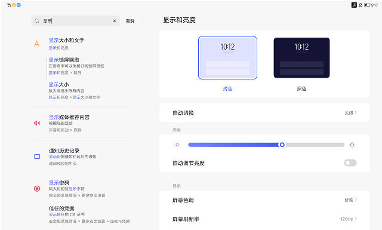

# 设置搜索

[App 入口](../../README.md) · [功能查找](../../functions.md) · [页面导航](../../navigation.md)

| 信息 | 内容 |
|---|---|
| 知识 ID | `settings.search` |
| 功能入口 | 设置首页 > 搜索框 |
| 检索词 | 搜索 关键词 历史 跳转 高亮 取消；搜索设置项；按关键词找功能；搜索历史 |

## 进入本页

| 定位要点 | 操作依据 |
|---|---|
| 推荐路径 | 设置首页 > 搜索框 |
| 直接上级／起点 | [设置首页](../home/README.md) |
| 要找的入口 | 搜索框 |
| 形状与相对位置 | 设置标题下方的圆角长输入框，带放大镜；双栏位于左栏顶部。 |
| 入口图示 | [上级页入口区域](../home/images/focus_01.png) |
| 到达确认 | 出现搜索输入框及取消入口；有匹配项时显示标题和路径组成的结果列表。 |
| 资料覆盖 | 覆盖范围以本页列出的入口、控件和操作反馈为限；未列出的子流程不视为已知。 |

点击后先核对内容区标题及上述识别特征；双栏中左侧仍显示原导航属于正常布局，不要求整屏切换。多级路径中每一步均按当前界面重新定位。

## 页面识别与布局

搜索层包含输入框、结果列表及取消入口；结果按模块分组，设置类结果通常带路径。历史区域有清空入口。

## 关键控件：形状、位置与操作目标

位置均相对**当前页面的内容区或弹窗**，不是固定屏幕坐标。颜色只是辅助线索；优先结合标签、控件形状及相邻元素识别。

| 控件／入口 | 外观特征 | 相对位置 | 操作目标／状态区别 | 局部图 |
|---|---|---|---|---|
| 输入框／取消 | 圆角搜索框；右侧为取消文字 | 左栏顶部 | 点框输入，点取消退出；框内清除与退出不同 | [图 1](./images/focus_01.png) |
| 结果条目 | 图标、主标题和较小的路径文字组成的行 | 输入框下方左栏 | 通过标题＋路径选结果，不点右侧旧页面 | [图 1](./images/focus_01.png) |
| 目标高亮 | 目标设置行带浅色高亮背景 | 跳转后的内容栏 | 短暂显示后消退，用页面标题和目标行确认到达 | [图 2](./images/focus_02.png) |

搜索结果按模块顺序分组。目标高亮约出现 300 ms、淡出约 500 ms；自动化应等待目标页可操作，不依赖抓到高亮瞬间。

## 操作与结果

| 操作目的 | 如何操作 | 页面变化／结果 |
|---|---|---|
| 寻找设置项 | 输入功能关键词，结合名称和路径选择结果 | 跳转目标页，目标项短暂高亮 |
| 处理键盘遮挡 | 滚动或选择结果 | 键盘收起 |
| 结束搜索 | 点击取消 | 退出搜索层，保留进入前的页面 |
| 清理搜索记录 | 使用历史区域的清空全部入口 | 清空历史记录 |

## 入口找不到时的排查顺序

1. 确认起点为[设置首页](../home/README.md)，在“进入本页”注明的区域定位／滚动。
2. 同名结果先读路径；取消与清除输入不是同一操作；搜索无结果不能证明功能不存在。
3. 核对下方出现条件；仍无匹配时按[导航中的搜索与返回策略](../../navigation.md)诊断。只有用例允许时才改变前置条件或使用替代入口；无新线索则按[资料不足处理](../../limitations.md)记录阻塞。

## 交互常识与出现条件

同名结果要看所属模块。高亮会消失，不应把持续高亮当作页面到达条件。无结果文案与匹配算法未提供。

## 返回与继续导航

上级资料：[设置首页](../home/README.md)。本文件若包含子页或弹窗，返回可能先到内部上一级；按实际标题确认，不假定一次返回就到上述起点。保存与取消规则见“操作与结果”，公共策略见[页面导航](../../navigation.md)。

## 相关页面

[设置首页](../../pages/home/README.md)。

## 控件局部图

每张图聚焦上表对应的页面区域，保留标题或相邻标签作为定位参照。原图里的编号、虚线和箭头是设计说明，不是 App 控件。

### 图 1：搜索结果和保留的右侧页面

### 图 2：结果跳转后的目标高亮

## 资料来源（无需常规加载）

[S15](../../sources/S15.png)；原文件映射见[来源表](../../sources.md)。
