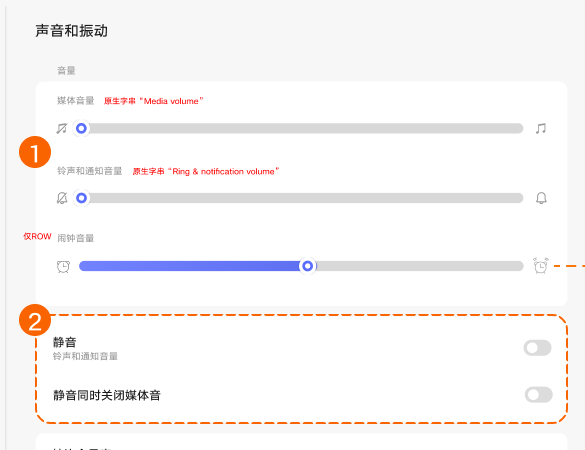
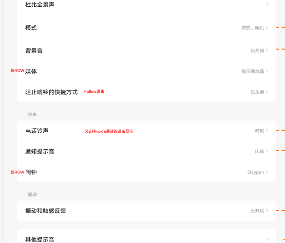

# 声音和振动

[App 入口](../../README.md) · [功能查找](../../functions.md) · [页面导航](../../navigation.md)

| 信息 | 内容 |
|---|---|
| 知识 ID | `settings.sound` |
| 功能入口 | 设置 > 声音和振动（无振动硬件时为声音） |
| 检索词 | 声音 震动 振动 音量 静音 媒体 闹钟；媒体音量；闹钟音量；静音；静音时关闭媒体；充电提示音 |

## 进入本页

| 定位要点 | 操作依据 |
|---|---|
| 推荐路径 | 设置 > 声音和振动（无振动硬件时为声音） |
| 直接上级／起点 | [设置首页](../home/README.md) |
| 要找的入口 | 声音和振动／声音 |
| 形状与相对位置 | 首页的分组导航列表；图标＋模块名称所在行。双栏在左侧，向下滚动导航区查找。 |
| 入口图示 | [上级页入口区域](../home/images/focus_02.png) |
| 到达确认 | 顶部是媒体、铃声／通知、闹钟音量；下方是静音及媒体子开关、振动、铃声、杜比、模式、其他声音等。没有振动硬件时标题可为“声音”。 |
| 资料覆盖 | 覆盖范围以本页列出的入口、控件和操作反馈为限；未列出的子流程不视为已知。 |

点击后先核对内容区标题及上述识别特征；双栏中左侧仍显示原导航属于正常布局，不要求整屏切换。多级路径中每一步均按当前界面重新定位。

## 页面识别与布局

顶部是媒体、铃声／通知、闹钟音量；下方是静音及媒体子开关、振动、铃声、杜比、模式、其他声音等。没有振动硬件时标题可为“声音”。

## 关键控件：形状、位置与操作目标

位置均相对**当前页面的内容区或弹窗**，不是固定屏幕坐标。颜色只是辅助线索；优先结合标签、控件形状及相邻元素识别。

| 控件／入口 | 外观特征 | 相对位置 | 操作目标／状态区别 | 局部图 |
|---|---|---|---|---|
| 音量 | 水平轨道＋圆形滑块，标签标识媒体／铃声／闹钟 | 内容最上方，多条上下排列 | 先读通道标签再拖动 | [图 1](./images/focus_01.png) |
| 静音 | 白色卡片内两行，右端胶囊开关 | 音量区域下面；媒体子开关在静音下一行 | 两项同时开才抑制媒体声音 | [图 1](./images/focus_01.png) |
| 杜比／模式 | 文字行，右端有箭头或当前模式摘要 | 静音卡片下方 | 点行进入子页 | [图 2](./images/focus_02.png) |
| 振动和触感反馈 | 独立入口行 | 铃声区域下方、其他提示音上方 | 点击进入振动子页 | [图 2](./images/focus_02.png) |

## 操作与结果

| 操作目的 | 如何操作 | 页面变化／结果 |
|---|---|---|
| 调整指定声音 | 先确认滑块对应媒体、铃声还是闹钟，再拖动 | 对应通道音量改变 |
| 开启静音 | 操作静音开关 | 与控制中心同步；退出时恢复先前音量 |
| 静音时也关闭媒体 | 同时启用静音与静音时关闭媒体声音 | 媒体声音受到抑制 |
| 查找提示音选项 | 滚动至其他声音，定位锁屏、充电、触摸或截屏等 | 操作对应开关 |

## 入口找不到时的排查顺序

1. 确认起点为[设置首页](../home/README.md)，在“进入本页”注明的区域定位／滚动。
2. 先按通道标签找滑块；无马达设备可只有声音标题；勿扰设置从模式入口进入。
3. 核对下方出现条件；仍无匹配时按[导航中的搜索与返回策略](../../navigation.md)诊断。只有用例允许时才改变前置条件或使用替代入口；无新线索则按[资料不足处理](../../limitations.md)记录阻塞。

## 交互常识与出现条件

静音不等于关闭振动。ROW 闹钟最小音量不为零。拨号声音依 LTE 能力，振动项依马达；勿扰另行控制哪些对象允许打扰。

## 返回与继续导航

上级资料：[设置首页](../home/README.md)。本文件若包含子页或弹窗，返回可能先到内部上一级；按实际标题确认，不假定一次返回就到上述起点。保存与取消规则见“操作与结果”，公共策略见[页面导航](../../navigation.md)。

## 从这里继续找子功能

下表链接到各目标页的进入方法；条件性分支以目标页为准。

| 要找的入口 | 目标资料 |
|---|---|
| 杜比全景声／杜比音效 | [杜比音效](../dolby/README.md) |
| 模式 → 勿扰／睡眠 | [模式与勿扰](../modes/README.md) |
| 背景音 | [背景音（仅入口存在时）](../background_sound/README.md) |
| 振动和触感反馈 | [振动设置](../vibration/README.md) |
| 通知铃声／任务指定的铃声行 | [铃声选择](../ringtones/README.md) |

## 相关页面

[振动设置](../../pages/vibration/README.md)、[铃声选择](../../pages/ringtones/README.md)、[杜比音效](../../pages/dolby/README.md)、[模式与勿扰](../../pages/modes/README.md)、[物理音量键与音量面板](../../features/volume_panel/README.md)、[控制中心及跨页状态同步](../../features/control_center_sync/README.md)。

## 控件局部图

每张图聚焦上表对应的页面区域，保留标题或相邻标签作为定位参照。原图里的编号、虚线和箭头是设计说明，不是 App 控件。

### 图 1：音量、静音及媒体子开关

### 图 2：音效、铃声和振动入口

## 资料来源（无需常规加载）

[S18](../../sources/S18.png)；原文件映射见[来源表](../../sources.md)。
