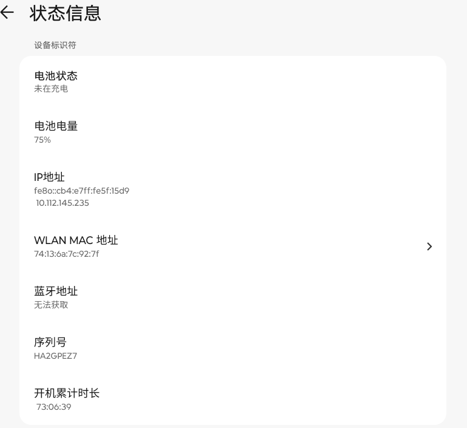

# 状态信息

[App 入口](../../README.md) · [功能查找](../../functions.md) · [页面导航](../../navigation.md)

| 信息 | 内容 |
|---|---|
| 知识 ID | `settings.status` |
| 功能入口 | 设置 > 关于平板电脑 > 状态信息 |
| 检索词 | 状态 序列号 MAC IP IMEI EID 电池 制造日期 使用日期；查MAC地址；序列号；IMEI；EID；复制EID |

## 进入本页

| 定位要点 | 操作依据 |
|---|---|
| 推荐路径 | 设置 > 关于平板电脑 > 状态信息 |
| 直接上级／起点 | [关于平板电脑](../about/README.md) |
| 要找的入口 | 状态信息 |
| 形状与相对位置 | 关于页内容下部卡片中的文字行，右端箭头；未显示时滚动内容区。 |
| 入口图示 | [上级页入口区域](../about/images/focus_01.png) |
| 到达确认 | 页面按标签列出电池、网络地址、序列号、运行时间及支持的 SIM／IMEI／EID 等信息。 |
| 资料覆盖 | 覆盖范围以本页列出的入口、控件和操作反馈为限；未列出的子流程不视为已知。 |

点击后先核对内容区标题及上述识别特征；双栏中左侧仍显示原导航属于正常布局，不要求整屏切换。多级路径中每一步均按当前界面重新定位。

## 页面识别与布局

页面按标签列出电池、网络地址、序列号、运行时间及支持的 SIM／IMEI／EID 等信息。

## 关键控件：形状、位置与操作目标

位置均相对**当前页面的内容区或弹窗**，不是固定屏幕坐标。颜色只是辅助线索；优先结合标签、控件形状及相邻元素识别。

| 控件／入口 | 外观特征 | 相对位置 | 操作目标／状态区别 | 局部图 |
|---|---|---|---|---|
| 返回 | 左向箭头 | 状态信息标题左侧 | 返回上级，不点击左栏其他模块 | [图 1](./images/focus_01.png) |
| 状态字段 | 上方黑色字段名，下方较小灰色值 | 白色圆角列表内 | 将字段名与自己的值关联读取 | [图 1](./images/focus_01.png) |
| WLAN MAC 地址 | 标签和值，最右侧有尖括号 | IP 地址下方 | 支持时可进入详情；不是所有字段都有箭头 | [图 1](./images/focus_01.png) |

## 操作与结果

| 操作目的 | 如何操作 | 页面变化／结果 |
|---|---|---|
| 读取设备标识 | 找到目标标签后读取同行值 | 使用运行数据，不匹配样例数字 |
| 查看 EID | 在提供 EID 的设备点击该行 | 弹出条码和文本 |
| 复制 EID | 在弹窗点击复制 | 提示成功并关闭；取消仅关闭 |

## 入口找不到时的排查顺序

1. 确认起点为[关于平板电脑](../about/README.md)，在“进入本页”注明的区域定位／滚动。
2. 先查对应标签而非示例数值；无SIM硬件可缺IMEI/EID；复制EID规则不能推广到所有字段。
3. 核对下方出现条件；仍无匹配时按[导航中的搜索与返回策略](../../navigation.md)诊断。只有用例允许时才改变前置条件或使用替代入口；无新线索则按[资料不足处理](../../limitations.md)记录阻塞。

## 交互常识与出现条件

无相关无线硬件时可不显示 SIM／IMEI／EID。ROW 可有电池制造和首次使用日期，双电池可有两组。不能把 EID 可复制推广到所有标识行。

## 返回与继续导航

上级资料：[关于平板电脑](../about/README.md)。本文件若包含子页或弹窗，返回可能先到内部上一级；按实际标题确认，不假定一次返回就到上述起点。保存与取消规则见“操作与结果”，公共策略见[页面导航](../../navigation.md)。

## 相关页面

[关于平板电脑](../../pages/about/README.md)。

## 控件局部图

每张图聚焦上表对应的页面区域，保留标题或相邻标签作为定位参照。原图里的编号、虚线和箭头是设计说明，不是 App 控件。

### 图 1：状态标签、值与可进入项

## 资料来源（无需常规加载）

[S10](../../sources/S10.png)、[S25](../../sources/S25.png)；原文件映射见[来源表](../../sources.md)。
