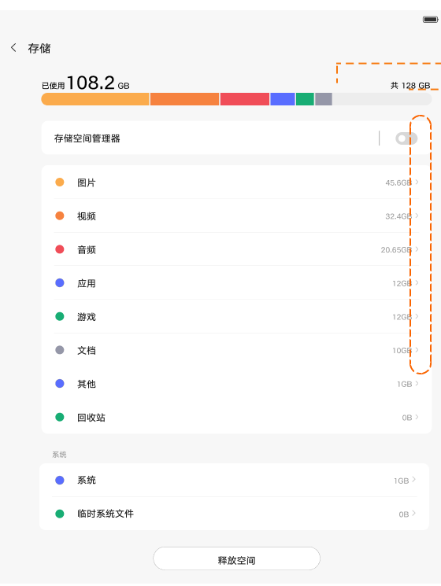
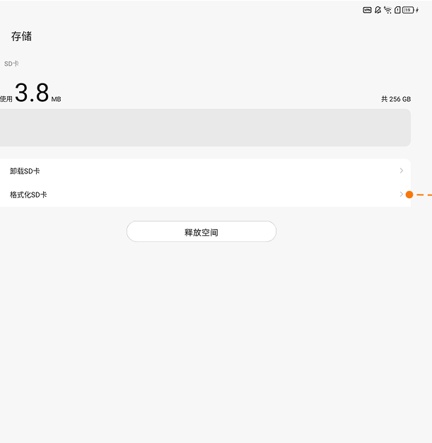

# 存储

[App 入口](../../README.md) · [功能查找](../../functions.md) · [页面导航](../../navigation.md)

| 信息 | 内容 |
|---|---|
| 知识 ID | `settings.storage` |
| 功能入口 | 设置 > 通用设置 > 存储 |
| 检索词 | 容量 空间 分类 SD卡 便携式 格式化 卸载 存储管理器；空间不足；查看容量；清理空间；SD卡格式化；卸载SD卡 |

## 进入本页

| 定位要点 | 操作依据 |
|---|---|
| 推荐路径 | 设置 > 通用设置 > 存储 |
| 直接上级／起点 | [通用设置](../general/README.md) |
| 要找的入口 | 存储 |
| 形状与相对位置 | 通用设置内容区的分组文字列表，右侧摘要或箭头；备份／重置等下方条目需滚动内容区查找。 |
| 入口图示 | [上级页入口区域](../general/images/focus_01.png) |
| 到达确认 | 上部以容量条与颜色分类展示空间，各类按占用大小排列；下方有存储管理和释放空间。插入 SD 卡后可有对应存储项。 |
| 资料覆盖 | 覆盖范围以本页列出的入口、控件和操作反馈为限；未列出的子流程不视为已知。 |

点击后先核对内容区标题及上述识别特征；双栏中左侧仍显示原导航属于正常布局，不要求整屏切换。多级路径中每一步均按当前界面重新定位。

## 页面识别与布局

上部以容量条与颜色分类展示空间，各类按占用大小排列；下方有存储管理和释放空间。插入 SD 卡后可有对应存储项。

## 关键控件：形状、位置与操作目标

位置均相对**当前页面的内容区或弹窗**，不是固定屏幕坐标。颜色只是辅助线索；优先结合标签、控件形状及相邻元素识别。

| 控件／入口 | 外观特征 | 相对位置 | 操作目标／状态区别 | 局部图 |
|---|---|---|---|---|
| 容量条 | 多种颜色拼接的水平条，上方已用／总量 | 内容顶部 | 读取容量；颜色块不是统一可点击入口 | [图 1](./images/focus_01.png) |
| 分类列表 | 彩色圆点＋分类名＋右侧大小 | 容量条下方 | 有箭头的行才按页面能力进入分类 | [图 1](./images/focus_01.png) |
| 释放空间 | 居中横向胶囊按钮 | 分类列表下方 | 点击进入清理能力 | [图 1](./images/focus_01.png) |
| SD 卡操作 | 卸载和格式化两条文字行 | SD 卡容量下方 | 按标签区分两种动作 | [图 2](./images/focus_02.png) |

## 操作与结果

| 操作目的 | 如何操作 | 页面变化／结果 |
|---|---|---|
| 查看或清理分类 | 按分类是否存在可点击箭头操作；PRC 可通过文件管理相关入口清理 | 可点击项进入关联页面，部分系统／临时项用提示解释 |
| 释放空间 | 找到底部释放空间入口 | 进入对应清理能力 |
| 设置新 SD 卡 | 插入后按提示确认便携式存储 | 完成后显示就绪 |
| 格式化 SD 卡 | 进入卡的操作项，选择格式化并处理确认 | 确认后显示处理进度 |

## 入口找不到时的排查顺序

1. 确认起点为[通用设置](../general/README.md)，在“进入本页”注明的区域定位／滚动。
2. SD卡操作要求当前显示对应存储卡；PRC分类不可点击时不要重复点容量分类；区分卸载与格式化。
3. 核对下方出现条件；仍无匹配时按[导航中的搜索与返回策略](../../navigation.md)诊断。只有用例允许时才改变前置条件或使用替代入口；无新线索则按[资料不足处理](../../limitations.md)记录阻塞。

## 交互常识与出现条件

PRC 分类不可点击，ROW 可提供箭头；跨 App 跳转目标需现场核对。格式化和卸载是不同操作。容量、分类顺序及卡名称为运行数据，不能按样例定位。

## 返回与继续导航

上级资料：[通用设置](../general/README.md)。本文件若包含子页或弹窗，返回可能先到内部上一级；按实际标题确认，不假定一次返回就到上述起点。保存与取消规则见“操作与结果”，公共策略见[页面导航](../../navigation.md)。

## 相关页面

[通用设置](../../pages/general/README.md)、[重置选项](../../pages/reset/README.md)。

## 控件局部图

每张图聚焦上表对应的页面区域，保留标题或相邻标签作为定位参照。原图里的编号、虚线和箭头是设计说明，不是 App 控件。

### 图 1：容量条、分类和释放空间

### 图 2：SD 卡操作区域

## 资料来源（无需常规加载）

[S06](../../sources/S06.png)；原文件映射见[来源表](../../sources.md)。
