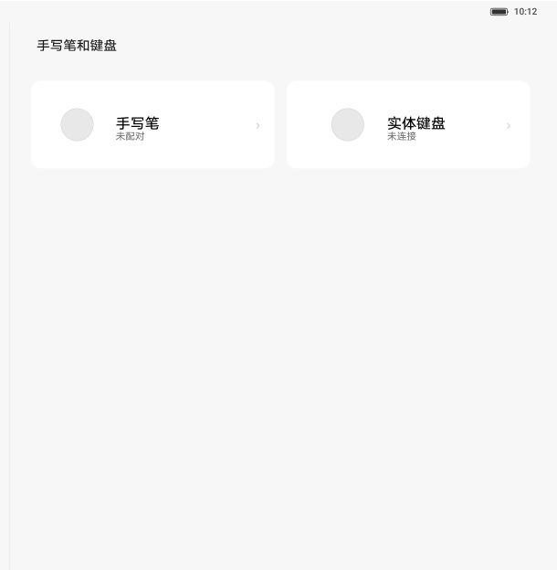

# 手写笔和键盘

[App 入口](../../README.md) · [功能查找](../../functions.md) · [页面导航](../../navigation.md)

| 信息 | 内容 |
|---|---|
| 知识 ID | `settings.stylus_keyboard` |
| 功能入口 | 设置 > 手写笔和键盘 |
| 检索词 | 手写笔 实体键盘 未配对 未连接 外设；查看手写笔连接；外接键盘状态；笔配对 |

## 进入本页

| 定位要点 | 操作依据 |
|---|---|
| 推荐路径 | 设置 > 手写笔和键盘 |
| 直接上级／起点 | [设置首页](../home/README.md) |
| 要找的入口 | 手写笔和键盘 |
| 形状与相对位置 | 首页的分组导航列表；图标＋模块名称所在行。双栏在左侧，向下滚动导航区查找。 |
| 入口图示 | [上级页入口区域](../home/images/focus_02.png) |
| 到达确认 | 入口页并列显示手写笔、实体键盘卡片，并显示配对／连接状态。 |
| 资料覆盖 | 入口级：笔／键盘卡片与连接状态；配对详情未提供。 |

点击后先核对内容区标题及上述识别特征；双栏中左侧仍显示原导航属于正常布局，不要求整屏切换。多级路径中每一步均按当前界面重新定位。

## 页面识别与布局

入口页并列显示手写笔、实体键盘卡片，并显示配对／连接状态。

## 关键控件：形状、位置与操作目标

位置均相对**当前页面的内容区或弹窗**，不是固定屏幕坐标。颜色只是辅助线索；优先结合标签、控件形状及相邻元素识别。

| 控件／入口 | 外观特征 | 相对位置 | 操作目标／状态区别 | 局部图 |
|---|---|---|---|---|
| 手写笔卡片 | 图标、名称、较小的配对状态组成的矩形卡片 | 内容左上 | 点左卡进入笔详情 | [图 1](./images/focus_01.png) |
| 实体键盘卡片 | 与笔卡片同级，带连接状态和箭头 | 右侧并排卡片 | 点右卡进入键盘详情 | [图 1](./images/focus_01.png) |

## 操作与结果

| 操作目的 | 如何操作 | 页面变化／结果 |
|---|---|---|
| 查看笔或键盘 | 点击对应卡片 | 进入相应详情 |
| 首页找不到键盘入口 | 在通用设置中查找键盘，必要时查语言相关入口 | 定位系统键盘设置 |

## 入口找不到时的排查顺序

1. 确认起点为[设置首页](../home/README.md)，在“进入本页”注明的区域定位／滚动。
2. 不支持手写笔时首页模块可能隐藏；系统键盘仍可经通用设置进入；未连接是状态而非另一个按钮。
3. 核对下方出现条件；仍无匹配时按[导航中的搜索与返回策略](../../navigation.md)诊断。只有用例允许时才改变前置条件或使用替代入口；无新线索则按[资料不足处理](../../limitations.md)记录阻塞。

## 交互常识与出现条件

不支持手写笔的设备可隐藏本一级入口和笔相关项，键盘仍可从通用设置访问。未配对／未连接是状态，不是设备必然初始值。配对详情未提供。

## 返回与继续导航

上级资料：[设置首页](../home/README.md)。本文件若包含子页或弹窗，返回可能先到内部上一级；按实际标题确认，不假定一次返回就到上述起点。保存与取消规则见“操作与结果”，公共策略见[页面导航](../../navigation.md)。

## 相关页面

[键盘、输入法与鼠标](../../pages/keyboard/README.md)、[屏幕刷新率](../../pages/refresh_rate/README.md)。

## 控件局部图

每张图聚焦上表对应的页面区域，保留标题或相邻标签作为定位参照。原图里的编号、虚线和箭头是设计说明，不是 App 控件。

### 图 1：并排的手写笔与实体键盘卡片

## 资料来源（无需常规加载）

[S03](../../sources/S03.png)；原文件映射见[来源表](../../sources.md)。
