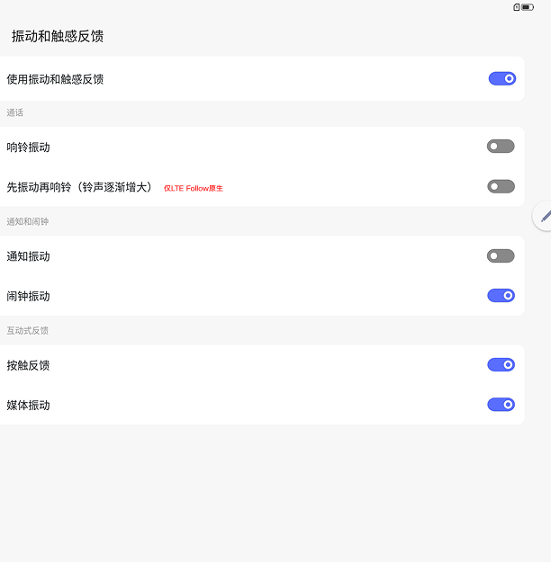

# 振动设置

[App 入口](../../README.md) · [功能查找](../../functions.md) · [页面导航](../../navigation.md)

| 信息 | 内容 |
|---|---|
| 知识 ID | `settings.vibration` |
| 功能入口 | 设置 > 声音和振动 > 振动和触感反馈 |
| 检索词 | 振动 震动 来电 通知 先振动再响铃 马达；来电震动；通知震动；触感反馈；先震动后响铃 |

## 进入本页

| 定位要点 | 操作依据 |
|---|---|
| 推荐路径 | 设置 > 声音和振动 > 振动和触感反馈 |
| 直接上级／起点 | [声音和振动](../sound/README.md) |
| 要找的入口 | 振动和触感反馈 |
| 形状与相对位置 | 声音内容区中，铃声区域下方、其他提示音上方的独立入口行；点击进入子页。 |
| 入口图示 | [上级页入口区域](../sound/images/focus_02.png) |
| 到达确认 | 内容区出现振动和触感反馈相关标题及使用振动和触感反馈总开关，下方按用途分组。 |
| 资料覆盖 | 覆盖范围以本页列出的入口、控件和操作反馈为限；未列出的子流程不视为已知。 |

点击后先核对内容区标题及上述识别特征；双栏中左侧仍显示原导航属于正常布局，不要求整屏切换。多级路径中每一步均按当前界面重新定位。

## 页面识别与布局

声音页中的振动相关设置包含来电、通知等开关；LTE 可有来电下的“先振动再响铃”。

## 关键控件：形状、位置与操作目标

位置均相对**当前页面的内容区或弹窗**，不是固定屏幕坐标。颜色只是辅助线索；优先结合标签、控件形状及相邻元素识别。

| 控件／入口 | 外观特征 | 相对位置 | 操作目标／状态区别 | 局部图 |
|---|---|---|---|---|
| 总开关 | 使用振动和触感反馈行右侧胶囊开关 | 内容顶部 | 先确认总开关 | [图 1](./images/focus_01.png) |
| 响铃振动 | 行右端开关 | 通话分组内 | 开启后可设置下一行先振动再响铃 | [图 1](./images/focus_01.png) |
| 先振动再响铃 | 较下方的独立开关行 | 响铃振动下面 | 父项关闭时跟随关闭 | [图 1](./images/focus_01.png) |
| 通知／闹钟振动 | 两行胶囊开关 | 通知和闹钟分组 | 按标签区分，不点错相邻开关 | [图 1](./images/focus_01.png) |
| 触感反馈 | 按触反馈、媒体振动等开关 | 页面更下方 | 只在设备支持时出现 | [图 1](./images/focus_01.png) |

原图明确：关闭响铃振动时，“先振动再响铃”也跟随关闭。控制中心振动关闭时，响铃振动与通知振动同步关闭。

## 操作与结果

| 操作目的 | 如何操作 | 页面变化／结果 |
|---|---|---|
| 开启来电或通知振动 | 操作对应开关 | 任意一项开启时控制中心振动显示开启 |
| 设置先振动再响铃 | 先开启父级来电振动，再操作子项 | 父级开启后子项可用 |
| 从控制中心关闭振动 | 关闭振动磁贴 | 来电与通知振动均关闭 |

## 入口找不到时的排查顺序

1. 确认起点为[声音和振动](../sound/README.md)，在“进入本页”注明的区域定位／滚动。
2. 声音页中查振动和触感反馈；无振动硬件可不提供入口；子开关受总开关和响铃振动影响。
3. 核对下方出现条件；仍无匹配时按[导航中的搜索与返回策略](../../navigation.md)诊断。只有用例允许时才改变前置条件或使用替代入口；无新线索则按[资料不足处理](../../limitations.md)记录阻塞。

## 交互常识与出现条件

没有振动硬件时不提供这组。关闭响铃振动时，先振动再响铃也关闭。静音与勿扰需分别检查。

## 返回与继续导航

上级资料：[声音和振动](../sound/README.md)。本文件若包含子页或弹窗，返回可能先到内部上一级；按实际标题确认，不假定一次返回就到上述起点。保存与取消规则见“操作与结果”，公共策略见[页面导航](../../navigation.md)。

## 相关页面

[声音和振动](../../pages/sound/README.md)、[模式与勿扰](../../pages/modes/README.md)、[控制中心及跨页状态同步](../../features/control_center_sync/README.md)。

## 控件局部图

每张图聚焦上表对应的页面区域，保留标题或相邻标签作为定位参照。原图里的编号、虚线和箭头是设计说明，不是 App 控件。

### 图 1：振动和触感反馈分组

## 资料来源（无需常规加载）

[S18](../../sources/S18.png)；原文件映射见[来源表](../../sources.md)。
